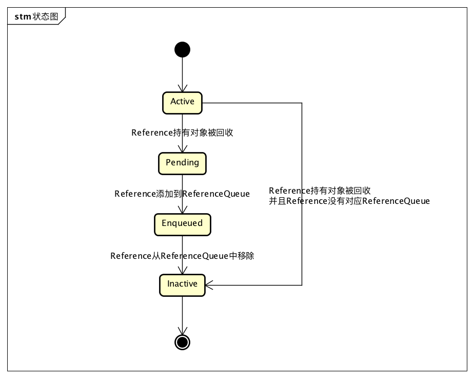
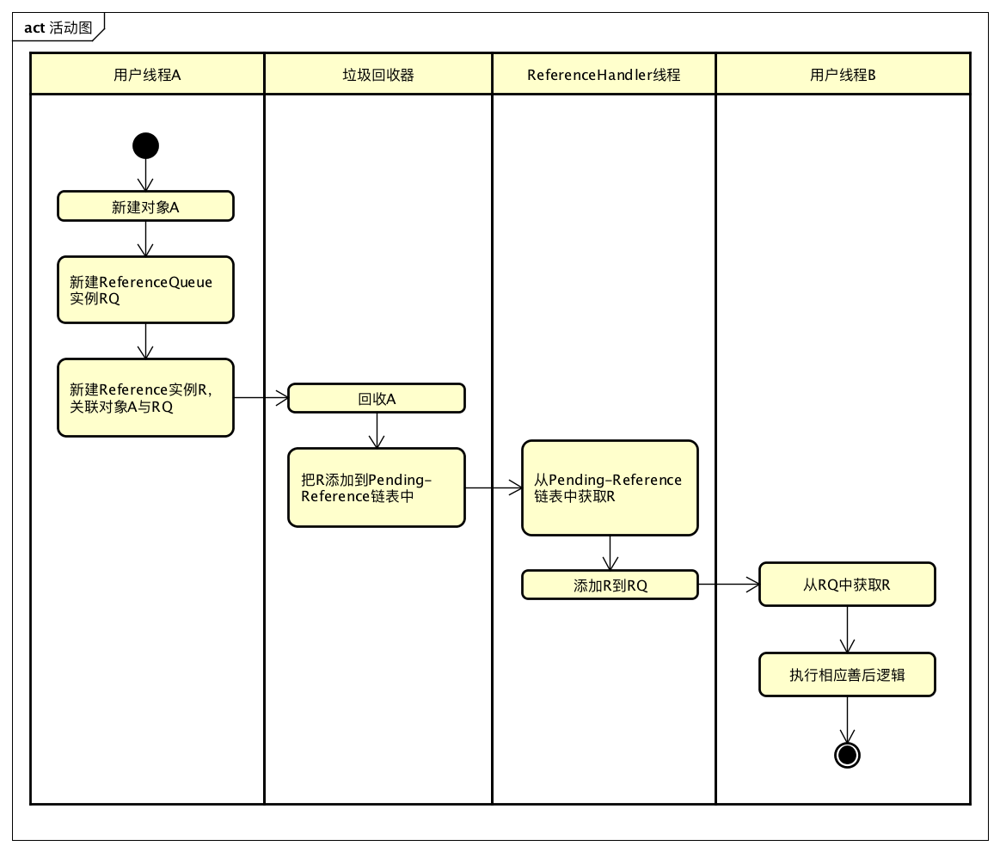
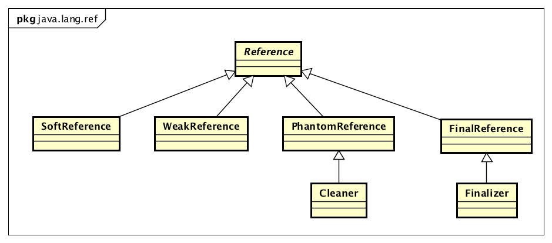

## Reference


> 参考网址: "http://imushan.com/2018/08/19/java/language/JDK%E6%BA%90%E7%A0%81%E9%98%85%E8%AF%BB-Reference/"
>
> 此外, 在"http://www.throwable.club/2019/02/16/java-reference/"这个blog中, 主要说明了在JDK11版本的实现;
>
> > **根据它的源码分析, 发现和本Note中介绍的1.8版本实现上还是有一些区别, 可做为参考;**

> 关于Java Reference 及其子类的两大功能: 
>
> > 1. ***实现特定的引用类型, 由子类SoftReference, WeakReference等实现;***
> >
> > 2. ***用户可以对象被回收后得到通知;***
> >
> >    > 关于实现对象被回收后得到通知功能实现: 
> >    >
> >    > 有一种思路是在创建Reference实例时, 添加一个回调方法, 当java.lang.ref.Reference#referent 被回收时, 由JVM负责调用回调; 但对引用和垃圾回收这种底层场景来说, 会导致实现复杂、性能不高的问题; 
> >    >
> >    > ***Reference使用了另外一种方式, 就是把引用对象回收的Reference添加到一个队列中, 用户后续去队列中获取并使用;  所以在Reference中有一个 ReferenceQueue类型的成员变量 queue;***

#### 1.  泛型抽象基类 java.lang.ref.Reference

```java
  /* 下面为Reference源码中的英文翻译结果
  Reference实例有四种状态: 
  1. Active; 新实例为Active状态; JVM探测到Reference实例的可达性, 则会将状态修改为Pending或Inactive; 
  	 而具体是改为Pending还是Inactive, 则按照此Reference中的queue是否可用; 
  	 此外, 若状态改为Pending状态, Reference实例还会被加入到pending-Reference list中; 
  	 
  2. Pending; 当前Reference实例是pending-Reference list中的元素,等待Reference-handler线程将它加入queue
  	 若Reference实例未注册queue, 则其永远不会处于此状态; 
  	 
  3. Enqueued; 当前实例位于它注册的queue中, 当此实例从queue中移除时, 它的状态也就变为Inactive状态; 
  	 未注册queue的Reference实例启动不会处理此状态; 
  	 
  4. Inactive; 实例状态不会再改变, 直至被回收;
  
  而当Reference位于各个状态时, 它的queue和next成员变量的引用如下: 
  1. Active; queue = 实例注册的ReferenceQueue实例或RefereneceQueue.NULL; next = null; 
  2. Pending; queue = 实例注册的ReferenceQueue实例; next = this; 
  3. Enqueued: queue = ReferenceQueue.ENQUEUED; next = queue中的下一个Reference实例(或this, 如果
  		当前Reference实例已是queue中最后一个元素);
  4. Inactive; queue = ReferenceQueue.NULL; next = this;
  
  基于以上的说明, 垃圾收集器只需要检查Reference#next成员变量来决定是否需要特殊处理; 
  若next为null, 则表示Active状态, 不能回集此实例; 若next为non-null, 表示垃圾收集器正常进行收集流程;
  
  为了保证并发垃圾收集器可以在不影响应用层线程的情况下执行enqueue()方法, 收集器使用discovered字段来标识找到的
  待回收的Reference; 
  此外discovered字段还被用于关联pending list中的Reference对象;
  */
public abstract class Reference<T> {

  //关于持有对象的字段,getter和setter
  private T referent; //实际持有的对象;
  public T get() { return this.referent;}
  public void clear() {this.referent = null;}
  
  //判断当前Reference实例是否处于Enqueued状态  
  public boolean isEnqueued() {return (this.queue == ReferenceQueue.ENQUEUED);}
  
  //将当前Reference改变为
  public boolean enqueue() {return this.queue.enqueue(this);}
  
  //两个构造方法, 若未显式指定queue, 默认将queue设置为ReferenceQueue.NULL
  Reference(T referent) {
        this(referent, null);
  }

  Reference(T referent, ReferenceQueue<? super T> queue) {
    this.referent = referent;
    this.queue = (queue == null) ? ReferenceQueue.NULL : queue;
  }
  
  /* The queue this reference gets enqueued to by GC notification or by
     * calling enqueue().
     *
     * When registered: the queue with which this reference is registered.
     *        enqueued: ReferenceQueue.ENQUEUE
     *        dequeued: ReferenceQueue.NULL
     *    unregistered: ReferenceQueue.NULL
     */
  volatile ReferenceQueue<? super T> queue;
  
  /* The link in a ReferenceQueue's list of Reference objects.
     *
     * When registered: null
     *        enqueued: next element in queue (or this if last)
     *        dequeued: this (marking FinalReferences as inactive)
     *    unregistered: null
     */
  volatile Reference next;
  
  /* When active: next element in a discovered reference list maintained by GC (or this if last)
   * pending:	next element in the pending list (or null if last)
   * otherwise: NULL
   */
  transient private Reference<T> discovered;
  
  /* List of References waiting to be enqueued.  The collector adds
   * References to this list, while the Reference-handler thread removes
   * them.  This list is protected by the above lock object. The
   * list uses the discovered field to link its elements.
   */
  //其实就是pending list, 因为全局只有一个pending list, 所以pending字段为static静态变量;
  private static Reference<Object> pending = null;
  
  //lock用于保证Reference-handler线程处理pending list时的同步;
  static private class Lock { }
  private static Lock lock = new Lock();
  
  
  //Reference-handler线程执行逻辑
  private static class ReferenceHandler extends Thread {
        private static void ensureClassInitialized(Class<?> clazz) {
            try {
                Class.forName(clazz.getName(), true, clazz.getClassLoader());
            } catch (ClassNotFoundException e) {
                throw (Error) new NoClassDefFoundError(e.getMessage()).initCause(e);
            }
        }

        static {
            // pre-load and initialize InterruptedException and Cleaner classes
            // so that we don't get into trouble later in the run loop if there's
            // memory shortage while loading/initializing them lazily.
            ensureClassInitialized(InterruptedException.class);
            ensureClassInitialized(Cleaner.class);
        }

        ReferenceHandler(ThreadGroup g, String name) {
            super(g, name);
        }

        public void run() {
            while (true) {
                tryHandlePending(true);
            }
        }
  }
  
  static boolean tryHandlePending(boolean waitForNotify) {
        Reference<Object> r;
        Cleaner c;
        try {
            synchronized (lock) {
                if (pending != null) {
                    r = pending;
                    // 'instanceof' might throw OutOfMemoryError sometimes
                    // so do this before un-linking 'r' from the 'pending' chain...
                    c = r instanceof Cleaner ? (Cleaner) r : null;
                    // unlink 'r' from 'pending' chain
                    pending = r.discovered;
                    r.discovered = null;
                } else {
                    // The waiting on the lock may cause an OutOfMemoryError
                    // because it may try to allocate exception objects.
                    if (waitForNotify) {
                        lock.wait();
                    }
                    // retry if waited
                    return waitForNotify;
                }
            }
        } catch (OutOfMemoryError x) {
            // Give other threads CPU time so they hopefully drop some live references
            // and GC reclaims some space.
            // Also prevent CPU intensive spinning in case 'r instanceof Cleaner' above
            // persistently throws OOME for some time...
            Thread.yield();
            // retry
            return true;
        } catch (InterruptedException x) {
            // retry
            return true;
        }

        // Fast path for cleaners
        if (c != null) {
            c.clean();
            return true;
        }

        ReferenceQueue<? super Object> q = r.queue;
        if (q != ReferenceQueue.NULL) q.enqueue(r);
        return true;
  }
  
  static {
        ThreadGroup tg = Thread.currentThread().getThreadGroup();
        for (ThreadGroup tgn = tg;
             tgn != null;
             tg = tgn, tgn = tg.getParent());
        Thread handler = new ReferenceHandler(tg, "Reference Handler");
        /* If there were a special system-only priority greater than
         * MAX_PRIORITY, it would be used here
         */
        handler.setPriority(Thread.MAX_PRIORITY);
        handler.setDaemon(true);
        handler.start();

        // provide access in SharedSecrets
        SharedSecrets.setJavaLangRefAccess(new JavaLangRefAccess() {
            @Override
            public boolean tryHandlePendingReference() {
                return tryHandlePending(false);
            }
        });
  }
  
}
```


##### 1.1 关于Reference状态转换



##### 1.2 关于pending list 和 ReferenceQueue

> 根据上面Reference类的注释说明中, 其实涉及到了两个集合, 即 ***pending list  和 ReferenceQueue***; 
>
> 1. pending list
>
>    > ***pending字段和discovered字段指定的单向链表;***
>    >
>    > + **由于全局只有一个pending list, 所以pending字段为static静态变量; pending为表头节点;**
>    > + **被加入到pending list中的Reference实例是被垃圾收集器自动完成的, 而若要访问pending list中的下一个元素, 需要通过discovered字段访问;  但discovered字段为非static类型, 所以整个pending list的遍历则需要通过pending获取到头节点, 再访问头节点的discovered字段获取下一个元素; 依此类推;**
>
> 2. ReferenceQueue
>
>    > ***由Reference构造方法中传入的ReferenceQueue#head字段和实例next字段给组成的单向链表;***
>    >
>    > ***具体Reference被加入ReferenceQueue的时机, 是在Reference static静态代码块中启动的ReferenceHandler线程中, 通过遍历获取到pending list中的元素后, 调用ReferenceQueue#enqueue方法完成的;***
>    >
>    > > **需要注意的是, 在ReferenceQueue#enqueue方法中, Reference被加入到Queue中时, 是添加到ReferenceQueue#head指定的链表中的, Reference#next指向原head节点; 而Reference#queue则会变为 ReferenceQueue.ENQUEUED引用, 用于表示当前Reference状态; **


##### 1.3 ReferenceHandler线程

> 根据1.2节, Reference实例从pending list 转加入到 ReferenceQueue的操作是在ReferenceHandler线程中完成的;


##### 1.4 Reference状态转换的完整流程




#### 2. 子类实现




##### 2.1 SoftReference

> **SoftReference在JVM内存不足时由垃圾收集器回收; 所以它经常用来实现memory-sensitive caches; **
>
> 当在某一时刻, 垃圾收集器发现某个对象object属于"软连接可达"时, 就可能会选择将所有连接到本对象的SoftReference回收掉, 并且还会回收所有从本object硬连接可达的所有其它对象; 然后在当时或之后的某一时刻, 将回收的所有SoftReference实例加入到它们所有注册的ReferenceQueue中;
>
> JVM会保证抛出OOM之前回收到所有SoftReference实例; 而在内存充裕时, JVM则不保证何时以及是否会回收这些实例; 
>
> 使用SoftReference实现cache时, 可以额外设置强引用到最近添加的或频繁访问到的元素, 防止被回收;

```java
public class SoftReference<T> extends Reference<T> {
  static private long clock; //timestamp clock; 本字段的值由垃圾收集器自动设置
  
  //每次调用SoftReference#get方法时, 会更新本字段;
  //VM在选择要收集的软引用时, 可以依靠本字段确定实例的上次访问时间, 进而确定是否现在进行回收; 
  //但VM也可能并不使用本字段, VM不保证;
  private long timestamp;
  
  public SoftReference(T referent) {
    super(referent);
    this.timestamp = clock;
  }
  
  public SoftReference(T referent, ReferenceQueue<? super T> q) {
    super(referent, q);
    this.timestamp = clock;
  }
  
  public T get() {
    T o = super.get();
    if (o != null && this.timestamp != clock)
      this.timestamp = clock;
    return o;
  }
}
```


##### 2.2 WeakReference

> **基本只是继承了Reference基类, 并未有特别的处理; 所以可以认为WeakReference只起到了一个标记作用, JVM可以在检测到某实例是WeakReference的话, 会在垃圾回收时将之回收; **

```java
public class WeakReference<T> extends Reference<T> {

    /**
     * Creates a new weak reference that refers to the given object.  The new
     * reference is not registered with any queue.
     *
     * @param referent object the new weak reference will refer to
     */
    public WeakReference(T referent) {
        super(referent);
    }

    /**
     * Creates a new weak reference that refers to the given object and is
     * registered with the given queue.
     *
     * @param referent object the new weak reference will refer to
     * @param q the queue with which the reference is to be registered,
     *          or <tt>null</tt> if registration is not required
     */
    public WeakReference(T referent, ReferenceQueue<? super T> q) {
        super(referent, q);
    }

}
```


##### 2.3 PhantomReference

> 通常用于实现在JVM垃圾回收时能有一个时间进行清理操作; 

```java
public class PhantomReference<T> extends Reference<T> {

    /**
     * Returns this reference object's referent.  Because the referent of a
     * phantom reference is always inaccessible, this method always returns
     * <code>null</code>.
     *
     * @return  <code>null</code>
     */
    public T get() { //可以看到虚引用#get方法拿不到被引用对象
        return null;
    }

    /**
     * Creates a new phantom reference that refers to the given object and
     * is registered with the given queue.
     *
     * <p> It is possible to create a phantom reference with a <tt>null</tt>
     * queue, but such a reference is completely useless: Its <tt>get</tt>
     * method will always return null and, since it does not have a queue, it
     * will never be enqueued.
     *
     * @param referent the object the new phantom reference will refer to
     * @param q the queue with which the reference is to be registered,
     *          or <tt>null</tt> if registration is not required
     */
    //构造方法决定了虚引用必须传入一个ReferenceQueue实例
    public PhantomReference(T referent, ReferenceQueue<? super T> q) {
        super(referent, q);
    }

}
```


###### 2.3.1 虚引用子类 Cleaner

> 虚引用应用举例: 
>
> 在 ***java.nio.DirectByteBuffer*** 构造方法中包含如下一行: 
>
> > ```java
> > DirectByteBuffer(int cap) {   
> >   super(-1, 0, cap, cap);
> >   
> >   //...
> >   //获取需要分配的内存大小size; 由于内存对齐的原因, 可能出现size和cap不同的情况;
> >   cleaner = Cleaner.create(this, new Deallocator(base, size, cap));
> >   //...
> > }
> > ```
> >
> > > 这里的cleaner字段则是指向DirectByteBuffer实例this的Cleaner引用;
> > >
> > > 当JVM中没有其它引用指向DirectByteBuffer实例时, 由于只有虚引用指向此实例, 则会回收该实例; 
> > >
> > > 并且调用Deallocator线程释放分配的堆外内存;

```java
public class Cleaner extends PhantomReference<Object>
{
  //工具ReferenceQueue实例, 由于PhantomReference构造方法中必须传入一个ReferenceQueue实例, 可以传入本实例; 
  //因为在Reference#ReferenceHandler线程执行过程中, 若得到Cleaner实例时: 会直接执行Cleaner#clean方法, 
  //而且不会再继续调用ReferenceQueue#enqueue, 所以一般可以传入本实例做为构造方法参数;
  private static final ReferenceQueue<Object> dummyQueue = new ReferenceQueue<>();
  
  private final Runnable thunk;

  private Cleaner(Object referent, Runnable thunk) { 
    super(referent, dummyQueue); //这里可以看到, 创建父类虚引用实例时就是传入的dummyQueue变量
    this.thunk = thunk;
  }
  
  //静态方法, 用于创建Cleaner实例且将该实例加入到双向链表中;
  //并且需要注意, 创建Cleaner时不能将thunk置为null;
  public static Cleaner create(Object ob, Runnable thunk) {
    if (thunk == null)
      return null;
        
    return add(new Cleaner(ob, thunk));
  }
  
  //first & next & prev字段, 用于构造双向Cleaner链表, 用于防止活跃Cleaner实例被回收;
  /*
  防止活跃Cleaner被回收的意思是: 当一个对象object 只有Clearner实例持有其引用时; 
  JVM会回收这个object并调用Clearner#clean执行清理工作; 
  
  但却可能会出现另一个情况: 如果Clearner实例的引用也只有要被清理的对象object持有时(如DirectorByteBuffer中
  clearner字段), JVM可能会先一步将Clearner实例标记为垃圾对象并进行回收, 而后再标记object对象; 这样的话可能
  造成内存汇漏;
  */
  static private Cleaner first = null;
  private Cleaner next = null,prev = null;
  
  //加入链表
  private static synchronized Cleaner add(Cleaner cl) { //往双向链表中添实例时, 直接在头部添加
    if (first != null) {
      cl.next = first;
      first.prev = cl;
    }
    first = cl;
    return cl;
  }
  
  //链表移除元素
  private static synchronized boolean remove(Cleaner cl) {
    //根据下面的处理, 从链表中删除cl时, 会将next和prev字段自指;
    //所以若 cl.next == cl 为真, 则直接返回;
    if (cl.next == cl) return false; 
    
    if (first == cl) {  //若cl为链表头, 进行处理;
      if (cl.next != null)
        first = cl.next;
      else
        first = cl.prev;
    }
    
    if (cl.next != null)
      cl.next.prev = cl.prev;
      
    if (cl.prev != null)
      cl.prev.next = cl.next;

    // cl从链表中移除时, 将next和prev字段自指;
    cl.next = cl;
    cl.prev = cl;
     
    return true;
  }
  
  /**
   * Runs this cleaner, if it has not been run before.
   */
  public void clean() {
    if (!remove(this)) //若this不在双向链表中, 则表示已执行清理操作, 直接返回;
      return;
        
    try {
      //这里表示在Reference#ReferenceHandler线程中若取到Cleaner实例, 
      //则会直接在ReferenceHandler线程内执行thunk逻辑;
      thunk.run(); 
    } catch (final Throwable x) {
      AccessController.doPrivileged(new PrivilegedAction<Void>() {
        public Void run() {
          if (System.err != null)
            new Error("Cleaner terminated abnormally", x).printStackTrace();
                       
          System.exit(1);
          return null;
        }});
    }
  }
}
```


##### 2.4 FinalReference & Finalizer

> **FinalReference类似WeakReference, 起到一种标志的作用; 它的主要作用是为了其子类Finalizer;**
>
> > ```java
> > class FinalReference<T> extends Reference<T> {
> >     public FinalReference(T referent, ReferenceQueue<? super T> q) {
> >         super(referent, q);
> >     }
> > }
> > ```
>
> **所以这里主要对Finalizer进行说明; **
>
> > 参考资料:《深入理解Java虚拟机》"3.2.4章 生存还是死亡?"
> >
> > > 引用原文: ***即使在可达性分析算法中判定为不可达的对象, 也不是"非死不可"的, 这时候它们暂时还处于"缓刑"阶段, 要真正宣告一个对象死亡, 至少要经历两次标记过程: 如果对象在进行可达性分析后发现没有与GC Roots相连接的引用链, 那它将会第一次标记, 随后进行一次筛选, 筛选的条件是此对象是否有必要执行 finalize() 方法. 假如对象没有覆盖finalize() 方法, 或者 finalize() 方法已经被虚拟机调用过, 那么虚拟机将这两种情况都视为"没有必要执行".***
> > >
> > > ***如果这个对象被判定为确有必要执行finalize() 方法, 那么该对象将会被放置在一个名为 F-Queue 的队列中, 并在稍后由一条由虚拟机自动建立的、低调度优先级的 Finalizer 线程去执行它们的 finalize() 方法. 这里所说的"执行" 是指虚拟机会触发这个方法开始运行, 但并不承诺一定会等待它运行结束. 这样做的原因是, 如果某个对象的 finalize() 方法执行缓慢, 或者更极端地发生了死循环, 将很可能导致 F-Queue 队列中的其他对象永久处于等待, 甚至导致整个内存回收子系统的崩溃. finalize() 方法是对象逃脱死亡命运的最后一次机会以, 稍后收集器将对 F-Queue 中的对象进行第二次小规模的标记, 如果对象要在 finalize() 中成功拯救自己—— 只要重新与引用链上的任何一个对象建立关联即可, ......***
> >
> > 参考网址: "http://www.throwable.club/2019/02/16/java-reference/"
> >
> > > **前面提到的`Finalizer`守护线程和`F-Queue`队列其实在JDK中有具体的实现类 "java.lang.ref.Finalizer" ; "F-Queue" 队列只是《深入理解Java虚拟机-2nd》中的一个名词描述, 实际上笔者没有找到相关的资料, 这里我们通过分析JDK和JVM相关的源码去理解这个 "F-Queue" 队列; **

```java
final class Finalizer extends FinalReference<Object> { 
    
    static { //静态代码块, 会启动FinalizerThread线程
        ThreadGroup tg = Thread.currentThread().getThreadGroup();
        for (ThreadGroup tgn = tg;
             tgn != null;
             tg = tgn, tgn = tg.getParent());
        Thread finalizer = new FinalizerThread(tg);
        finalizer.setPriority(Thread.MAX_PRIORITY - 2);
        finalizer.setDaemon(true);
        finalizer.start();
    }
  
    /* Invoked by VM 这个方法由JVM激活，也就是链表的元素入队是由JVM控制的，见下文分析 */
    //由于Finalizer构造方法为private, 所以本方法为创建Finalizer实例的唯一对外接口(也是对JVM的接口);
    static void register(Object finalizee) {
        new Finalizer(finalizee);
    }

    // Finalizer关联的ReferenceQueue，其实Finalizer是一个特殊的Reference实现
    private static ReferenceQueue<Object> queue = new ReferenceQueue<>();
  
    static ReferenceQueue<Object> getQueue() {
        return queue;
    }
  
    private Finalizer(Object finalizee) { //private构造方法
        super(finalizee, queue); //可以看到Finalizer都注册到了同一个queue中;
        add(); //将创建的实例加入到unfinalized标识的双向链表中
    }

    //=== 双向链表操作start
    // 等待finalization的所有Finalizer实例链表的头节点，这里称此链表为unfinalized链表
    private static Finalizer unfinalized = null;
    
    // 中间变量，分别记录unfinalized链表中当前执行元素的下一个节点和前一个节点
    private Finalizer next = null, prev = null;
  
    // unfinalized链表的锁，静态final，全局的锁实例
    private static final Object lock = new Object();    
  
    private void add() { //双向链表添加元素时往头部添加
        synchronized (lock) {
            if (unfinalized != null) {
                this.next = unfinalized;
                unfinalized.prev = this;
            }
            unfinalized = this;
        }
    }

    private void remove() { //将自身从双向链表中移除, 同时next和prev字段自指;
        synchronized (lock) {
            if (unfinalized == this) {
                if (this.next != null) {
                    unfinalized = this.next;
                } else {
                    unfinalized = this.prev;
                }
            }
            if (this.next != null) {
                this.next.prev = this.prev;
            }
            if (this.prev != null) {
                this.prev.next = this.next;
            }
            this.next = this;   /* Indicates that this has been finalized */
            this.prev = this;
        }
    }
  
    //检测是否已执行过finalizee对象的finalize()方法;
    //根据对上面 remove() 方法的说明, 只有当Finalizer实例从双向链表中移除时才会出现"next==this"为true的情况
    //而remove()方法的调用时机则是在FinalizerThread线程从queue中获取Finalizer实例后第一次从链表中移除时;
    //第一次 remove() 之后才会执行被包装对象的 finalize()方法; 
    //所以可以通过判断next字段来确认是否已执行过 finalize() 方法;
    private boolean hasBeenFinalized() {
        return (next == this);
    }
    //=== 双向链表操作end

    //执行被包装对象的finalize()方法; 由于会执行 hasBeanFinalize() 判断, 所以只会执行一次finalize()方法;
    private void runFinalizer(JavaLangAccess jla) {
        synchronized (this) {
            if (hasBeenFinalized()) return;
            remove();
        }
        try {
            Object finalizee = this.get();
            if (finalizee != null && !(finalizee instanceof java.lang.Enum)) {
                jla.invokeFinalize(finalizee);

                /* Clear stack slot containing this variable, to decrease
                   the chances of false retention with a conservative GC */
                finalizee = null;
            }
        } catch (Throwable x) { }
        super.clear();
    }

    /* Create a privileged secondary finalizer thread in the system thread
       group for the given Runnable, and wait for it to complete.

       This method is used by both runFinalization and runFinalizersOnExit.
       The former method invokes all pending finalizers, while the latter
       invokes all uninvoked finalizers if on-exit finalization has been
       enabled.

       These two methods could have been implemented by offloading their work
       to the regular finalizer thread and waiting for that thread to finish.
       The advantage of creating a fresh thread, however, is that it insulates
       invokers of these methods from a stalled or deadlocked finalizer thread.
     */
    private static void forkSecondaryFinalizer(final Runnable proc) {
        AccessController.doPrivileged(
            new PrivilegedAction<Void>() {
                public Void run() {
                    ThreadGroup tg = Thread.currentThread().getThreadGroup();
                    for (ThreadGroup tgn = tg;
                         tgn != null;
                         tg = tgn, tgn = tg.getParent());
                    Thread sft = new Thread(tg, proc, "Secondary finalizer");
                    sft.start();
                    try {
                        sft.join();
                    } catch (InterruptedException x) {
                        Thread.currentThread().interrupt();
                    }
                    return null;
                }});
    }

    /* Called by Runtime.runFinalization() */
    // 这个方法是给Runtime.runFinalization()委托调用的，其实就是主动取出queue的元素强制调用其finalize方法
    static void runFinalization() {
        if (!VM.isBooted()) {
            return;
        }

        forkSecondaryFinalizer(new Runnable() {
            private volatile boolean running;
            public void run() {
                // in case of recursive call to run()
                if (running)
                    return;
                final JavaLangAccess jla = SharedSecrets.getJavaLangAccess();
                running = true;
                for (;;) {
                    Finalizer f = (Finalizer)queue.poll();
                    if (f == null) break;
                    f.runFinalizer(jla);
                }
            }
        });
    }

    /* Invoked by java.lang.Shutdown */
    static void runAllFinalizers() {
        if (!VM.isBooted()) {
            return;
        }

        forkSecondaryFinalizer(new Runnable() {
            private volatile boolean running;
            public void run() {
                // in case of recursive call to run()
                if (running)
                    return;
                final JavaLangAccess jla = SharedSecrets.getJavaLangAccess();
                running = true;
                for (;;) {
                    Finalizer f;
                    synchronized (lock) {
                        f = unfinalized;
                        if (f == null) break;
                        unfinalized = f.next;
                    }
                    f.runFinalizer(jla);
                }}});
    }

    private static class FinalizerThread extends Thread {
        private volatile boolean running;
        FinalizerThread(ThreadGroup g) {
            super(g, "Finalizer");
        }
        public void run() {
            // in case of recursive call to run()
            if (running)
                return;

            // Finalizer thread starts before System.initializeSystemClass
            // is called.  Wait until JavaLangAccess is available
            while (!VM.isBooted()) {
                // delay until VM completes initialization
                try {
                    VM.awaitBooted();
                } catch (InterruptedException x) {
                    // ignore and continue
                }
            }
            final JavaLangAccess jla = SharedSecrets.getJavaLangAccess();
            running = true;
            for (;;) {
                try {
                    // 注意这里是调用`Reference#remove()`的永久阻塞版本，只有`Reference#enqueue()`
                    // 被调用才会解除阻塞
                    // `Reference#remove()`解除阻塞说明元素已经完成入队，由ReferenceHandler线程完成
                    Finalizer f = (Finalizer)queue.remove();
                    f.runFinalizer(jla);
                } catch (InterruptedException x) {
                    // ignore and continue
                }
            }
        }
    }
}

```

> 小结: 
>
> - `Finalizer`是`FinalReference`的子类，而`FinalReference`是`Reference`的实现，所以它的工作原理和其他引用类似，对象的状态更变和由ReferenceHandler线程密切相关。
>
> - `Finalizer`内部维护了一个链表，每当JVM调用静态注册方法就会新建一个`Finalizer`实例加入到链表的头节点中，头节点元素为unfinalized，这里称此链表为unfinalized链表。
>
> - `Finalizer`线程由`Finalizer`静态代码块构建并且运行，它是守护线程，优先级是最高优先级-2，它的作用就是提取unfinalized链表的元素并且执行元素对象的`finalize()`方法，过程中还会涉及到线程的阻塞、唤醒，以及unfinalized链表的重建等工作。
>
> - 由于静态方法`Finalizer#register(Object finalizee)`是由JVM调用的，所以我们必须要分析一些JVM的源码，参考的是OpenJDK主分支的代码，文件是`instanceKlass.cpp`：
>
>   > ```c++
>   > instanceOop InstanceKlass::register_finalizer(instanceOop i, TRAPS) {
>   >   if (TraceFinalizerRegistration) {
>   >     tty->print("Registered ");
>   >     i->print_value_on(tty);
>   >     tty->print_cr(" (" INTPTR_FORMAT ") as finalizable", p2i(i));
>   >   }
>   >   instanceHandle h_i(THREAD, i);
>   >   // Pass the handle as argument, JavaCalls::call expects oop as jobjects
>   >   JavaValue result(T_VOID);
>   >   JavaCallArguments args(h_i);
>   >   // 这里Universe::finalizer_register_method()获取到的就是Finalizer#register方法句柄
>   >   methodHandle mh (THREAD, Universe::finalizer_register_method());
>   >   JavaCalls::call(&result, mh, &args, CHECK_NULL);
>   >   return h_i();
>   > }
>   > 
>   > //javaCalls.cpp
>   > void JavaCalls::call(JavaValue* result, const methodHandle& method, JavaCallArguments* args, TRAPS) {
>   >   // Check if we need to wrap a potential OS exception handler around thread
>   >   // This is used for e.g. Win32 structured exception handlers
>   >   assert(THREAD->is_Java_thread(), "only JavaThreads can make JavaCalls");
>   >   // Need to wrap each and every time, since there might be native code down the
>   >   // stack that has installed its own exception handlers
>   >   os::os_exception_wrapper(call_helper, result, method, args, THREAD);
>   > }
>   > ```
>   >
>   > > 简单来看就是把创建对象过程中，如果有必要注册`Finalizer`(一般是覆盖了`finalize()`方法)，则基于当前线程通过`Finalizer#register(Object finalizee)`把当前新建的实例注册到`Finalizer`自身维护的链表中(如果没理解错，所谓的`F-Queue`就是这个链表了)，等待后台`Finalizer`线程轮询并且执行链表中对象的`finalize()`方法。


