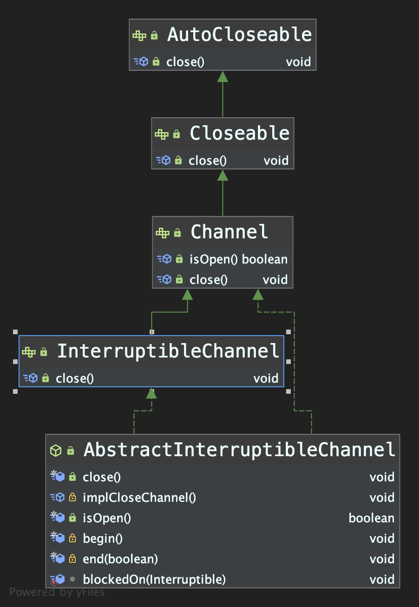

### Channel





#### 1. AbstractInterruptibleChannel

> > ***AbstractInterruptibleChannel#begin() 方法, 给当前线程注册了 Interruptible interruptor;* **
> >
> > ***该interruptor的作用是在其它线程调用执行实现I/O操作线程的interrupt()方法时, 可以自动关闭本Channel, 并且将 open字段设置为 false, 并将被中断的线程对象存储在 interrupted 字段中;***
>
> > ***AbstractInterruptibleChannel#end(boolean completed)方法, 会做两个检查; ***
> >
> > > 1. ***interrupted字段非null, 则对于执行I/O操作的线程, 表示被其它线程中断过, 抛出ClosedByInterruptException 异常;***
> > > 2. ***completed参数为false(即I/O操作未完成) 并且 open为false(即通道被关闭), 则抛出 AsynchronousCloseException 异常; ***
>
> > ***AbstractInteruptibleChannel#close()方法***
> >
> > > ***将 open字段设置为 false, 并且调用了子类的implCloseChannel() 方法; ***
> > >
> > > ***close() 并不会真正中断 I/O 操作, 只是等到I/O操作成功或失败后, 再到 end()方法中去检查; ***

```java
public abstract class AbstractInterruptibleChannel implements Channel, InterruptibleChannel {
  
  protected AbstractInterruptibleChannel() { }
  
  private volatile boolean open = true;
  public final boolean isOpen() { return open; }
  
  protected abstract void implCloseChannel() throws IOException; //需要子类去实现的方法
  
  
  /*
  模板模式; 本抽象父类 定义了 begin()/end()/close() 方法以及遇到中断时的逻辑架构; 
  这里还涉及到了 Interruptible 接口的作用;
  
  在下面的Thread#interrupt() 方法中, 如果没有给 blocker字段赋值, 则会调用本地方法 interrupt0();
  但如果设置了 blocker 字段, 则除了调用 interrupt0()本地方法外, 还会执行 blocker#interrupt(this)方法;
  而设置blocker字段的方法就是 blockedOn(); 
  
  这样的话, 线程就可以在接收到来自其它线程的 interrupt() 中断, 则可以使用blocker执行一些清理工作;
  
  在 Thread 类中, 定义了如下字段和方法:
  ==============
 		private volatile Interruptible blocker;
    private final Object blockerLock = new Object();
		
		void blockedOn(Interruptible b) {
        synchronized (blockerLock) {
            blocker = b;
        }
    }
    
    public void interrupt() {
       //...
        synchronized (blockerLock) {
            Interruptible b = blocker;
            if (b != null) {
                interrupt0();           // Just to set the interrupt flag
                b.interrupt(this);
                return;
            }
        }
        interrupt0();
    }
  =============
  
  */
  private Interruptible interruptor;
  private volatile Thread interrupted;
  
  protected final void begin() {
    if (interruptor == null) {
      interruptor = new Interruptible() {
        public void interrupt(Thread target) {
          synchronized (closeLock) {
            if (!open)
              return;
            open = false;
            interrupted = target;
                          
            try {
              AbstractInterruptibleChannel.this.implCloseChannel();
            } catch (IOException x) { }
          }
        }};
       
    }
    blockedOn(interruptor);
    Thread me = Thread.currentThread();
     
    if (me.isInterrupted())
      interruptor.interrupt(me);
    
  }
  
  protected final void end(boolean completed) throws AsynchronousCloseException {
        blockedOn(null);
        Thread interrupted = this.interrupted;
        if (interrupted != null && interrupted == Thread.currentThread()) {
            interrupted = null;
            throw new ClosedByInterruptException();
        }
        if (!completed && !open)
            throw new AsynchronousCloseException();
  
  }
  
  public final void close() throws IOException {
    synchronized (closeLock) {
      if (!open)
        return;
      open = false;
      implCloseChannel();
    }
  }
}
```


##### 1.1 应用

```java
//需要注意在调用线程的interrupt()/close() 以及 end()参数为true和false等情况下输出的异常信息;
public class CustomizedChannel extends AbstractInterruptibleChannel {
    @Override
    protected void implCloseChannel() throws IOException {
        System.out.println(Thread.currentThread().getName()
                           + "\t" + System.currentTimeMillis() + ": start shutdown channel;");
    }

    protected void virtualRead() {
        try {
            begin();
            System.out.println("Start reading...");
            TimeUnit.SECONDS.sleep(3);
            System.out.println("Finish read...");
        } catch (Exception e) {
            e.printStackTrace();
        } finally {
            try {
//                end(true); 
                end(false); 
            } catch (AsynchronousCloseException e) {
                e.printStackTrace();
            }
        }
    }

    public static void main(String[] args) throws InterruptedException, IOException {
        final CustomizedChannel customizedChannel = new CustomizedChannel();
        Runnable r = customizedChannel::virtualRead;

        final Thread a = new Thread(r, "Thread-a");
        a.start();
        TimeUnit.MILLISECONDS.sleep(500);
//        a.interrupt();
        customizedChannel.close();
    }
}
```


#### FileChannel

> ***//TODO; 实现以及FileLock, 还有map等***


#### SocketChannel
