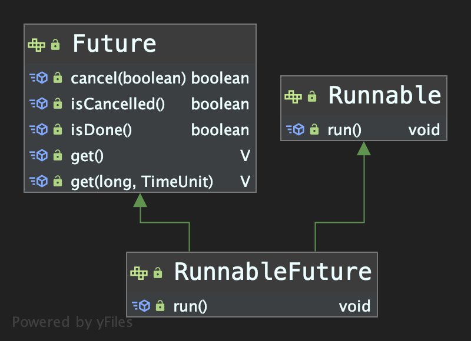

## java.util.concurrent.FutureTask


#### 1. 接口 RunnableFuture

> 作用： 定义了一个支持 Future API 相关操作的线程接口；




#### 2. 实现 FutureTask

```java
// java.util.concurrent.FutureTask
public class FutureTask<V> implements RunnableFuture<V> {

    public FutureTask(Callable<V> callable) {
        if (callable == null)
            throw new NullPointerException();
        this.callable = callable;
        this.state = NEW;       // ensure visibility of callable
    }
  
    public FutureTask(Runnable runnable, V result) {
        this.callable = Executors.callable(runnable, result);
        this.state = NEW;       // ensure visibility of callable
    }  
  
    private volatile int state; //当前任务状态, 初始值为 NEW; 
  
  
    /*
    state的可能状态转换过程如下:
    NEW -> COMPLETING -> NORMAL
    NEW -> COMPLETING -> EXCEPTIONAL
    NEW -> CANCELLED
    NEW -> INTERRUPTING -> INTERRUPTED
    */
    private static final int NEW          = 0;
    private static final int COMPLETING   = 1;
    private static final int NORMAL       = 2;
    private static final int EXCEPTIONAL  = 3;
    private static final int CANCELLED    = 4;
    private static final int INTERRUPTING = 5;
    private static final int INTERRUPTED  = 6;
  
    private Callable<V> callable; //构造方法传入的需要执行的任务;
    
    private Object outcome; //若任务正常执行完成, 存储执行结果; 执行出错, 则存储异常信息;
  
    private volatile Thread runner; //标识实际执行本任务的线程
  
    static final class WaitNode {
        volatile Thread thread;
        volatile WaitNode next;
        WaitNode() { thread = Thread.currentThread(); }
    }
    private volatile WaitNode waiters;
  
    //==== 状态判断
    public boolean isCancelled() { return state >= CANCELLED; }
  	
  	public boolean isDone() { return state != NEW; }
  
    //==== 执行任务逻辑
    //==== FutureTask通常会被submit到线程池执行, 当某个线程拿到此任务后, 会在该线程内执行本 run() 方法;
    public void run() {
        
        // 任务的开始状态必须是NEW; 并且通过CAS更新runner字段以防止超过一个线程同时执行本任务;
        if (state != NEW || 
            !UNSAFE.compareAndSwapObject(this, runnerOffset,null, Thread.currentThread()))
            return;
      
        try {
            Callable<V> c = callable;
            if (c != null && state == NEW) {
                V result;
                boolean ran;
                try {
                    result = c.call();
                    ran = true;
                } catch (Throwable ex) {
                    result = null;
                    ran = false;
                    setException(ex);
                }
                if (ran)
                    set(result);
            }
        } finally {
            // runner must be non-null until state is settled to
            // prevent concurrent calls to run()
            runner = null;
            // state must be re-read after nulling runner to prevent
            // leaked interrupts
            int s = state;
            if (s >= INTERRUPTING)
                handlePossibleCancellationInterrupt(s);
        }
    }
```

