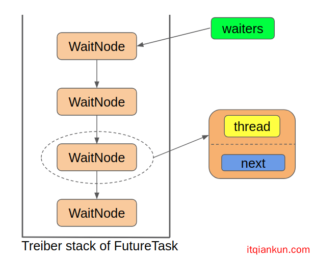

# java.util.concurrent.FutureTask

> 参考：[FutureTask源码解析](https://www.itqiankun.com/article/1190000016572591)

> **FutureTask本质上就是一个“Task”，我们可以把它当做简单的Runnable对象来使用。但是它又同时实现了Future接口，因此我们可以对它所代表的“Task”进行额外的控制操作。**

## 1. 接口 RunnableFuture

> 作用： 定义了一个支持 Future API 相关操作的线程接口；


## 2. 相关工具类

### 2.1 Runnable转换Callable的适配器类: Executors#RunnableAdapter

```java
    public class Executors {
        /**
         * Returns a {@link Callable} object that, when
         * called, runs the given task and returns the given result.  This
         * can be useful when applying methods requiring a
         * {@code Callable} to an otherwise resultless action.
         * @param task the task to run
         * @param result the result to return
         * @param <T> the type of the result
         * @return a callable object
         * @throws NullPointerException if task null
         */
        public static <T> Callable<T> callable(Runnable task, T result) {
            if (task == null)
                throw new NullPointerException();
            return new RunnableAdapter<T>(task, result);
        }
        /**
         * A callable that runs given task and returns given result
         */
        static final class RunnableAdapter<T> implements Callable<T> {
            final Runnable task;
            final T result;
            RunnableAdapter(Runnable task, T result) {
                this.task = task;
                this.result = result;
            }
            public T call() {
                task.run();
                return result;
            }
        }
   
    }
```

### 2.2 Unsafe

> **它提供了硬件级别的CAS原子操作**

## 3. Runnable实现

> **Java 并发工具类的三板斧：状态、队列、CAS**

> run方法重点做了以下几件事：
>
> 1. 将runner属性设置成当前正在执行run方法的线程
> 2. 调用callable成员变量的call方法来执行任务
> 3. 设置执行结果outcome, 如果执行成功, 则outcome保存的就是执行结果；如果执行过程中发生了异常, 则outcome中保存的就是异常，设置结果之前，先将state状态设为中间态
> 4. 对outcome的赋值完成后，设置state状态为终止态(`NORMAL`或者`EXCEPTIONAL`)
> 5. 唤醒Treiber栈中所有等待的线程
> 6. 善后清理(waiters, callable，runner设为null)
> 7. 检查是否有遗漏的中断，如果有，等待中断状态完成。
>
> 前面说“**state只要不是NEW状态，就说明任务已经执行完成了**”就体现在这里，因为run方法中，我们是在`c.call()`执行完毕或者抛出了异常之后才开始设置中间态和终止态的。

```java
// java.util.concurrent.FutureTask
public class FutureTask<V> implements RunnableFuture<V> {

    //--- 构造函数, state字段初始为NEW
    public FutureTask(Callable<V> callable) {
        if (callable == null)
            throw new NullPointerException();
        this.callable = callable;
        this.state = NEW;       // ensure visibility of callable
    }
  
    public FutureTask(Runnable runnable, V result) {
        this.callable = Executors.callable(runnable, result);
        this.state = NEW;       // ensure visibility of callable
    }  
  
    private volatile int state; //当前任务状态, 初始值为 NEW; 
  
    /*
    state的可能状态转换过程如下:
    NEW -> COMPLETING -> NORMAL
    NEW -> COMPLETING -> EXCEPTIONAL
    NEW -> CANCELLED
    NEW -> INTERRUPTING -> INTERRUPTED
    
    状态包括了1个初始态，2个中间态和4个终止态;
    
    任务的中间状态是一个瞬态, 它非常的短暂.
    而且任务的中间态并不代表任务正在执行, 而是任务已经执行完了, 正在设置最终的返回结果, 所以可以这么说: 
      只要state不处于 NEW 状态，就说明任务已经执行完毕
      注意，这里的执行完毕是指传入的Callable对象的call方法执行完毕, 或者抛出了异常.
      	所以这里的COMPLETING的名字显得有点迷惑性, 它并不意味着任务正在执行中, 而意味着call方法已经执行完毕, 
      	正在设置任务执行的结果。
      	
    而将一个任务的状态设置成终止态只有三种方法: set setException cancel
    */
    private static final int NEW          = 0;
    private static final int COMPLETING   = 1; //正在设置任务结果
    private static final int NORMAL       = 2; //任务正常执行完毕
    private static final int EXCEPTIONAL  = 3; //任务执行过程中发生异常
    private static final int CANCELLED    = 4; //任务被取消
    private static final int INTERRUPTING = 5; //正在中断运行任务的线程
    private static final int INTERRUPTED  = 6; //任务被中断
  
    private Callable<V> callable; //构造方法传入的需要执行的任务;
    
    private Object outcome; //若任务正常执行完成, 存储执行结果; 执行出错, 则存储异常信息;
  
    private volatile Thread runner; //标识实际执行本任务的线程
  
    static final class WaitNode {
        volatile Thread thread;
        volatile WaitNode next;
        WaitNode() { thread = Thread.currentThread(); }
    }
    private volatile WaitNode waiters; //整个单向链表的头节点
  
    //==== 状态判断
    public boolean isCancelled() { return state >= CANCELLED; }
  	
  	public boolean isDone() { return state != NEW; }
  
    //==== 执行任务逻辑
    //==== FutureTask通常会被submit到线程池执行, 当某个线程拿到此任务后, 会在该线程内执行本 run() 方法;
    public void run() {
        // 任务的开始状态必须是NEW; 并且通过CAS更新runner字段以防止超过一个线程同时执行本任务;
        if (state != NEW || 
            !UNSAFE.compareAndSwapObject(this, runnerOffset,null, Thread.currentThread()))
            return;
      
        try {
            Callable<V> c = callable;
            if (c != null && state == NEW) {
                V result;
                boolean ran;
                try {
                    result = c.call();
                    ran = true;
                } catch (Throwable ex) {
                    result = null;
                    ran = false;
                    setException(ex);
                }
                if (ran)
                    set(result);
            }
        } finally {
            runner = null; //清空runner引用
          
            //有可能在cancel方法中执行到t.interrupt()时, 实际线程已执行完, 
            //此时的state状态为INTERRUPTING, 但它只是一个中间状态, 需要设置为终结状态.
            //此时需要将当前线程让出, 等到cancel()中将状态更新为INTERRUPTED
            int s = state;
            if (s >= INTERRUPTING)
                handlePossibleCancellationInterrupt(s);
        }
    }
  
  protected void set(V v) {
        if (UNSAFE.compareAndSwapInt(this, stateOffset, NEW, COMPLETING)) {
            outcome = v;
            UNSAFE.putOrderedInt(this, stateOffset, NORMAL); // final state
            finishCompletion();
        }
    }
  
  protected void setException(Throwable t) {
        if (UNSAFE.compareAndSwapInt(this, stateOffset, NEW, COMPLETING)) {
            outcome = t;
            UNSAFE.putOrderedInt(this, stateOffset, EXCEPTIONAL); // final state
            finishCompletion();
        }
    }
  
  //--- 完成执行结果的设置
  private void finishCompletion() {
    for (WaitNode q; (q = waiters) != null;) {//变向自旋
      if (UNSAFE.compareAndSwapObject(this, waitersOffset, q, null)) {
        for (;;) { //遍历链表, 唤醒所有阻塞的线程
          Thread t = q.thread;
          if (t != null) {
            q.thread = null;
            LockSupport.unpark(t);
          }
          WaitNode next = q.next;
          if (next == null)
            break;
               
          q.next = null; // unlink to help gc
          q = next;
        }
        break;
      }
    }

    done(); //默认为空实现
    callable = null; // to reduce footprint
  }
}
```

### 3.1 FutureTask使用的队列结构



### 3.2 CAS操作

> **CAS操作主要针对3个属性，包括`state`、`runner`和`waiters`，说明这3个属性基本是会被多个线程同时访问的**
>
> **`state`代表任务状态**
>
> **`runner`代表执行FutureTask中的"Task"的线程, 这是为了中断或者取消任务做准备的, 因为只有知道了执行任务的线程, 才有去中断它**
>
> **`waiters`代表队列首节点指针**

```java
        // Unsafe mechanics
        private static final sun.misc.Unsafe UNSAFE;
        private static final long stateOffset;
        private static final long runnerOffset;
        private static final long waitersOffset;
        static {
            try {
                UNSAFE = sun.misc.Unsafe.getUnsafe();
                Class<?> k = FutureTask.class;
                stateOffset = UNSAFE.objectFieldOffset(k.getDeclaredField("state"));
                runnerOffset = UNSAFE.objectFieldOffset(k.getDeclaredField("runner"));
                waitersOffset = UNSAFE.objectFieldOffset(k.getDeclaredField("waiters"));
            } catch (Exception e) {
                throw new Error(e);
            }
        }
```

## 4. Future功能实现

### 4.1 cancel

> **cancel方法实际完成如下两种转换之一:**
>
> 1. `NEW -> CANCELLED` (对应于`mayInterruptIfRunning=false`)
>
>    > **对于此转换, 只是简单的设置state状态为CANCELLED, 不会中断线程的执行；后果是任务即使执行完毕了, 也无法设置任务的执行结果; 因为run()方法中更新状态为COMPLETING时是基于NEW为前提的**
>
> 2. `NEW -> INTERRUPTING -> INTERRUPTED` (对应于`mayInterruptIfRunning=true`)
>
>    > **对于此转换, 结合run()方法逻辑, 在run()方法进入`catch块`中执行时, `setException`的操作也一定是失败的, 因为在更新状态时同样是基于state为NEW的前提进行CAS的; **
>    >
>    > **既然这个`setException(ex)`的操作一定是失败的，那放在这里有什么用呢？事实上，这个`setException(ex)`是用来处理任务自己在正常执行过程中产生的异常的，在我们没有主动去cancel任务时，任务的state状态在执行过程中就会始终是`NEW`，如果任务此时自己发生了异常，则这个异常就会被`setException(ex)`方法成功的记录到`outcome`中。**
>    >
>    > **所以这里响应cancel方法所造成的中断最大的意义不是为了对中断进行处理，而是简单的停止任务线程的执行，节省CPU资源**

> 关于cancel方法，要补充说几点：
> 首先有以下三种情况之一的，cancel操作一定是失败的：
>
> 1. 任务已经执行完成了
> 2. 任务已经被取消过了
> 3. 任务因为某种原因不能被取消
>
> 其它情况下，cancel操作将返回true。值得注意的是，**cancel操作返回true并不代表任务真的就是被取消了**，这取决于发动cancel状态时，任务所处的状态：
>
> 1. 如果发起cancel时任务还没有开始运行，则随后任务就不会被执行；
> 2. 如果发起cancel时任务已经在运行了，则这时就需要看`mayInterruptIfRunning`参数了：
>    - 如果`mayInterruptIfRunning` 为true, 则当前在执行的任务会被中断
>    - 如果`mayInterruptIfRunning` 为false, 则可以允许正在执行的任务继续运行，直到它执行完

```java
public boolean cancel(boolean mayInterruptIfRunning) {
    /*
    只要state不为NEW，说明任务已经执行完毕了; 所以只要state不等于NEW, 直接返回false
    如果state为NEW, 则CAS设置state为INTERUPTING或CANCELLED状态, 如果成功, 表示CAS前仍为NEW状态, 否则返回false
    
    上面CAS成功的话, 则继续执行try/finally代码块, 但无论执行结果如何, 都只返回true
    */
    if (!(state == NEW &&
          UNSAFE.compareAndSwapInt(this, stateOffset, NEW,
                  mayInterruptIfRunning ? INTERRUPTING : CANCELLED)))
            return false;
       
    try { // in case call to interrupt throws exception
      if (mayInterruptIfRunning) {
        try {
          Thread t = runner;
          if (t != null)
            t.interrupt();
        } finally { // final state
          UNSAFE.putOrderedInt(this, stateOffset, INTERRUPTED);
        }
      }
    } finally {
      finishCompletion();
    }
    return true;
}
```

### 4.2 isCancelled

> **包括了: `CANCELLED` `INTERRUPTING` `INTERRUPTED`**

```java
    public boolean isCancelled() {
        return state >= CANCELLED;
    }
```

### 4.3 isDone

```java
    public boolean isDone() {
        return state != NEW;
    }
```

### 4.4 get

```java
//无参版本
public V get() throws InterruptedException, ExecutionException {
  int s = state;
    
  if (s <= COMPLETING)
    s = awaitDone(false, 0L);
       
  return report(s);
}

 
public V get(long timeout, TimeUnit unit) throws InterruptedException, ExecutionException, TimeoutException {
       
  if (unit == null)
    throw new NullPointerException();
        
  int s = state;
      
  if (s <= COMPLETING && (s = awaitDone(true, unit.toNanos(timeout))) <= COMPLETING)
    throw new TimeoutException();
  return report(s);
}

//awaitDone方法, 用于挂起线程, 响应中断等 
//这里的线程不是执行FutureTask.run的线程, 而是调用get()获取结果的线程,
//可以有多个线程同时调用get(), 所以需要构造单向链表保存
private int awaitDone(boolean timed, long nanos) throws InterruptedException {
  
  final long deadline = timed ? System.nanoTime() + nanos : 0L;
     
  WaitNode q = null;
  boolean queued = false;
     
  for (;;) { //无限循环
    if (Thread.interrupted()) { //如果get()线程中断, 则处理中断
      removeWaiter(q);
      throw new InterruptedException();
    }
         
    int s = state;
    if (s > COMPLETING) { //已完成, 无论是正常完成、异常、中断等, 清空thread引用, 返回state
      if (q != null)
        q.thread = null;
      return s;
    }
    else if (s == COMPLETING) //正在设置结果的中间状态, 所以不挂起线程, 而是等待设置结果完成
      Thread.yield();
    else if (q == null) //创建实例
      q = new WaitNode();
    else if (!queued) //加入链表
      queued = UNSAFE.compareAndSwapObject(this, waitersOffset,
                                                     q.next = waiters, q);
    else if (timed) { //判断超时
      nanos = deadline - System.nanoTime();
      if (nanos <= 0L) {
        removeWaiter(q);
        return state;
      }
      LockSupport.parkNanos(this, nanos);
    }
    else
      LockSupport.park(this); //挂起线程
  }
}

//--- removeWaiter方法, 作用: 移除
private void removeWaiter(WaitNode node) {
  if (node != null) {
    //将node.thread清空, 并会将null作为一个标记;
    //下面的循环会通过判断null值来确定某节点是否是node节点
    node.thread = null;
         
    retry:
    for (;;) { // restart on removeWaiter race
      for (WaitNode pred = null, q = waiters, s; q != null; q = s) {
        s = q.next;
        if (q.thread != null)
          pred = q;
        else if (pred != null) {
          //找到thread为null的节点, 且该节点不是头节点
          pred.next = s;
          
          /*
          多加的那个if判断是很有必要的，因为removeWaiter方法并没有加锁，所以可能有多个线程在同时执行，
          WaitNode的两个成员变量thread和next都被设置成volatile，这保证了它们的可见性，
          如果我们在这时发现了pred.thread == null，那就意味着它已经被另一个线程标记了，
          将在另一个线程中被拿出waiters链表，而我们当前目标节点的原后继节点现在是接在这个pred节点上的
          ，因此，如果pred已经被其他线程标记为要拿出去的节点，我们现在这个线程再继续往后遍历就没有什么意义了，
          所以这时就调到retry处，从头再遍历。
          
          如果pred节点没有被其他线程标记，那我们就接着往下遍历，直到整个链表遍历完。
          */
          if (pred.thread == null) 
            continue retry;
        }
        else if (!UNSAFE.compareAndSwapObject(this, waitersOffset, q, s)) 
          //要移除的就是头节点, 所以直接将waiters指向waiters.next
          continue retry;
      }
      break;
    }
  }
}
```

