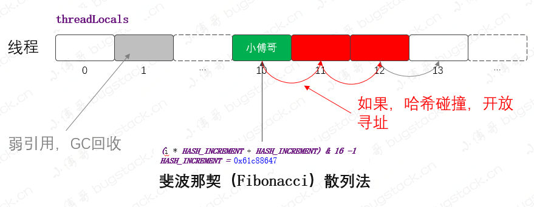
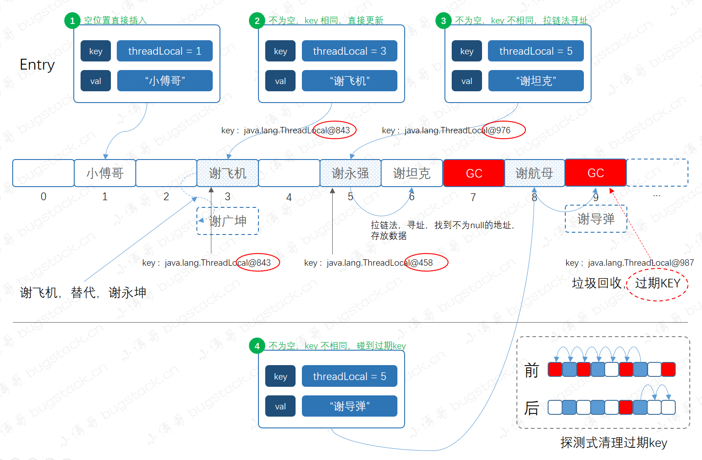

# java.lang.ThreadLocal

> `参考`
>
> [面经手册 · 第12篇：ThreadLocal](https://bugstack.cn/interview/2020/09/23/%E9%9D%A2%E7%BB%8F%E6%89%8B%E5%86%8C-%E7%AC%AC12%E7%AF%87-%E9%9D%A2%E8%AF%95%E5%AE%98-ThreadLocal-%E4%BD%A0%E8%A6%81%E8%BF%99%E4%B9%88%E9%97%AE-%E6%88%91%E5%B0%B1%E6%8C%82%E4%BA%86.html)
>
> [万字图文深度解析ThreadLocal](https://www.cnblogs.com/wang-meng/p/12856648.html)
>
> [ThreadLocal源码解读](https://www.cnblogs.com/micrari/p/6790229.html)

> **ThreadLocal应用场景**
>
> > `ThreadLocal` 要解决的是线程内资源共享 (*This class provides thread-local variables*)， 所以一般会用在全链路监控中，或者是像日志框架 `MDC` 这样的组件里。
>
> **涉及的知识点**
>
> > **`数据结构`、`拉链存储`、`斐波那契散列`、`神奇的0x61c88647`、`弱引用Reference`、`过期key探测清理和启发式清理`等等。**

## 1. 数据结构

> **这里说的数据结构不是指ThreadLocal数据结构，而是在每个Thread对象中的ThreadLocalMap数据结构，毕竟ThreadLocal是在ThreadLocalMap作为每个Entry的key存储的；**
>
> **其实如果单是 `斐波那契散列 + 开放寻址` 的话， 还是比较容易理解； 但由于又引入了弱引用Reference，就导致算法实现比较复杂，因为在处理散列冲突时，还需要同时处理被回收的weak Reference引用；**

**`以 new ThreadLocal<String>().set("小傅哥")` 的实现为例**

```java
public void set(T value) {
        Thread t = Thread.currentThread();
        ThreadLocalMap map = getMap(t);
        if (map != null)
            map.set(this, value);
        else
            createMap(t, value);
}
```



如上图是 `ThreadLocal` 存放数据的底层数据结构，包括知识点如下；

1. 它是一个数组结构。
2. `Entry`，这里没用再打开，其实它是一个弱引用实现，`static class Entry extends WeakReference<ThreadLocal<?>>`。这说明只要没用强引用存在，发生GC时就会被垃圾回收。
3. 数据元素采用哈希散列方式进行存储，不过这里的散列使用的是 `斐波那契（Fibonacci）散列法`，后面会具体分析。
4. 另外由于这里不同于HashMap的数据结构，发生哈希碰撞不会存成链表或红黑树，而是使用拉链法进行存储。也就是同一个下标位置发生冲突时，则`+1向后寻址`，直到找到空位置或垃圾回收位置进行存储。

## 2. Hash算法

> HashMap 使用 ***数组 + 链表, 即拉链法*** 存储数据；
>
> ThreadLocal 使用的是 ***斐波那契(Fibonacci)散列法 + 线性探测法*** 存储数据到数组结构中；
>
> Fibonacci 数列哈希算法来自数学公式计算：
>
> > **公式**：`f(k) = ((k * 2654435769) >> X) << Y`
> >
> > `对于常见的32位整数而言，也就是 f(k) = (k * 2654435769) >> 28`
>
> 线性探测法: 
>
> > 参考自: https://zh.wikipedia.org/wiki/%E7%BA%BF%E6%80%A7%E6%8E%A2%E6%B5%8B
> >
> > **当散列函数对一个给定值产生一个键，并且这个键指向散列表中某个已经被另一个键值对所占用的单元时，线性探测用于解决此时产生的冲突：查找散列表中离冲突单元最近的空闲单元，并且把新的键插入这个空闲单元。同样的，查找也同插入如出一辙：从散列函数给出的散列值对应的单元开始查找，直到找到与键对应的值或者是找到空单元。**
> >
> > > ***根据线性探测法的逻辑, 当从散列表中删除一个键值对时, 但是单独删除这个键值对是不对的, 因为这会影响到存储时间早于该键值对、但存储位置在该单元之后的其它键值对; 这样会导致搜索得到错误的结果;***

```java
private final int threadLocalHashCode = nextHashCode();

private static AtomicInteger nextHashCode = new AtomicInteger();

/*
这个字段的值来自一个哈希值的黄金分割点, 计算公式: (√5 - 1) / 2; 取相近值即 0.6180339887
之后用 2 ^ 32 * 0.6180339887, 得到的结果是: -1640531527, 也就是 16 进制的 0x61c88647;
*/
private static final int HASH_INCREMENT = 0x61c88647;

private static int nextHashCode() { 
  return nextHashCode.getAndAdd(HASH_INCREMENT);
}
```

### 2.1 验证1

```java
@Test
public void test_idx() {
    int hashCode = 0;
    for (int i = 0; i < 16; i++) {
        hashCode = i * HASH_INCREMENT + HASH_INCREMENT;
        int idx = hashCode & 15;
        System.out.println("斐波那契散列：" + idx + " 普通散列：" + 
                           (String.valueOf(i).hashCode() & 15));
    }
}
```

> 测试结果显示: 斐波那契散列的非常均匀，普通散列到15个以后已经开发生产碰撞。这也就是斐波那契散列的魅力，减少碰撞也就可以让数据存储的更加分散，获取数据的时间复杂度基本保持在O(1) 。

### 2.2 验证2

> **因为 `threadLocalHashCode` ，是一个私有属性，所以我们实例化后通过反射方式进行获取哈希值。**
>
> **根据 `threadLocalHashCode` 和 `nextHashCode` 这两个静态变量, 则每个ThreadLocal实例的 `threadLocalHashCode` 成员变量都是按照斐波那契数列的顺序确定的;**

```java
@Test
public void test_threadLocalHashCode() throws Exception {
    for (int i = 0; i < 5; i++) {
        ThreadLocal<Object> objectThreadLocal = new ThreadLocal<>();
        Field threadLocalHashCode = objectThreadLocal.getClass()
          	.getDeclaredField("threadLocalHashCode");
      
        threadLocalHashCode.setAccessible(true);
        System.out.println("objectThreadLocal：" + threadLocalHashCode.get(objectThreadLocal));
    }
}
```

> 结果: 
>
> ```java
> objectThreadLocal：-1401181199
> objectThreadLocal：239350328
> objectThreadLocal：1879881855
> objectThreadLocal：-774553914
> objectThreadLocal：865977613
> ```

## 3. 源码

### 3.1 初始化

```java
//默认构造方法创建的ThreadLocal实例, 调用它的initialValue() 方法返回null;
public ThreadLocal() { } 
protected T initialValue() {return null;}

//创建子类SuppliedthreadLocal实例, 该类覆写了initialValue()方法, 返回值为supplier.get();
public static <S> ThreadLocal<S> withInitial(Supplier<? extends S> supplier) {
  return new SuppliedThreadLocal<>(supplier);
}

//SuppliedThreadLocal 是定义在ThreadLocal中的内部类, 同时也是ThreadLocal的子类
//它重写了ThreadLocal#initialValue()方法, 返回 supplier.get()
static final class SuppliedThreadLocal<T> extends ThreadLocal<T> {
        private final Supplier<? extends T> supplier;

        SuppliedThreadLocal(Supplier<? extends T> supplier) {
            this.supplier = Objects.requireNonNull(supplier);
        }

        @Override protected T initialValue() { return supplier.get(); }
}
```

### 3.2 设置元素

#### 3.2.1 图示

> **在 `new ThreadLocal<String>().set("小傅哥")` 调用时可能出现的情况如下:**



> 乍一看可能感觉有点晕，我们从左往右看，分别有如下知识点；
>
> 1. 中间是 `ThreadLocal` 的数组结构，之后在设置元素时分为四种不同的情况，另外元素的插入是通过斐波那契散列计算下标值，进行存放的。
> 2. 情况1，待插入的下标，是空位置直接插入。
> 3. 情况2，待插入的下标，不为空，key 相同，直接更新
> 4. 情况3，待插入的下标，不为空，key 不相同，拉链法寻址
> 5. 情况4，不为空，key 不相同，碰到过期key。其实情况4，遇到的是弱引用发生GC时，产生的情况。碰到这种情况，`ThreadLocal` 会进行探测清理过期key，这部分清理内容后续讲解。

#### 3.2.2 ThreadLocal.ThreadLocalMap#set()源码

> **for循环中的逻辑：**
>
> 1. **`遍历当前`key`值对应的桶中`Entry`数据为空，这说明散列数组这里没有数据冲突，跳出`for`循环，直接`set`数据到对应的桶中`**
> 2. **`如果`key`值对应的桶中`Entry`数据不为空`**
>    2.1 **`如果`k = key`，说明当前`set`操作是一个替换操作，做替换逻辑，直接返回`**
>    2.2 **`如果`key = null`，说明当前桶位置的`Entry`是过期数据，执行`replaceStaleEntry()`方法(核心方法)，然后返回`**
> 3. **`for`循环执行完毕，继续往下执行说明向后迭代的过程中遇到了`entry`为`null`的情况**
>    3.1 **`在`Entry`为`null`的桶中创建一个新的`Entry`对象`**
>    3.2 **`执行++size操作`**
> 4. **`调用`cleanSomeSlots()`做一次启发式清理工作，清理散列数组中`Entry`的`key`过期的数据`**
>    4.1 **`如果清理工作完成后，未清理到任何数据，且`size`超过了阈值(数组长度的2/3)，进行`rehash()`操作`**
>    4.2 **`rehash()`中会先进行一轮探测式清理，清理过期`key`，清理完成后如果**size >= threshold - threshold / 4**，就会执行真正的扩容逻辑(扩容逻辑往后看)`**

```java
private void set(ThreadLocal<?> key, Object value) {

    Entry[] tab = table;
    int len = tab.length;
    int i = key.threadLocalHashCode & (len-1); //计算key本来要放置的数组索引值;

    //拉链法寻址: 
    //1.如果没有过期元素, 则从i位置开始, 往后找到第一个非null索引, 并创建Entry放到对应位置处; 
    //2.如果向后遍历过程中, 先遇到了被回收的元素, 则调用replaceStaleEntry进行处理;
    for (Entry e = tab[i]; e != null; e = tab[i = nextIndex(i, len)]) {
      	ThreadLocal<?> k = e.get();

        if (k == key) { e.value = value; return; } //Entry的key与参数k相同, 直接更新value

        //对应entry.key已被回收, 调用replaceStaleEntry, 探测式清理过期元素
        if (k == null) { replaceStaleEntry(key, value, i); return; }
    }
         
    tab[i] = new Entry(key, value); //若i处为null, 直接创建Entry实例后存储;
    int sz = ++size;
    if (!cleanSomeSlots(i, sz) && sz >= threshold)
        rehash();
}
```


#### 3.2.3 ThreadLocal.ThreadLocalMap#replaceStaleEntry()源码

> **哈希冲突并且在向后遍历查找Entry时，优先遇到了key被回收的Entry，调用replaceStaleEntry方法；**
>
> > **`由于可能会发生查找到key相同的Entry之间先遇到被回收的Entry，所以本方法中也会处理遇到key相同的情况；`**
>
> > ```html
> > slotToExpunge`表示开始探测式清理过期数据的开始下标，默认从当前的`staleSlot`开始。以当前的`staleSlot`开始，向前迭代查找，找到没有过期的数据，`for`循环一直碰到`Entry`为`null`才会结束。如果向前找到了过期数据，更新探测清理过期数据的开始下标为i，即`slotToExpunge=i
> > ```

```java
//param staleSlot: 弱引用对象被回收的Entry对应的数组索引;
private void replaceStaleEntry(ThreadLocal<?> key, Object value, int staleSlot) {
    Entry[] tab = table;
    int len = tab.length;
    Entry e;
    
    /*
    遇到了被回收的Entry, 肯定需要调用expungeStaleEntry方法来清除过期Entry;
    
    这里 slotToExpunge 变量的作用, 是尽量获取一个 过期元素slot到next null slot的扫描范围, 
    之后 slotToExpunge 会作为expungeStaleEntry方法的参数传入;
    */
  
    int slotToExpunge = staleSlot;// 从staleSlot开始, 往前和往后找到最近key被回收的数组索引, 作为界限值;
           
    // 往前寻找最左端的过期元素slot
    for (int i = prevIndex(staleSlot, len); (e = tab[i]) != null; i = prevIndex(i, len))
        if (e.get() == null)
            slotToExpunge = i;

    // 往后寻找可能的key对应的Entry以及最左端的过期元素slot(如果上面往前寻找没有找到的话)       
    for (int i = nextIndex(staleSlot, len);  (e = tab[i]) != null; i = nextIndex(i, len)) {
        ThreadLocal<?> k = e.get();

        /*
        如果迭代过程中，碰到k == key，这说明这里是替换逻辑，替换新数据并且交换当前staleSlot位置。
        如果slotToExpunge == staleSlot，这说明replaceStaleEntry()一开始向前查找过期数据时并未找到过期的
        Entry数据，接着向后查找过程中也未发现过期数据，修改开始探测式清理过期数据的下标为当前循环的index，
        即slotToExpunge = i。最后调用cleanSomeSlots(expungeStaleEntry(slotToExpunge), len);
				进行启发式过期数据清理。
        */
        if (k == key) {
          	e.value = value;
						
            tab[i] = tab[staleSlot];
            tab[staleSlot] = e;
                  
            if (slotToExpunge == staleSlot) slotToExpunge = i;
                   
            cleanSomeSlots(expungeStaleEntry(slotToExpunge), len);
            return;
        }

				/*
				如果k != key则会接着往下走，k == null说明当前遍历的Entry是一个过期数据，slotToExpunge == staleSlot
				说明，一开始的向前查找数据并未找到过期的Entry。如果条件成立，则更新slotToExpunge 为当前位置，
				这个前提是前驱节点扫描时未发现过期数据。
				*/
        if (k == null && slotToExpunge == staleSlot)       
          	slotToExpunge = i;
    }

    //没有找到包含key的entry, 直接在staleSlot处释放原value并创建新Entry
    tab[staleSlot].value = null; 
    tab[staleSlot] = new Entry(key, value);

    // 判断除了staleSlot以外，还发现了其他过期的slot数据，就要开启清理数据的逻辑：
    if (slotToExpunge != staleSlot)
        cleanSomeSlots(expungeStaleEntry(slotToExpunge), len);
        
}
```


### 3.3 探测式清理过期元素 ThreadLocal.ThreadLocalMap#expungeStaleEntry

> **原英文注释：Expunge a stale entry by rehashing any possibly colliding entries lying between staleSlot and the next null slot.  This also expunges any other stale entries encountered before the trailing null.  See Knuth, Section 6.4**
>
> **清除从 `staleSlot ~ 下一个null值slot` 之间的过期元素; 并对位于它们之间的元素进行rehash; **
>
> > **参数和返回值：**
> >
> > **`staleSlot： 已知的key被回收的Entry索引值`**
> >
> > **`返回值： the index of next null slot after staleSlot.`**

```java
private int expungeStaleEntry(int staleSlot) {
  	Entry[] tab = table;
  	int len = tab.length;

  	// 释放staleSlot处的Entry空间, 并递减size值
  	tab[staleSlot].value = null;
  	tab[staleSlot] = null;
  	size--;

    // 遍历从staleSlot的下一索引值到next null slot之间的元素，
    // 清除其它已被释放的Entry，并对可能的冲突Entry进行rehash
  	Entry e;
  	int i;
          
  	for (i = nextIndex(staleSlot, len); (e = tab[i]) != null; i = nextIndex(i, len)) {
      	ThreadLocal<?> k = e.get();
      	if (k == null) {
          	e.value = null;
          	tab[i] = null;
          	size--;
        } else {
          	int h = k.threadLocalHashCode & (len - 1);
          
          	if (h != i) {
              	tab[i] = null;
              	
                /*
                 * 在原代码的这里有句注释值得一提，原注释如下：
                 *
                 * Unlike Knuth 6.4 Algorithm R, we must scan until
                 * null because multiple entries could have been stale.
                 *
                 * 这段话提及了Knuth高德纳的著作TAOCP（《计算机程序设计艺术》）的6.4章节（散列）
                 * 中的R算法。R算法描述了如何从使用线性探测的散列表中删除一个元素。
                 * R算法维护了一个上次删除元素的index，当在非空连续段中扫到某个entry的哈希值取模后的索引
                 * 还没有遍历到时，会将该entry挪到index那个位置，并更新当前位置为新的index，
                 * 继续向后扫描直到遇到空的entry。
                 *
                 * ThreadLocalMap因为使用了弱引用，所以其实每个slot的状态有三种也即
                 * 有效（value未回收），无效（value已回收），空（entry==null）。
                 * 正是因为ThreadLocalMap的entry有三种状态，所以不能完全套高德纳原书的R算法。
                 *
                 * 因为expungeStaleEntry函数在扫描过程中还会对无效slot清理将之转为空slot，
                 * 如果直接套用R算法，可能会出现具有相同哈希值的entry之间断开（中间有空entry）。
                 */
              	while (tab[h] != null)
                  	h = nextIndex(h, len);
                       
              	tab[h] = e;
            }
        }
    }
    return i;
}
```


### 3.4 启发式清理 cleanSomeSlots

> **启发式清理**，有这么一段注释，大概意思是；试探的扫描一些单元格，寻找过期元素，也就是被垃圾回收的元素。*当添加新元素或删除另一个过时元素时，将调用此函数。它执行对数扫描次数，作为不扫描（快速但保留垃圾）和与元素数量成比例的扫描次数之间的平衡，这将找到所有垃圾，但会导致一些插入花费O（n）时间。*
>
> > **`说明：第二个参数n一般都是传入table长度len，而cleanSomeSlots的目的是从参数i的下一个位置开始，尝试测试其是否是过期Entry，测试的Entry个数为 (len>>>=1) 直至到0；但是如果在测试过程中找到了过期元素，则会重置n为table len，并重新测试；`**

```java
private boolean cleanSomeSlots(int i, int n) {
           
  	boolean removed = false;
           
  	Entry[] tab = table;
  	int len = tab.length;
          
  	do {
      	i = nextIndex(i, len);
               
      	Entry e = tab[i];
                
      	if (e != null && e.get() == null) {
          	n = len;
          	removed = true;
                   
          	i = expungeStaleEntry(i);
        	}
           
    	} while ( (n >>>= 1) != 0);
            
  	return removed;
}
```


### 3.5 获取Entry ThreadLocal.ThreadLocalMap#getEntry方法

```java
private Entry getEntry(ThreadLocal<?> key) {
  	int i = key.threadLocalHashCode & (table.length - 1);
    
  	Entry e = table[i];
    
  	if (e != null && e.get() == key) //找到key对应的Entry, 直接返回
      	return e;
  	else
      return getEntryAfterMiss(key, i, e);      
}
```


#### 3.5.1 未找到key对应的Entry时的处理方法 getEntryAfterMiss

```java
private Entry getEntryAfterMiss(ThreadLocal<?> key, int i, Entry e) {
        
  	Entry[] tab = table;
  	int len = tab.length;

  	while (e != null) {
      	ThreadLocal<?> k = e.get();
        
      	if (k == key)
          	return e;
            
      	if (k == null)
          	expungeStaleEntry(i);
      	else
          	i = nextIndex(i, len);
      		
      	e = tab[i];
    }
        
  	return null; //如果i索引处的Entry为null, 则直接返回null
}
```


### 3.6 扩容机制 ThreadLocal.ThreadLocalMap#rehash()

```java
private void rehash() {
  	expungeStaleEntries(); //先尝试清除过期Entry, 如果清除之后size也超出阈值, 再调用resize()

  	if (size >= threshold - threshold / 4)
      	resize();
}

private void expungeStaleEntries() { //从开始遍历整个table, 清除回收的Entry
            
  	Entry[] tab = table;
    
  	int len = tab.length;
         
  	for (int j = 0; j < len; j++) {
      	Entry e = tab[j];
               
      	if (e != null && e.get() == null)
          	expungeStaleEntry(j);
    }
}

  //扩容table, 并将原table中的元素存储进新table中, 当然中间也要处理可能的过期Entry
	private void resize() { 
            Entry[] oldTab = table;
            int oldLen = oldTab.length;
            int newLen = oldLen * 2;
            Entry[] newTab = new Entry[newLen];
            int count = 0;

            for (int j = 0; j < oldLen; ++j) {
                Entry e = oldTab[j];
                if (e != null) {
                    ThreadLocal<?> k = e.get();
                    if (k == null) {
                        e.value = null; // Help the GC
                    } else {
                        int h = k.threadLocalHashCode & (newLen - 1);
                        while (newTab[h] != null)
                            h = nextIndex(h, newLen);
                        newTab[h] = e;
                        count++;
                    }
                }
            }

            setThreshold(newLen);
            size = count;
            table = newTab;
      
  }
```
