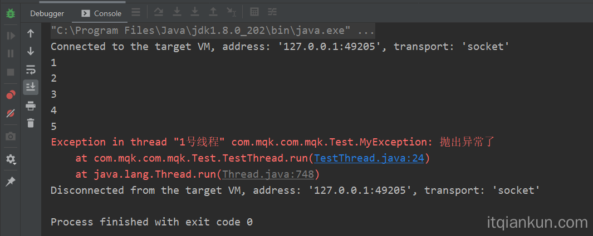
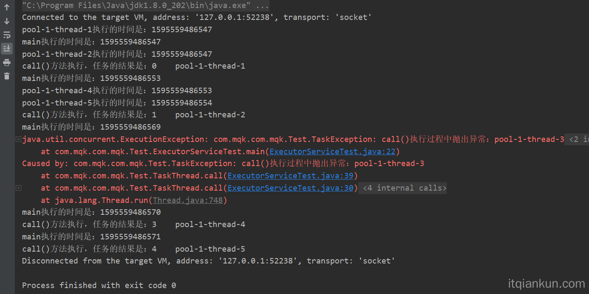
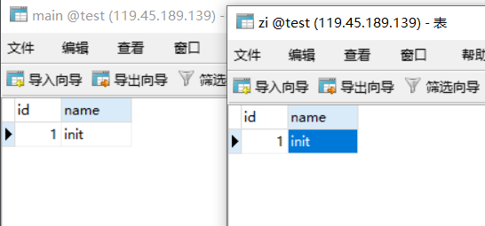
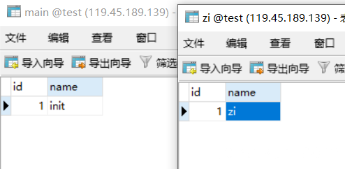
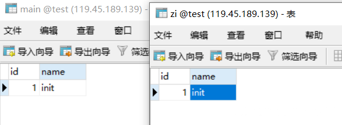
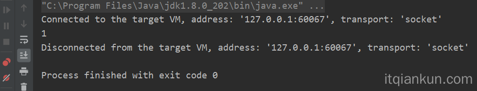
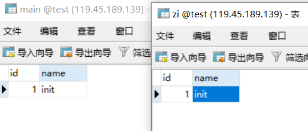
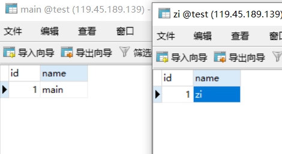

### 实战学习多线程抛出异常处理(含事务)

> 转载自：https://www.itqiankun.com/article/many-thread-exception

## 正常情况下：主线程为什么捕获不到子线程异常

多线程设计的主要初衷是线程运行是互相独立的。如果线程之间异常互相干扰，那么1000个线程，一个线程挂了，其它线程跟着遭殃，这是不合理的，所以正常情况下每一个线程的异常都是独立的，此时主线程捕获不到子线程异常时正常的，子线程的异常只能抛给子线程

```java
package com.mqk.com.mqk.Test;

class MyException extends RuntimeException{    
  	public  MyException(String str){       
      	super(str);    
    }
}

public class TestThread implements Runnable{   
  	private volatile Integer num = 1;   
  	public static void main(String[] args) {       
      	Thread t = new Thread(new TestThread());    
      	t.setName("1号线程");      
      	t.start();   
    }    
  
  	@Override  
  	public void run() {   
      	while (true){
          	System.out.println(num);       
          	if(num == 5){              
              	throw new MyException("抛出异常了"); 
            }           
          	num++;
        } 
    }
}
```

此时子线程的异常时抛给了子线程（1号线程）



### 自定义子线程异常处理

我们可以使用实现Thread.UncaughtExceptionHandler来自定义子线程处理方式，而且这样把异常处理业务和子线程业务也分开了

```java
package com.mqk.com.mqk.Test;
class MyException extends RuntimeException{ 
  	public  MyException(String str){      
      	super(str);  
    }
}

class MyUnchecckedExceptionhandler implements Thread.UncaughtExceptionHandler { 
  	@Override
  	public void uncaughtException(Thread t, Throwable e) {      
      	System.out.println("当前线程是："+Thread.currentThread().getName());        
      	System.out.println("自定义处理子线程抛出异常");   
    }
}

public class TestThread implements Runnable{   
  	private volatile Integer num = 1;   
  
  	public static void main(String[] args) {    
      	Thread t = new Thread(new TestThread());        
      	t.setName("1号线程");      
      	t.setUncaughtExceptionHandler(new MyUnchecckedExceptionhandler());     
      	t.start();
    } 
  
  	@Override   
  	public void run() {       
      	while (true){          
          	System.out.println(num);      
          	if(num == 5){                
              	throw new MyException("抛出异常了");     
            }
          
          	num++;
        } 
    }
}
```

此时可以看到子线程抛出异常之后，子线程停止了，然后MyUnchecckedExceptionhandler里面的uncaughtException被执行，而且此时可以看这个调用MyUnchecckedExceptionhandler里面的uncaughtException方法的线程还是`子线程(1号线程)`


## 主线程怎么捕获子线程的异常

### 一 Callable和Future配合使用抛出异常

```java
package com.mqk.com.mqk.Test;

import java.util.ArrayList;
import java.util.List;
import java.util.concurrent.*;

public class ExecutorServiceTest {   
  	public static void main(String[] args) { 
      	ExecutorService executorService = Executors.newCachedThreadPool();    
      
      	List<Future<String>> resultList = new ArrayList<Future<String>>();     
      	// 创建5个线程任务      
      	for (int i = 0; i < 5; i++) {   
          	Future<String> future = executorService.submit(new TaskThread(i));   
          	// 将任务执行结果存储到List中         
          	resultList.add(future);     
        }      
      
      	executorService.shutdown();        

				// 遍历任务的结果  
      	for (Future<String> fs : resultList) {   
          	try {              
              	System.out.println(Thread.currentThread().getName()
                                   +"执行的时间是："+System.currentTimeMillis());   
              	System.out.println(fs.get());      
            } catch (Exception e) {          
              	e.printStackTrace();           
            }
        }
    }
}

class TaskThread implements Callable<String> { 
  	private int id;   
  
  	public TaskThread(int id) {    
      	this.id = id;   
    } 
  
  	public String call() {     
      	if (id == 2 )           
          	throw new TaskException("call()执行过程中抛出异常：" + Thread.currentThread().getName()); 
      
      	System.out.println(Thread.currentThread().getName()+"执行的时间是："+System.currentTimeMillis());        
      
      	//这里模拟具体代码的逻辑       
      	for (int i = 999999999; i > 0; i--)   
          	;        
      
      	return "call()方法执行，任务的结果是：" + id + "    " + Thread.currentThread().getName();    
    }
}

class TaskException extends RuntimeException { 
  	public TaskException(String message) {    
      	super(message);  
    }
}
```

此时结果如下所示，可以看出，此时虽然第三个线程抛出了异常，但是此时的第四个第五个线程的call方法还都是执行完成了的，说明多个子线程里面的异常时不受影响的

然后main线程捕获到了线程池里面的第三个子线程的异常，因为被捕获了，所以main方法没有被阻塞，因此for循环里面把第四个和第五个线程的返回值也打印出来了



当然这里可以在main线程里面处理异常的时候向上抛出一个异常，这样如果main()方法是一个事务方法的话，这个事务就能够捕获到方法里面的子线程里面的异常了，但是这个事务会不会把子线程里面的操作回滚了？下面来求实一下

**Controller层**

```java
@Controller
public class TestController {   
	
  	@Autowired   
  	private ThreadTestService threadTestService;  
  
  	@GetMapping("/thread")    
  	public String thread(){       
      	threadTestService.threadTestTransactional();     
      	return "ok";  
    }
}
```

**service层**

```java
@Service
public class ThreadTestServiceImpl implements ThreadTestService {   
  	@Autowired   
  	public MainThreadMapper mainThreadMapper; 
  
  	@Autowired   
  	public ZiThreadMapper ziThreadMapper;   
  
  	@Override   
  	@Transactional 
  	public void threadTestTransactional() {        
      	ExecutorService executorService = Executors.newCachedThreadPool();   
      	List<Future<String>> resultList = new ArrayList<Future<String>>();        
      	
      	mainThreadMapper.updateById(1,"main");     
      
      	for (int i = 0; i < 1; i++) {           
          	Future<String> future = executorService.submit(new TaskThread(ziThreadMapper));            
          
          	// 将任务执行结果存储到List中           
          	resultList.add(future);       
        }      
      
      	executorService.shutdown();     
      
      	// 遍历任务的结果       
      	for (Future<String> fs : resultList) {         
          	try {             
              	System.out.println(fs.get());            
            } catch (Exception e) {              
              	throw new MyException("子线程抛出异常了");      
            }    
        }
    }
}

class TaskThread implements Callable<String> {  
  	private ZiThreadMapper ziThreadMapper;   
  
  	public TaskThread(ZiThreadMapper ziThreadMapper){     
      	this.ziThreadMapper = ziThreadMapper;    
    }
  
  	public String call() {     
      	ziThreadMapper.updateById(1,"zi");   
      	System.out.println("子线程执行成功");       
      	throw new MyException("call()执行过程中抛出异常：" + Thread.currentThread().getName());  
    }
}
```

**mapper层**

```java
@Mapper
@Repository
public interface MainThreadMapper { 
  	void updateById(@Param("id") Integer id, @Param("name") String name);
}

@Mapper
@Repository
public interface ZiThreadMapper {  
  	void updateById(@Param("id") Integer id, @Param("name") String name);
}
```

**mapper.xml层**

```xml
<?xml version="1.0" encoding="UTF-8"?>
<!DOCTYPE mapper PUBLIC "-//mybatis.org//DTD Mapper 3.0//EN" "http://mybatis.org/dtd/mybatis-3-mapper.dtd">
<mapper namespace="com.itqiankun.demo.mapper.MainThreadMapper">  
  	<update id="updateById">   
      update main    set name=#{name}    where id = #{id,jdbcType=INTEGER} 
  	</update>
</mapper>

<?xml version="1.0" encoding="UTF-8"?>
<!DOCTYPE mapper PUBLIC "-//mybatis.org//DTD Mapper 3.0//EN" "http://mybatis.org/dtd/mybatis-3-mapper.dtd">
<mapper namespace="com.itqiankun.demo.mapper.ZiThreadMapper"> 
  	<update id="updateById">   
      update zi    set name=#{name}    where id = #{id,jdbcType=INTEGER}  
  	</update>
</mapper>
```

**数据库层**



**执行接口：** `localhost:9000/thread`

**然后后台抛出异常，截图部分**

```java
com.itqiankun.demo.service.impl.MyException: 子线程抛出异常了
    at com.itqiankun.demo.service.impl.ThreadTestServiceImpl.threadTestTransactional(ThreadTestServiceImpl.java:40) ~[classes/:na]
    at com.itqiankun.demo.service.impl.ThreadTestServiceImpl$$FastClassBySpringCGLIB$$53e6cfa8.invoke(<generated>) ~[classes/:na]
```

此时可以看到这种情况是可以让子线程里面的事务没有回滚的，不过主线程里面的事务是回滚了的



看上面的结果，后来发现是子线程类不归spring容器处理，所以子线程里面的事务没有回滚，所以我们把service层里面的代码变成下面这样，让子线程这个类交给spring管理

```java
@Service
public class ThreadTestServiceImpl implements ThreadTestService {    
  	@Autowired   
  	public MainThreadMapper mainThreadMapper; 
  
  	@Autowired  
  	public ZiThreadMapper ziThreadMapper;    
  
  	@Autowired    
  	private TaskThread taskThread;  
  
  	@Override   
  	@Transactional  
  	public void threadTestTransactional() {      
      	ExecutorService executorService = Executors.newCachedThreadPool();    
      	List<Future<String>> resultList = new ArrayList<Future<String>>();        
      	mainThreadMapper.updateById(1,"main");   
      
      	for (int i = 0; i < 1; i++) {        
          	Future<String> future = executorService.submit(taskThread);           
          	// 将任务执行结果存储到List中           
          	resultList.add(future);       
        }       
      
      	executorService.shutdown();     
      
      	// 遍历任务的结果      
      	for (Future<String> fs : resultList) {          
          	try {               
              	System.out.println(fs.get());         
            } catch (Exception e) {      
              	throw new MyException("子线程抛出异常了");         
            }       
        } 
    }
}

@Component
class TaskThread implements Callable<String> {   
  	@Autowired    
  	private ZiThreadMapper ziThreadMapper;  
  
  	@Transactional   
  	public String call() {     
      	ziThreadMapper.updateById(1,"zi");    
      	System.out.println("子线程执行成功");     
      	throw new MyException("call()执行过程中抛出异常：" + Thread.currentThread().getName());  
    }
}
```

执行结果如下所示,`子线程执行成功`打印出来，表示子线程执行成功了

```java
子线程执行成功
2020-07-29 18:50:48.560 ERROR 21912 --- [nio-9000-exec-1] o.a.c.c.C.[.[.[/].[dispatcherServlet]    : Servlet.service() for servlet [dispatcherServlet] in context with path [] threw exception [Request processing failed; nested exception is com.itqiankun.demo.service.impl.MyException: 子线程抛出异常了] with root cause
com.itqiankun.demo.service.impl.MyException: 子线程抛出异常了
    at com.itqiankun.demo.service.impl.ThreadTestServiceImpl.threadTestTransactional(ThreadTestServiceImpl.java:42) ~[classes/:na]
```

然而数据库里面里面的是没有变化的，表明子线程里面的事务也回滚了



### 二 使用CompletableFuture.exceptionally来捕获子线程里面的异常

CompletableFuture是1.8之后引入的新类，它的出现时为了解决Future获取值比较困难问题(在Future里面获取值的时候，要么轮询isDone()，确认完成后，调用get()获取值；要么调用get(), 但是这个get()方法会阻塞住调用线程)，思想是借助了guava里面的监听机制，然后给我们封装好了一些异步方法，我们直接使用就好了

**CompletableFuture.exceptionally捕获异常的方式**

```java
public static void main(String[] args) {  
  	CompletableFuture.supplyAsync( () -> {
      	System.out.println(1);          
      	throw new MyException("异步抛出异常了");      
    }).exceptionally(ex->{     
      	throw new MainException("主线程抛出异常了");  
    });
}
```

此时从下面的图片也可以看出来，这里子线程里面抛出异常后，然后在exceptionally()方法里面抛出异常，但是主线程里面是不会捕获到这个异常的，为什么，暂时不清楚？



在这种情况下，我觉得的主线程是捕获不到子线程里面抛出的异常的，下面验证一下，只是修改上面的service层里面的代码

```java
@Service
public class ThreadTestServiceImpl implements ThreadTestService {  
  	@Autowired
  	public MainThreadMapper mainThreadMapper;  
  
  	@Autowired
  	public ZiThreadMapper ziThreadMapper;  
  
  	@Override
  	@Transactional   
  	public void threadTestTransactional() {     
      	mainThreadMapper.updateById(1,"main");      
      	CompletableFuture.supplyAsync(() -> {          
          ziThreadMapper.updateById(1,"zi");          
          throw new MyException("异步抛出异常了");       
        }).exceptionally(ex->{          
          throw new MyException("抛出异常了");        
        }); 
    }
}
```

然后数据库里面的原来代码如下：



执行完`localhost:9000/thread`之后结果如下：此时可以看出来主线程和子线程的异常都没有抛出

