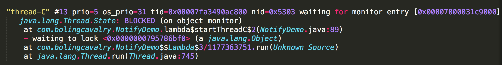

# Java Wait/Notify JVM源码实现分析

> 参考网址:
>
> > https://blog.csdn.net/boling_cavalry/article/details/77793224
> >
> > https://blog.csdn.net/boling_cavalry/article/details/77897108
> >
> > https://blog.csdn.net/boling_cavalry/article/details/77995069
> >
> > > 三篇文章的学习目标：
> > >
> > > 一、通过阅读openjdk8的源码，分析和理解wait，notify在JVM中的具体执行过程；
> > > 二、修改JVM源码，编译构建成新的JVM，把我们感兴趣的参数打印出来，结合具体代码检查和我们的理解是否一致；
> > > 三、修改JVM源码，编译构建成新的JVM，按照我们的理解去修改关键参数，看能否达到预期效果；
>
> **注: 参考网址是基于openjdk8进行分析，而本机搭建的是openjdk12版本，中间可能有出入；**

## 1. wait & notify 的通常用法

> Java多线程开发中，我们常用到wait()和notify()方法来实现线程间的协作，简单的说步骤如下：
>
> 1. A线程取得锁，执行wait()，释放锁;
> 2. B线程取得锁，完成业务后执行notify()，再释放锁;
> 3. B线程释放锁之后，A线程取得锁，继续执行wait()之后的代码；

##### 1.1关于 Synchronized 修饰的代码块

> 通常，对于synchronize(lock){…}这样的代码块，编译后会生成monitorenter和monitorexit指令，线程执行到monitorenter指令时会尝试取得lock对应的monitor的所有权（CAS设置对象头），取得后即获取到锁，执行monitorexit指令时会释放monitor的所有权即释放锁；
>
> > **注： 关于偏向锁、轻量级锁以及锁膨胀等不属于本资料的重点说明；**

## 2. 示例代码

```java
package idea;

public class NotifyDemo {

    private static void sleep(long sleepVal){
        try{
            Thread.sleep(sleepVal);
        }catch(Exception e){
            e.printStackTrace();
        }
    }

    private static void log(String desc){
        System.out.println(Thread.currentThread().getName() + " : " + desc);
    }

    private final Object lock = new Object();

    private void startThreadA(){
        new Thread(() -> {
            synchronized (lock){
                log("get lock");
                startThreadB();
                log("start wait");
                try {
                    lock.wait();
                }catch(InterruptedException e){
                    e.printStackTrace();
                }

                log("get lock after wait");
                log("release lock");
            }
        }, "thread-A").start();
    }

    private void startThreadB(){
        new Thread(()->{
            synchronized (lock){
                log("get lock");
                startThreadC();
                sleep(100);
                log("start notify");
                lock.notify();
                log("release lock");

            }
        },"thread-B").start();
    }

    private void startThreadC(){
        new Thread(() -> {
            synchronized (lock){
                log("get lock");
                log("release lock");
            }
        }, "thread-C").start();
    }

    public static void main(String[] args){
        new NotifyDemo().startThreadA();
    }
}
```

> 关于上面代码的执行逻辑:
>
> 1. 启动线程A，取得锁之后先启动线程B再执行wait()方法，释放锁并等待；
>
> 2. 线程B启动之后会等待锁，A线程执行wait()之后，线程B取得锁，然后启动线程C，再执行notify唤醒线程A，最后退出synchronize代码块，释放锁；
>
> 3. 线程C启动之后就一直在等待锁，***这时候线程B还没有退出synchronize代码块，锁还在线程B手里；***
>
> 4. 线程A在线程B执行notify()之后就一直在等待锁，***这时候线程B还没有退出synchronize代码块，锁还在线程B手里；***
>
> 5. 线程B退出synchronize代码块，***释放锁之后，线程A和线程C竞争锁（重点要分析的问题）；***
>
>    > ***本文要分析的问题：当线程B退出synchronizer代码块时，线程A由于B调用 lock.notify() 而唤醒，线程C由于B线程退出后竞争锁；***
>    >
>    > ***那么： 线程A 和 线程C 谁先获取到锁？？？***
>    >
>    > > ***按个人原有想法，B退出后，A/C 公平竞争锁，应该谁都有可能先争抢到锁之后执行；***
>    > >
>    > > ***但是如果执行示例代码，结果却显示总是 线程A先得到锁后执行，下面将进行分析；***

## 3. 问题分析

### 3.1 示例代码结果提出的问题

> ***第一个问题：将以上代码反复执行多次，结果都是B释放锁之后A会先得到锁，这又是为什么呢？C为何不能先拿到锁呢？***
>
> ***第二个问题：线程C自开始就执行了monitorenter指令，它能得到锁是容易理解的，但是线程A呢？在wait()之后并没有没有monitorenter指令，那么它又是如何取得锁的呢？***

### 3.2 查看JVM源码的重点

> 1. ***线程A在wait()的时候做了什么？***
> 2. ***线程C启动后，由于此时线程B持有锁，那么线程C此时在干啥？***
> 3. ***线程B在notify()的时候做了什么？***
> 4. ***线程B释放锁的时候做了什么？***

### 3.3 关于ObjectMonitor 和 ObjectWaiter 

> 在 ObjectMonitor中定义了几个重要的字段，这些字段可能会在下面的说明中接触；

```c++
class ObjectMonitor {
	public:
  enum {
    OM_OK,                    // no error
    OM_SYSTEM_ERROR,          // operating system error
    OM_ILLEGAL_MONITOR_STATE, // IllegalMonitorStateException
    OM_INTERRUPTED,           // Thread.interrupt()
    OM_TIMED_OUT              // Object.wait() timed out
  };
  
  protected:
    void *  volatile _owner;          // 当前获取到锁的线程id
  	volatile jlong _previous_owner_tid;  //前一个获取的锁的线程id
    volatile intptr_t  _recursions;  //当前线程重入次数
    ObjectWaiter * volatile _EntryList; //获取锁失败的线程对应的ObjectWaiter列表
  
    ObjectWaiter * volatile _WaitSet; // wait()线程链表
    volatile jint  _waiters;          // 在wait锁的线程数量;
  
  private:
  	ObjectWaiter * volatile _cxq; //最近到达的获取锁失败的线程链表
    Thread * volatile _succ; // Heir presumptive thread - used for futile wakeup throttling

  
  //...略
}
```


```c++
class ObjectWaiter : public StackObj {
 public:
  enum TStates { TS_UNDEF, TS_READY, TS_RUN, TS_WAIT, TS_ENTER, TS_CXQ };
  enum Sorted  { PREPEND, APPEND, SORTED };
  ObjectWaiter * volatile _next;
  ObjectWaiter * volatile _prev;
  Thread*       _thread;
  jlong         _notifier_tid;
  ParkEvent *   _event;
  volatile int  _notified;
  volatile TStates TState;
  Sorted        _Sorted;           // List placement disposition
  bool          _active;           // Contention monitoring is enabled
 public:
  ObjectWaiter(Thread* thread);

  void wait_reenter_begin(ObjectMonitor *mon);
  void wait_reenter_end(ObjectMonitor *mon);
};
```


## 4. wait()源码

> ```c++
> // src/hotspot/share/runtime/objectMonitor.cpp
> // Object#wait() 方法对应如下native方法
> void ObjectMonitor::wait(jlong millis, bool interruptible, TRAPS) {
>   Thread * const Self = THREAD; //Self指代当前线程
>   assert(Self->is_Java_thread(), "Must be Java thread!");
>   JavaThread *jt = (JavaThread *)THREAD;
>   //...略
> 
>   ObjectWaiter node(Self); //使用当前线程构造ObjectWaiter类型的node实例;
>   node.TState = ObjectWaiter::TS_WAIT; //设置调用 wait()方法的线程state为 TS_WAIT
>   Self->_ParkEvent->reset();   //略
>   OrderAccess::fence(); //内存屏障          // ST into Event; membar ; LD interrupted-flag
> 
>   // Enter the waiting queue, which is a circular doubly linked list in this case
>   // but it could be a priority queue or any data structure.
>   // _WaitSetLock protects the wait queue.  Normally the wait queue is accessed only
>   // by the the owner of the monitor *except* in the case where park()
>   // returns because of a timeout of interrupt.  Contention is exceptionally rare
>   // so we use a simple spin-lock instead of a heavier-weight blocking lock.
> 
>   Thread::SpinAcquire(&_WaitSetLock, "WaitSet - add");
>   AddWaiter(&node); //==================
>   Thread::SpinRelease(&_WaitSetLock);
>    
>   _Responsible = NULL;
> 
>   intptr_t save = _recursions; // record the old recursion count
>   _waiters++;                  // increment the number of waiters
>   _recursions = 0;             // set the recursion level to be 1
>   exit(true, Self);                    // exit the monitor
>   guarantee(_owner != Self, "invariant");
> 
>   int ret = OS_OK;
>   int WasNotified = 0;
>   { // State transition wrappers
>     OSThread* osthread = Self->osthread();
>     OSThreadWaitState osts(osthread, true);
>     {
>       ThreadBlockInVM tbivm(jt);
>       // Thread is in thread_blocked state and oop access is unsafe.
>       jt->set_suspend_equivalent();
> 
>       //在没有被中断的情况下, 挂起线程;
>       if (interruptible && 
>           (Thread::is_interrupted(THREAD, false) || HAS_PENDING_EXCEPTION)) {
>         // Intentionally empty; 
>       } else if (node._notified == 0) {
>         if (millis <= 0) {
>           Self->_ParkEvent->park();
>         } else {
>           ret = Self->_ParkEvent->park(millis);
>         }
>       }
> 
>       // were we externally suspended while we were waiting?
>       if (ExitSuspendEquivalent (jt)) {
>         // TODO-FIXME: add -- if succ == Self then succ = null.
>         jt->java_suspend_self();
>       }
>     }
>   }
>   
>   //重要注释
>   // Node may be on the WaitSet, the EntryList (or cxq), or in transition
>   // from the WaitSet to the EntryList.
>   // See if we need to remove Node from the WaitSet.
>   // We use double-checked locking to avoid grabbing _WaitSetLock
>   // if the thread is not on the wait queue.
>   if (node.TState == ObjectWaiter::TS_WAIT) {
>     Thread::SpinAcquire(&_WaitSetLock, "WaitSet - unlink");
>     if (node.TState == ObjectWaiter::TS_WAIT) {
>         DequeueSpecificWaiter(&node);       // unlink from WaitSet
>         assert(node._notified == 0, "invariant");
>         node.TState = ObjectWaiter::TS_RUN;
>     }
>     Thread::SpinRelease(&_WaitSetLock);
>   }
>   
>   // The thread is now either on off-list (TS_RUN),
>   // on the EntryList (TS_ENTER), or on the cxq (TS_CXQ).
>   // The Node's TState variable is stable from the perspective of this thread.
>   // No other threads will asynchronously modify TState.
>   guarantee(node.TState != ObjectWaiter::TS_WAIT, "invariant");
>   OrderAccess::loadload();
>   if (_succ == Self) _succ = NULL;
>   WasNotified = node._notified;
> 
>   // Reentry phase -- reacquire the monitor.
>   // re-enter contended monitor after object.wait().
>   // retain OBJECT_WAIT state until re-enter successfully completes
>   // Thread state is thread_in_vm and oop access is again safe,
>   // although the raw address of the object may have changed.
>   // (Don't cache naked oops over safepoints, of course).
> 
>   // post monitor waited event. Note that this is past-tense, we are done waiting.
>   if (JvmtiExport::should_post_monitor_waited()) {
>     JvmtiExport::post_monitor_waited(jt, this, ret == OS_TIMEOUT);
> 
>     if (node._notified != 0 && _succ == Self) {
>         // In this part of the monitor wait-notify-reenter protocol it
>         // is possible (and normal) for another thread to do a fastpath
>         // monitor enter-exit while this thread is still trying to get
>         // to the reenter portion of the protocol.
>         //
>         // The ObjectMonitor was notified and the current thread is
>         // the successor which also means that an unpark() has already
>         // been done. The JVMTI_EVENT_MONITOR_WAITED event handler can
>         // consume the unpark() that was done when the successor was
>         // set because the same ParkEvent is shared between Java
>         // monitors and JVM/TI RawMonitors (for now).
>         //
>         // We redo the unpark() to ensure forward progress, i.e., we
>         // don't want all pending threads hanging (parked) with none
>         // entering the unlocked monitor.
>       node._event->unpark();
>     }
>   }
> 
>   if (event.should_commit()) {
>     post_monitor_wait_event(&event, this, node._notifier_tid, millis, ret == OS_TIMEOUT);
>   }
>   OrderAccess::fence();
>   
>   assert(Self->_Stalled != 0, "invariant");
>   Self->_Stalled = 0;
> 
>   assert(_owner != Self, "invariant");
>   ObjectWaiter::TStates v = node.TState;
>   if (v == ObjectWaiter::TS_RUN) {
>     enter(Self);
>   } else {
>     guarantee(v == ObjectWaiter::TS_ENTER || v == ObjectWaiter::TS_CXQ, "invariant");
>     ReenterI(Self, &node);
>     node.wait_reenter_end(this);
>   }
> 
>   // Self has reacquired the lock.
>   // Lifecycle - the node representing Self must not appear on any queues.
>   // Node is about to go out-of-scope, but even if it were immortal we wouldn't
>   // want residual elements associated with this thread left on any lists.
>    guarantee(node.TState == ObjectWaiter::TS_RUN, "invariant");
>    assert(_owner == Self, "invariant");
>     assert(_succ != Self, "invariant");
>   } // OSThreadWaitState()
> 
>   jt->set_current_waiting_monitor(NULL);
> 
>   guarantee(_recursions == 0, "invariant");
>   _recursions = save;     // restore the old recursion count
>   _waiters--;             // decrement the number of waiters
> 
>   // Verify a few postconditions
>   assert(_owner == Self, "invariant");
>   assert(_succ != Self, "invariant");
>   assert(((oop)(object()))->mark() == markOopDesc::encode(this), "invariant");
> 
>   // check if the notification happened
>   if (!WasNotified) {
>     // no, it could be timeout or Thread.interrupt() or both
>     // check for interrupt event, otherwise it is timeout
>     if (interruptible && Thread::is_interrupted(Self, true) && !HAS_PENDING_EXCEPTION) {
>       THROW(vmSymbols::java_lang_InterruptedException());
>     }
>   }
> 
>   // NOTE: Spurious wake up will be consider as timeout.
>   // Monitor notify has precedence over thread interrupt.
> }
> ```
>

> ***需要注意的是上面部分代码的"重要注释"标志；***
>
> ***它说明了，在执行Object.wait()方法的线程构造出的ObjectWaiter对象，存在于WaitSet、EntryList、cxq等集合中，或者正在这些集合中移动；***
>
> ***务必记住这三个集合：WaitSet、EntryList、cxq；***

### 4.1 代码说明

> ObjectMonitor::wait 函数的说明：
>
> > 1. 将当前线程包装成ObjectWaiter对象，并且状态为TS_WAIT，这里对应的是jstack看到的线程状态WAITING；
> >
> > ObjectWaiter node(Self); //使用当前线程构造ObjectWaiter类型的node实例;
> > node.TState = ObjectWaiter::TS_WAIT;
>
> > 2. AddWaiter(&node) 将node添加到 _WaitSet ；
> >
> >    ```c++
> >    //AddWaiter方法实现
> >    //可以看到 _WaitSet 是一个双向环形链表
> >    //新节点会添加到_WaitSet 结尾;
> >    inline void ObjectMonitor::AddWaiter(ObjectWaiter* node) {
> >      assert(node != NULL, "should not add NULL node");
> >      assert(node->_prev == NULL, "node already in list");
> >      assert(node->_next == NULL, "node already in list");
> >      // put node at end of queue (circular doubly linked list)
> >      if (_WaitSet == NULL) {
> >        _WaitSet = node;
> >        node->_prev = node;
> >        node->_next = node;
> >      } else {
> >        ObjectWaiter* head = _WaitSet;
> >        ObjectWaiter* tail = head->_prev;
> >        assert(tail->_next == head, "invariant check");
> >        tail->_next = node;
> >        head->_prev = node;
> >        node->_next = head;
> >        node->_prev = tail;
> >      }
> >    }
> >    ```
> >   ```
> > 
> >   3. 挂起当前线程
> > ​```c++
> > if (millis <= 0) {
> >   Self->_ParkEvent->park();
> > } else {
> >   ret = Self->_ParkEvent->park(millis);
> > }
> >   ```

> 总结wait()实现: 
>
> 1. **包装成ObjectWaiter对象，状态为TS_WAIT；**
>
> 2. **ObjectWaiter对象被放入_WaitSet中；**
>
>    > ***添加完_WaitSet之后， 程序将ObjectMonitor#\_recursions字段清空为0； 并将原值存储在 save 局部变量中***
>    >
>    > ***之后线程挂起，其它线程争抢锁；***
>    >
>    > ***当Wait线程被其它线程调用notify唤醒后，会将\_recursions恢复为save局部变量值；***
>    >
>    > > **这里着重介绍了 _recursions 清零的动作，这样无论线程对一个锁重入几次，当调用wait时都会释放锁， 从而允许其它线程获取锁； **
>    > >
>    > > **如下所示： **
>    > >
>    > > ```java
>    > > // 下面的代码片段, 在调用 lock.wait() 时, 线程已经调用两次 synchronized(lock), 即重入了2次;
>    > > // 但lock.wait() 仍可正常工作;
>    > > // 原因就参考上面的 _recursions 字段清零动作;
>    > > synchronized (lock) {
>    > >                 System.out.println(Thread.currentThread().getName() + " outer synchronized");
>    > >                 synchronized (lock) {
>    > >                     System.out.println(Thread.currentThread().getName() + " inner synchronized");
>    > >                     try {
>    > >                         lock.wait();
>    > >                     } catch (InterruptedException e) {
>    > >                         e.printStackTrace();
>    > >                     }
>    > >                     System.out.println(Thread.currentThread().getName() + " inner after wait");
>    > >                 }
>    > >             }
>    > > ```
>    >
>    >
>    > ***关于 _recursions 清零的动作，可以将它作为参考来印证 AQS 源码；***
>
> 3. **当前线程挂起；**

## 5. 线程B持有锁时线程C在做什么

> 此时线程C未获取到锁而被阻塞，用 jstack 看到应该是 BLOCKED 状态，如下图： 
>
> 

### 5.1 monitorenter 字节码实现

> synchronized关键字会导致Java字节码中自动添加 "monitorenter"/"monitorexit" 两个字节码；

`monitorenter的实现如下:`

```c++
//src/hotspot/share/interpreter/interpreterRuntime.cpp
IRT_ENTRY_NO_ASYNC(void, InterpreterRuntime::monitorenter(JavaThread* thread, BasicObjectLock* elem))
#ifdef ASSERT
  thread->last_frame().interpreter_frame_verify_monitor(elem);
#endif
  if (PrintBiasedLockingStatistics) {
    Atomic::inc(BiasedLocking::slow_path_entry_count_addr());
  }
  Handle h_obj(thread, elem->obj());
  assert(Universe::heap()->is_in_reserved_or_null(h_obj()), "must be NULL or an object");
  if (UseBiasedLocking) { //对是否使用偏向锁的判断; 由于此时是线程B持有锁, 线程C与B产生了冲突,不会使用偏向锁;
    // Retry fast entry if bias is revoked to avoid unnecessary inflation
    ObjectSynchronizer::fast_enter(h_obj, elem->lock(), true, CHECK);
  } else {
    ObjectSynchronizer::slow_enter(h_obj, elem->lock(), CHECK); //将进入此方法执行
  }
  assert(Universe::heap()->is_in_reserved_or_null(elem->obj()),
         "must be NULL or an object");
#ifdef ASSERT
  thread->last_frame().interpreter_frame_verify_monitor(elem);
#endif
IRT_END
  
//ObjectSynchronizer::slow_enter方法实现
// src/hotspot/share/runtime/synchronizer.cpp
void ObjectSynchronizer::slow_enter(Handle obj, BasicLock* lock, TRAPS) {
  markOop mark = obj->mark();
  assert(!mark->has_bias_pattern(), "should not see bias pattern here");

  //是否处于无锁状态
  if (mark->is_neutral()) {
    lock->set_displaced_header(mark);
    //无锁状态就去竞争锁
    if (mark == obj()->cas_set_mark((markOop) lock, mark)) {
      return;
    }
    // Fall through to inflate() ...
  } else if (mark->has_locker() && THREAD->is_lock_owned((address)mark->locker())) {
  //如果处于有锁状态，就检查是不是当前线程持有锁，如果是当前线程持有的，就return，然后就能执行同步代码块中的代码了
    assert(lock != mark->locker(), "must not re-lock the same lock");
    assert(lock != (BasicLock*)obj->mark(), "don't relock with same BasicLock");
    lock->set_displaced_header(NULL);
    return;
  }

  lock->set_displaced_header(markOopDesc::unused_mark());
  
  //锁膨胀
  ObjectSynchronizer::inflate(THREAD,obj(), inflate_cause_monitor_enter)->enter(THREAD);
}  
  
```

> 总结线程C 在执行synchonized关键字对应的 InterpreterRuntime::monitorenter 方法时， 顺序如下：
>
> 1. ***判断是否是无锁状态，如果是就通过Atomic::cmpxchg_ptr去竞争锁；***
> 2. ***不是无锁状态，就检查当前锁是否是线程C持有；***
> 3. ***不是线程C持有，调用inflate方法开始锁膨胀；***

### 5.2 锁膨胀 ObjectSynchronizer::inflate 源码

> 针对上面源码的一行：ObjectSynchronizer::inflate(THREAD,obj(), inflate_cause_monitor_enter)->enter(THREAD);
>
> 中的 ***ObjectSynchronizer::inflate***

```c++
// src/hotspot/share/runtime/synchronizer.cpp
// 锁膨胀源码, 返回值为重量级锁指针 ObjectMonitor*
ObjectMonitor* ObjectSynchronizer::inflate(Thread * Self, oop object, const InflateCause cause) {

  // Inflate mutates the heap ...
  // Relaxing assertion for bug 6320749.
  assert(Universe::verify_in_progress() ||
         !SafepointSynchronize::is_at_safepoint(), "invariant");

  EventJavaMonitorInflate event;

  for (;;) {
    const markOop mark = object->mark();
    assert(!mark->has_bias_pattern(), "invariant");

    // The mark can be in one of the following states:
    // *  Inflated     - just return
    // *  Stack-locked - coerce it to inflated
    // *  INFLATING    - busy wait for conversion to complete
    // *  Neutral      - aggressively inflate the object.
    // *  BIASED       - Illegal.  We should never see this

    //若对象上的锁已经是重量级锁, 获取对象头 markwork 中指向的 ObjectMonitor
    // CASE: inflated 
    if (mark->has_monitor()) {
      ObjectMonitor * inf = mark->monitor();
      assert(inf->header()->is_neutral(), "invariant");
      assert(oopDesc::equals((oop) inf->object(), object), "invariant");
      assert(ObjectSynchronizer::verify_objmon_isinpool(inf), "monitor is invalid");
      return inf;
    }
    
    //对象锁正在膨胀过程中, 则等待后继续循环
    //如果是膨胀中，就调用ReadStableMark方法进行等待，
    //ReadStableMark方法执行完毕后再通过continue继续检查，
    //ReadStableMark方法中还会调用os::NakedYield()释放CPU资源；
    // CASE: inflation in progress - inflating over a stack-lock.
    // Some other thread is converting from stack-locked to inflated.
    // Only that thread can complete inflation -- other threads must wait.
    // The INFLATING value is transient.
    // Currently, we spin/yield/park and poll the markword, waiting for inflation to finish.
    // We could always eliminate polling by parking the thread on some auxiliary list.
    if (mark == markOopDesc::INFLATING()) {
      ReadStableMark(object);
      continue;
    }
    
    //前面的判断没有命中, 表示目前已经是轻量级锁(且不在膨胀过程中), 可以开始膨胀了; 
    if (mark->has_locker()) {
      ObjectMonitor * m = omAlloc(Self);
    
      m->Recycle();
      m->_Responsible  = NULL;
      m->_recursions   = 0;
      m->_SpinDuration = ObjectMonitor::Knob_SpinLimit;   // Consider: maintain by type/class

      //膨胀前, 通过 CAS 设置markwork, 以标识正在膨胀过程中;
      markOop cmp = object->cas_set_mark(markOopDesc::INFLATING(), mark);
      if (cmp != mark) {
        omRelease(Self, m, true);
        continue;       // Interference -- just retry
      }
      markOop dmw = mark->displaced_mark_helper();
      assert(dmw->is_neutral(), "invariant");
      m->set_header(dmw);
      m->set_owner(mark->locker());
      m->set_object(object);
      
      guarantee(object->mark() == markOopDesc::INFLATING(), "invariant");
      object->release_set_mark(markOopDesc::encode(m));

      OM_PERFDATA_OP(Inflations, inc());
      if (log_is_enabled(Debug, monitorinflation)) {
        if (object->is_instance()) {
          ResourceMark rm;
          log_debug(monitorinflation)(
            "Inflating object " INTPTR_FORMAT " , mark " INTPTR_FORMAT " , type %s",
            p2i(object), 
            p2i(object->mark()),
            object->klass()->external_name());
        }
      }
      if (event.should_commit()) {
        post_monitor_inflate_event(&event, object, cause);
      }
      return m;
    }
    
    //若其它线程已经释放了锁, 则本线程加
    assert(mark->is_neutral(), "invariant");
    ObjectMonitor * m = omAlloc(Self);
    m->Recycle();
    m->set_header(mark);
    m->set_owner(NULL);
    m->set_object(object);
    m->_recursions   = 0;
    m->_Responsible  = NULL;
    m->_SpinDuration = ObjectMonitor::Knob_SpinLimit;       
    
    if (object->cas_set_mark(markOopDesc::encode(m), mark) != mark) {
      m->set_object(NULL);
      m->set_owner(NULL);
      m->Recycle();
      omRelease(Self, m, true);
      m = NULL;
      continue;
    }
    
    OM_PERFDATA_OP(Inflations, inc());
    if (log_is_enabled(Debug, monitorinflation)) {
      if (object->is_instance()) {
        ResourceMark rm;
        log_debug(monitorinflation)(
          "Inflating object " INTPTR_FORMAT " , mark " INTPTR_FORMAT " , type %s",
          p2i(object), 
          p2i(object->mark()),
          object->klass()->external_name());
      }
    }
    
    if (event.should_commit()) {
      post_monitor_inflate_event(&event, object, cause);
    }
    return m;
  }
}

```

### 5.3 enter源码

> 针对上面源码的一行： ObjectSynchronizer::inflate(THREAD,obj(), inflate_cause_monitor_enter)->enter(THREAD);
>
> 中的 ***enter(THREAD)***

```c++
//src/hotspot/share/runtime/objectMonitor.cpp
void ObjectMonitor::enter(TRAPS) {
  Thread * const Self = THREAD;

  //OjectMonitor的enter方法一进来就尝试通过CAS将OjectMonitor的_owner设置为当前线程
  //cmpxchg方法返回值为对应字段更新前的结果;
  /*
  如这里是设置 _owner字段的值, 期望值NULL, 目标设置值为Self;
  若设置成功, 则cur返回值为NULL; 
  若线程已获取到锁, 则cur返回Self;
  若有其它线程也执行 cmpxchg 时, 本执行会失败, 且cur为另一个线程; 
  */
  void * cur = Atomic::cmpxchg(Self, &_owner, (void*)NULL);
  
  if (cur == NULL) {
    // Either ASSERT _recursions == 0 or explicitly set _recursions = 0.
    assert(_recursions == 0, "invariant");
    assert(_owner == Self, "invariant");
    return;
  }

  // cmpxchg设置成功且 cur本来就是 Self, 表示这是已获取锁的线程重入, 则直接更新 _recursions字段值; 
  if (cur == Self) {
    // TODO-FIXME: check for integer overflow!  BUGID 6557169.
    _recursions++;
    return;
  }
  
  // 第一次设置_owner成功, 即第一次加锁成功;
  if (Self->is_lock_owned ((address)cur)) {
    assert(_recursions == 0, "internal state error");
    _recursions = 1;
    // Commute owner from a thread-specific on-stack BasicLockObject address to
    // a full-fledged "Thread *".
    _owner = Self;
    return;
  }
  
  //...略过部分代码
  
  // 线程C 竞争锁会失败, 所以会执行到本无限循环;
  for (;;) {
      jt->set_suspend_equivalent();

      EnterI(THREAD); //重要逻辑

      if (!ExitSuspendEquivalent(jt)) break;
    
      _recursions = 0;
      _succ = NULL;
      exit(false, Self);

      jt->java_suspend_self();
    }
    Self->set_current_pending_monitor(NULL);
}


//src/hotspot/share/runtime/objectMonitor.cpp
void ObjectMonitor::EnterI(TRAPS) {
  Thread * const Self = THREAD;
  
  //...略
  ObjectWaiter node(Self);  //构造一个ObjectWaiter
  Self->_ParkEvent->reset();
  node._prev   = (ObjectWaiter *) 0xBAD;
  node.TState  = ObjectWaiter::TS_CXQ; //设置state为 TS_CXQ

  //无限循环, 更新ObjectMonitor#_cxq字段指向新构造的node; 
  //所以只要成功，此node就一定在最新的_cxq队列的首位。
  ObjectWaiter * nxt;
  for (;;) {
    node._next = nxt = _cxq;
    if (Atomic::cmpxchg(&node, &_cxq, nxt) == nxt) break;

    // Interference - the CAS failed because _cxq changed.  Just retry.
    // As an optional optimization we retry the lock.
    if (TryLock (Self) > 0) {
      assert(_succ != Self, "invariant");
      assert(_owner == Self, "invariant");
      assert(_Responsible != Self, "invariant");
      return;
    }
  }
  
  //...略
  
  //另一个无限循环, 挂起线程
  for (;;) {
    if (TryLock(Self) > 0) break;
    assert(_owner != Self, "invariant");

    // park self
    if (_Responsible == Self) {
      Self->_ParkEvent->park((jlong) recheckInterval);
      // Increase the recheckInterval, but clamp the value.
      recheckInterval *= 8;
      if (recheckInterval > MAX_RECHECK_INTERVAL) {
        recheckInterval = MAX_RECHECK_INTERVAL;
      }
    } else {
      Self->_ParkEvent->park();
    }

    if (TryLock(Self) > 0) break;
    //...略
  }
}
```

### 5.4 总结线程C monitorenter 执行逻辑

> 1. ***偏向锁逻辑，未命中；***
> 2. ***如果是无锁状态，就通过CAS去竞争锁，此处由于锁已经被线程B持有，所以不是无锁状态；***
> 3. ***不是无锁状态，而且锁不是线程C持有，执行锁膨胀，构造OjectMonitor对象；***
> 4. ***竞争锁，竞争失败就将线程加入_cxq队列的首位；***
> 5. ***开始无限循环，竞争锁成功就退出循环，竞争失败线程挂起，等待被唤醒后继续竞争；***

## 6. 线程B在 notify() 时做什么

> ***也就是为什么线程A 会先于 线程C 获得锁的原因； 重要；***

```c++
// src/hotspot/share/runtime/objectMonitor.cpp
void ObjectMonitor::notify(TRAPS) {
  CHECK_OWNER();
  if (_WaitSet == NULL) { //如果本ObjectMonitor#_WaitSet链表为空(即没有wait()阻塞的线程), 直接返回;
    return;
  }
  DTRACE_MONITOR_PROBE(notify, this, object(), THREAD);
  INotify(THREAD); //主要逻辑
  OM_PERFDATA_OP(Notifications, inc(1));
}


void ObjectMonitor::INotify(Thread * Self) {
  Thread::SpinAcquire(&_WaitSetLock, "WaitSet - notify");
  
  //ObjectMonitor#_WaitSet字段指向双向Waiter链表Head;
  //DequeueWaiter() 每次都从头节点开始, 每次调用都从链表中删除头节点后返回
  ObjectWaiter * iterator = DequeueWaiter(); 

  if (iterator != NULL) {
    guarantee(iterator->TState == ObjectWaiter::TS_WAIT, "invariant");
    guarantee(iterator->_notified == 0, "invariant");
    
    // 重要注释
    // Disposition - what might we do with iterator ?
    // a.  add it directly to the EntryList - either tail (policy == 1)
    //     or head (policy == 0).
    // b.  push it onto the front of the _cxq (policy == 2).
    // For now we use (b).

    iterator->TState = ObjectWaiter::TS_ENTER; //修改State状态为 TS_ENTER

    //更新 notified 和 notifier_tid 字段
    iterator->_notified = 1; 
    iterator->_notifier_tid = JFR_THREAD_ID(Self);

    ObjectWaiter * list = _EntryList;
    if (list != NULL) {
      assert(list->_prev == NULL, "invariant");
      assert(list->TState == ObjectWaiter::TS_ENTER, "invariant");
      assert(list != iterator, "invariant");
    }

    //因为默认 policy值为2, 所以如果_EntryList为空, 则将iterator加入到 _EntryList;
    //如果 _EntryList 不为空, 则将 iterator加入到 _cxq 链表中, 且加入到链表头节点;
    if (list == NULL) {
      iterator->_next = iterator->_prev = NULL;
      _EntryList = iterator;
    } else {
      iterator->TState = ObjectWaiter::TS_CXQ;
      for (;;) {
        ObjectWaiter * front = _cxq;
        iterator->_next = front;
        if (Atomic::cmpxchg(iterator, &_cxq, front) == front) {
          break;
        }
      }
    }

    // _WaitSetLock protects the wait queue, not the EntryList.  We could
    // move the add-to-EntryList operation, above, outside the critical section
    // protected by _WaitSetLock.  In practice that's not useful.  With the
    // exception of  wait() timeouts and interrupts the monitor owner
    // is the only thread that grabs _WaitSetLock.  There's almost no contention
    // on _WaitSetLock so it's not profitable to reduce the length of the
    // critical section.

    iterator->wait_reenter_begin(this);
  }
  Thread::SpinRelease(&_WaitSetLock);
}
```


### 6.1 ObjectMonitor::INotify 方法说明

> 根据上面的源码，INotify方法执行逻辑： 
>
> > 1. ***通过调用 DequeueWaiter() 方法从 _WaitSet 链表中取出一个头节点，准备进行操作；***
> >
> >    > **取出后会更新ObjectWaiter的 TState、\_notified、\_notifier_tid 字段状态或值；**
> >
> > 2. ***对取出的ObjectWaiter进行操作***
> >
> >    > 源码中有一段重要的注释：
> >    >
> >    > > **// Disposition - what might we do with iterator ?**
> >    > > **// a.  add it directly to the EntryList - either tail (policy == 1)**
> >    > > **//     or head (policy == 0).**
> >    > > **// b.  push it onto the front of the _cxq (policy == 2).**
> >    > >
> >    > > **// For now we use (b).**
> >    >
> >    > ***即 : 当使用不同的 policy配置时，JVM会将取出的ObjectWaiter加入到不同集合或位置；***
> >    >
> >    > ***policy==0时，ObjectWaiter 会被放到 _EntryList链表头部；***
> >    >
> >    > ***policy==1时， ObjectWaiter 会被放到 _EntryList链表尾部；***
> >    >
> >    > ***policy==2时，ObjectWaiter 判断若 _EntryList为空则放入_EntryList中，非空则会被放到 _cxq 集合中，并且是加入到 _cxq 头部；***
>
> **总结： 按参考网址上的说明，openjdk8中 policy的可能值 0～4； 但在openjdk12中，只有 0～2 范围取值；**
>
> **并且在 openjdk12 源码中并没有对 policy 的判断，默认 policy 值已被设置为2；**

### 6.2 总结notify()时线程B的操作

> 对于JDK8来说：
>
> > 1. 执行过wait的线程都在队列_WaitSet中，此处从_WaitSet中取出第一个；
> > 2. 根据Policy的不同，将这个线程放入_EntryList或者_cxq队列中的起始或末尾位置；
>
>
> 对于 JDK12 来说： 
>
> > 1. 同样从WaitSet中取出第一个ObjectWaiter；
> > 2. 根据Policy的不同，来决定是添加到 EntryList 的头部或尾部 或者 _cxq队列头部；

## 7. 调用notify()之后的线程B退出时的操作

> 由于线程B调用 notify()之后并不会直接释放锁，而是等到剩下的代码执行完成退出后才会释放锁；
>
> ***也就是为什么线程A 会先于 线程C 获得锁的原因； 和 第6节 一样重要；***

```c++
void ObjectMonitor::exit(bool not_suspended, TRAPS) {
  Thread * const Self = THREAD;
  if (THREAD != _owner) {
    if (THREAD->is_lock_owned((address) _owner)) {
      assert(_recursions == 0, "invariant");
      _owner = THREAD;
      _recursions = 0;
    } else {
      assert(false, "Non-balanced monitor enter/exit! Likely JNI locking");
      return;
    }
  }

  //若锁重入过, 导致 _recursions 值大于0, 则直接将 _recursions 字段值减1 即可返回;
  if (_recursions != 0) {
    _recursions--;
    return;
  }

  // Invariant: after setting Responsible=null an thread must execute
  // a MEMBAR or other serializing instruction before fetching EntryList|cxq.
  _Responsible = NULL;

#if INCLUDE_JFR
  if (not_suspended && EventJavaMonitorEnter::is_enabled()) {
    _previous_owner_tid = JFR_THREAD_ID(Self);
  }
#endif

  for (;;) {
    assert(THREAD == _owner, "invariant");

    OrderAccess::release_store(&_owner, (void*)NULL);   // drop the lock
    OrderAccess::storeload();                        // See if we need to wake a successor
    if ((intptr_t(_EntryList)|intptr_t(_cxq)) == 0 || _succ != NULL) {
      return;
    }
    
    if (!Atomic::replace_if_null(THREAD, &_owner)) {
      return;
    }

    guarantee(_owner == THREAD, "invariant");

    ObjectWaiter * w = NULL;
    
    w = _EntryList; //首先从 _EntryList 中获取到一个 ObjectWaiter; 若有ObjectWaiter, 则唤醒它获取锁;
    if (w != NULL) {
      assert(w->TState == ObjectWaiter::TS_ENTER, "invariant");
      ExitEpilog(Self, w);
      return;
    }

    // If we find that both _cxq and EntryList are null then just
    // re-run the exit protocol from the top.
    w = _cxq;
    if (w == NULL) continue;

    // Drain _cxq into EntryList - bulk transfer.
    // First, detach _cxq.
    // The following loop is tantamount to: w = swap(&cxq, NULL)
    for (;;) {
      assert(w != NULL, "Invariant");
      ObjectWaiter * u = Atomic::cmpxchg((ObjectWaiter*)NULL, &_cxq, w);
      if (u == w) break;
      w = u;
    }

    assert(w != NULL, "invariant");
    assert(_EntryList == NULL, "invariant");

    //将 _cxq链表中的所有 ObjectWaiter 转到 _EntryList 中; 并更新它们的状态为 TS_ENTER;
    _EntryList = w;
    ObjectWaiter * q = NULL;
    ObjectWaiter * p;
    for (p = w; p != NULL; p = p->_next) {
      guarantee(p->TState == ObjectWaiter::TS_CXQ, "Invariant");
      p->TState = ObjectWaiter::TS_ENTER;
      p->_prev = q;
      q = p;
    }

    if (_succ != NULL) continue;

    //取_EntryList第一个元素(即原_cxq链表的第一个元素) 后唤醒;
    w = _EntryList;
    if (w != NULL) {
      guarantee(w->TState == ObjectWaiter::TS_ENTER, "invariant");
      ExitEpilog(Self, w);
      return;
    }
  }
}
```


### 7.1 总结线程退出时逻辑

> 按参考资料的源码分析，对于 JDK8 来说：
>
> > 1. 偏向锁逻辑，此处未命中；
> > 2. 根据QMode的不同，将ObjectWaiter从_cxq或者_EntryList中取出后唤醒；
> > 3. 唤醒的元素会继续执行挂起前的代码，按照我们之前的分析，线程唤醒后，就会通过CAS去竞争锁，此时由于线程B已经释放了锁，那么此时应该能竞争成功；
>
>
> 但按照 JDK12 的源码来看，它并没有像 JDK8 那样有对 QMode 的判断逻辑，而是按特定的顺序逻辑：
>
> > 1. 重入锁或偏向锁来说，将代表重入次数的字段 _recursions 值减1；
> > 2. 若 _EntryList 链表非空，获取头节点并唤醒线程；
> > 3. 若 _EntryList 为空，则将 _cxq 链表中的元素加入到 _EntryList后，再获取 _EntryList 头节点元素进行唤醒；

## 8. 汇总逻辑

> ***按参考资料的源码，对于 JDK8 来说：***
>
> > 1. 线程A在wait() 后被加入了_WaitSet队列中；
> > 2. 线程C被线程B启动后竞争锁失败，被加入到_cxq队列的首位；
> > 3. 线程B在notify()时，从_WaitSet中取出第一个，根据Policy的不同，将这个线程放入_EntryList或者_cxq队列中的起始或末尾位置；
> > 4. 根据QMode的不同，将ObjectWaiter从_cxq或者_EntryList中取出后唤醒；；
>
> 同样粘贴参考资料的结论：
>
> > 所以，最初的问题已经清楚了，wait()的线程被唤醒后，会进入一个队列，然后JVM会根据Policy和QMode的不同对队列中的ObjectWaiter做不同的处理，被选中的ObjectWaiter会被唤醒，去竞争锁；
> >
> > 至此，源码分析已结束，但是因为我们不知道Policy和QMode参数到底是多少，所以还不能对之前的问题有个明确的结果，这些还是留在下一章来解答吧，下一章里我们去修改JVM源码，把参数都打印出来；

> ***按 JDK12 源码分析：*** 
>
> > 1. 线程 A 在wait() 后被加入了 _WaitSet 队列中； 
> > 2. 线程 C 被线程B 启动后竞争锁失败，被加入到 _cxq 队列首位； 
> > 3. 线程B 在 notify()时，从WaitSet 中取出第一个，根据Policy的不同，将线程放入到 EntryList的首部或尾部 或 _cxq 队列首部；
> > 4. 从 _EntryList 首部获取元素后唤醒；若 _EntryList 为空，则将 _cxq 中的元素导出到 _EntryList 中； 之后再重新获取 _EntryList 首部之后唤醒； 

## 9. 验证

> 在参考网址中讲到，可以在openjdk8中修改policy以及QMode值，但openjdk12中没有找到；
>
> 所以在 openjdk12 版本中无法通过修改 policy 和 QMode 来验证，这里只能修改示例代码进行结果验证；

```java
/*
这里修改示例代码如下: 
添加一个 startThreadD() 方法, 并且在 startThreadB() 中启动"Thread-C"和"Thread-D"两个线程;

结果: 
如果先调用startThreadC(), 再调用startThreadD(), 结果是"Thread-D"先拿到锁,"Thread-C"后拿到锁;
如果调换两个方法顺序, 先调用startThreadD()方法的话, 则结果是"Thread-C"比"Thread-D"先拿到锁; 

结果分析: 
	根据前面对 ObjectMonitor::enter 方法的说明, "Thread-B"先获取到锁, 而"Thread-C"和"Thread-D"会获取锁失败, 进而在 lock对象对应的 ObjectMonitor::_cxq 队列中排队; 而再根据排队规则, 后启动的线程会被设置为_cxq队列头部; 
	再根据 ObjectMonitor::exit 的唤醒规则, B线程 notify()时会将A线程设置为 _EntryList中的唯一一个元素, 进而B退出时先唤醒A线程; 而A线程退出时, _EntryList已经为空, 所以将元素从 _cxq 队列取出后再添加到_EntryList; 进而再唤醒原 _cxq 头部的线程; 
  所以结果就是A线程退出后, 先获取到锁的就是"Thread-C"和"Thread-D" 中后一个启动的线程;
*/
package idea;

public class NotifyDemo {

    private static void sleep(long sleepVal){
        try{
            Thread.sleep(sleepVal);
        }catch(Exception e){
            e.printStackTrace();
        }
    }

    private static void log(String desc){
        System.out.println(Thread.currentThread().getName() + " : " + desc);
    }

    private final Object lock = new Object();

    private void startThreadA(){
        new Thread(() -> {
            synchronized (lock){
                log("get lock");
                startThreadB();
                log("start wait");
                try {
                    lock.wait();
                }catch(InterruptedException e){
                    e.printStackTrace();
                }

                log("get lock after wait");
                log("release lock");
            }
        }, "thread-A").start();
    }

    private void startThreadB(){
        new Thread(()->{
            synchronized (lock){
                log("get lock");
                startThreadD();
                startThreadC();

                sleep(100);
                log("start notify");
                lock.notify();
                log("release lock");

            }
        },"thread-B").start();
    }

    private void startThreadC(){
        new Thread(() -> {
            synchronized (lock){
                log("get lock");
                log("release lock");
            }
        }, "thread-C").start();
    }

    private void startThreadD() {
        new Thread(() -> {
            synchronized (lock) {
                log("get lock");
                log("release lock");
            }
        }, "Thread-D").start();
    }

    public static void main(String[] args){
        new NotifyDemo().startThreadA();
    }
}
```

