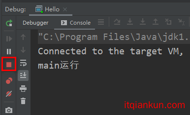

# LockSupport.park()和LockSupport.unpark()


## LockSupport类里面的park()和unpark()作用是什么

LockSupport是一个线程阻塞工具类，所有的方法都是静态方法，可以通过调用LockSupport.park()和LockSupport.unpark()实现线程的阻塞和唤醒。

我们写一个例子来看看这个工具类怎么用的。

下面的代码运行过程是这样的：

> 首先是main运行，然后启动t1线程，但是呢，因为在t1线程里面调用了`LockSupport.park()`，所以t1线程就在第10行被阻塞住了，所以不执行第11行
> 然后执行main执行第15行，第16行，然后`main线程`执行在第17行，然后就把t1线程给唤醒了，`注意t1线程醒了之后会继续往下走`，所以此时就会执行第11行代码

```java
package com.mqk.cache;
import lombok.SneakyThrows;
import java.util.concurrent.locks.LockSupport;
public class Hello {
    static ChangeObjectThread t1 = new ChangeObjectThread("t1");
    public static class ChangeObjectThread extends Thread {
        public ChangeObjectThread(String name) {
            super(name);
        }
        @SneakyThrows
        @Override public void run() {
            LockSupport.park();  // 假设是第10行
            System.out.println(getName() +"继续执行");// // 假设是第11行
        }
    }
    public static void main(String[] args) throws InterruptedException {
        t1.start();
        System.out.println("main运行");// 假设是第15行
        Thread.sleep(1000L);// 假设是第16行
        LockSupport.unpark(t1);// 假设是第17行
    }
}
```

所以最终结果如下所示，在输出`main运行`之后，会停顿大概1秒，然后继续输出`t1继续执行`

```shell
main运行
t1继续执行
```

这是我们一般使用`LockSupport类`正常的用法，推荐使用这种用法(其实就是先`LockSupport.park()`，然后在`LockSupport.unpark()`)

## park和unpark的灵活之处

在Java5里是用wait/notify/notifyAll来同步的。wait/notify机制有个很蛋疼的地方是，比如线程B要用notify通知线程A，那么线程B要确保线程A已经在wait调用上等待了，否则线程A可能永远都在等待。这样就很麻烦了。

但是使用park和unpark了之后，我们可以解决上面的问题。就是一个线程它在`启动`之后，可以先被别的线程`unPark()`，然后这个线程在进行`park()`

什么意思呢，比如下面的代码

> 首先还是`main线程`运行，然后执行第11行，然后在第12行启动`t1线程`
> 因为第6行睡眠1秒，所以是`main线程`首先执行第13行，此时`t1线程就被main线程先进行unPark()`了
> 然后1秒过后，`t1线程`执行第7行，在这里才被`park()`掉，但是在这样的情况下，`t1线程`是没有被阻塞的，原因就是`t1线程`先被`main线程unpark()`了，然后`t1线程`执行第8行。

```java
package com.mqk.cache;
import lombok.SneakyThrows;
import java.util.concurrent.locks.LockSupport;
public class Hello {
    static ChangeObjectThread t1 = new ChangeObjectThread("itqiankun.com");
    public static class ChangeObjectThread extends Thread {
        public ChangeObjectThread(String name) {
            super(name);
        }
        @SneakyThrows
        @Override public void run() {
            Thread.sleep(1000L);// 假设第6行
            LockSupport.park();// 假设第7行
            System.out.println(getName() +"继续执行");// 假设第8行
        }
    }
    public static void main(String[] args) throws InterruptedException {
        System.out.println("main运行"); // 假设第11行
        t1.start();// 假设第12行
        LockSupport.unpark(t1);// 假设第13行
    }
}
```

所以最终结果如下所示，在输出`main运行`之后，会停顿大概1秒，然后继续输出`itqiankun.com继续执行`

```text
main运行
itqiankun.com继续执行
```

但是这样使用的时候要注意一个问题，就是**LockSupport类里面的park()和unpark()多次调用**

```java
package com.mqk.cache;
import lombok.SneakyThrows;
import java.util.concurrent.locks.LockSupport;
public class Hello {
    static ChangeObjectThread t1 = new ChangeObjectThread("itqiankun.com");
    public static class ChangeObjectThread extends Thread {
        public ChangeObjectThread(String name) {
            super(name);
        }
        @SneakyThrows
        @Override public void run() {
            Thread.sleep(1000L);
            for(int i=0;i<2;i++){
                LockSupport.park();
            }
            System.out.println(getName() +"继续执行");
        }
    }
    public static void main(String[] args) throws InterruptedException {
        System.out.println("main运行");
        t1.start();
        for(int i=0;i<2;i++){
            LockSupport.unpark(t1);
        }
    }
}
```

当执行上面的代码的时候，可以看到线程被阻塞导致程序一直无法结束掉。



为什么会出现上面的问题呢，这里需要了解LockSupport类的底层实现，

```c++
class Parker : public os::PlatformParker {
private:
  volatile int _counter ;
  ...
public:
  void park(bool isAbsolute, jlong time);
  void unpark();
  ...
}
class PlatformParker : public CHeapObj<mtInternal> {
  protected:
    pthread_mutex_t _mutex [1] ;
    pthread_cond_t  _cond  [1] ;
    ...
}
```

LockSupport就是通过控制变量`_counter`来对线程阻塞唤醒进行控制的。原理有点类似于信号量机制。

> 当调用park()方法时，会将_counter置为0，同时判断前值，等于1说明前面被unpark过,则直接退出，否则将使该线程阻塞。
>
> 当调用unpark()方法时，会将_counter置为1，同时判断前值，等于0会进行线程唤醒，否则直接退出。

当先调用两次unpark()之后，那么`_counter`置还是1，然后第一次调用`park()`，将`_counter`置为0，同时前值等于1,所以直接退出了，但是在第二次`park()`的时候，`_count`值是0，所以此时直接被阻塞了。

所以使用LockSupport类里面的park()和unpark()的时候，推荐使用先`LockSupport.park()`，然后在`LockSupport.unpark()`