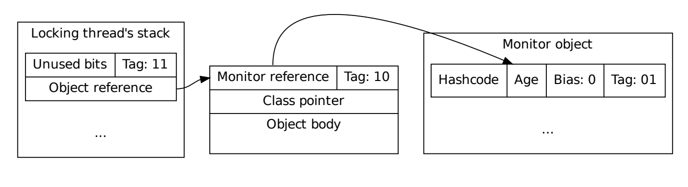

# synchronized实现原理

> 转载自: [线程间的同步与通信(3)——浅析synchronized的实现原理](https://www.itqiankun.com/article/1190000016016459)

## 前言

[系列文章目录](https://itqiankun.com/article/1190000016058789)

前面两篇文章我们介绍了synchronized同步代码块以及wait和notify机制，大致知道了这些关键字和方法是干什么的，以及怎么用。

但是，知其然，并不知其所以然。

例如:

1. 什么是监视器锁？
2. JAVA中任何对象都可以作为锁，那么锁信息是怎么被记录和存储的？
3. 监视器锁是怎样被获取的？
4. 监视器锁是怎样被释放的？
5. 什么是`wait set`？

本篇我们将来解答这些问题。

## spin-lock 和 suspend-lock

总的来说，锁有两种不同的实现方式，一种是自旋，一种是挂起。

(suspend-lock不知道怎么翻译，感觉叫”挂起锁”或”悬挂锁”都太难听了，后面就直接不翻译了)

自旋锁是一种乐观锁，它乐观地认为锁资源没有被占用，或者即使被占用了，也很快就会被释放, 所以当它发现锁已经被占用后，大多会在原地忙等待（一般是在死循环中等待，这也就是自旋的由来), 直到锁被释放，我们在之前分析AQS的文章中提过，AQS处在阻塞队列头部的线程用的就是自旋的方式来等待锁。

suspend-lock是一种悲观锁，它悲观地认为锁竞争总是经常发生的，如果锁被占用了，基本短时间内不会释放，所以他会让出CPU资源，直接挂起，等待条件满足后，别人将自己唤醒。

自旋锁的优点是实现简单，只需要很小的内存，在竞争不多的场景中性能很好。但是如果锁竞争很多，那么大量的时间会浪费在无意义的自旋等待上，造成CPU利用率降低。

suspend-lock的优点是CPU利用率高，因为在发现锁被占用后，它会立即释放自己剩下的CPU时间隙(time-slice)给其他线程，以期望获得更高的CPU利用率。但是因为线程的挂起与唤醒需要通过操作系统调用来完成，这涉及到用户空间和内核空间的转换，线程上下文的切换，所以即使在竞争很少的场景中，这种锁也会显得很慢。但是如果锁竞争很激烈，则这种锁就可以获得很好的性能。

由此可见，自旋锁和`suspend-lock`各有优劣，他们分别适用于竞争不多和竞争激烈的场景中。

在实际的应用中，我们可以综合这两种方式的优点，例如AQS中，排在阻塞队列第一位的使用自旋等待，而排在后面的线程则挂起。

而我们今天要讲的synchronized，使用的是suspend-lock方式。

## synchronized的实现

既然前面提到了synchronized用的是`suspend-lock`方式，在看synchronized的实现原理之前，我们不妨来思考一下: 如果要我们自己设计，该怎么做？

前几篇我们提到过:

> 每个java对象都可以用做一个实现同步的锁, 这些锁被称为内置锁(Intrinsic Lock)或者监视器锁(Monitor Lock).

要实现这个目标，则**每个java对象都应该与某种类型的锁数据关联。**

这就意味着，我们需要一个存储锁数据的地方，并且每一个对象都应该有这么个地方。

在java中，这个地方就是对象头。

其实Java的对象头和对象的关系很像Http请求的`http header`和`http body`的关系。

对象头中存储了该对象的`metadata`, 除了该对象的锁信息，还包括指向该对象对应的类的指针，对象的hashcode, GC分代年龄等，在对象头这个寸土寸金的地方，根据锁状态的不同，有些内存是大家公用的，在不同的锁状态下，存储不同的信息，而对象头中存储锁信息的那部分字段，我们称作`Mark Word`, 这个我们就不展开了讲了。我们只需要知道:

> 锁信息存储在对象头的 `Mark Word`中

在synchronized锁中，这个存储在对象头的`Mark Word`中的锁信息是一个指针，它指向一个monitor对象（也称为管程或监视器锁）的起始地址。这样，我们就通过对象头，将每一个对象与一个monitor关联了起来，它们的关系如下图所示：


（图片来源: [Evaluating and improving biased locking in the HotSpot virtual machine](http://www.diva-portal.org/smash/get/diva2:754541/FULLTEXT01.pdf)）

图片的最左边是线程的调用栈，它引用了堆中的一个对象，该对象的对象头部分记录了该对象所使用的监视器锁，该监视器锁指向了一个monitor对象。

那么这个monitor对象是什么呢？ 在Java虚拟机(HotSpot)中，monitor是由ObjectMonitor实现的，其主要数据结构如下: (源码在[这里](https://github.com/JetBrains/jdk8u_hotspot/blob/master/src/share/vm/runtime/objectMonitor.hpp))

```c++
     ObjectMonitor() {
        _header       = NULL;
        _count        = 0;
        _waiters      = 0,
        _recursions   = 0;
        _object       = NULL;
        _owner        = NULL;
        _WaitSet      = NULL;
        _WaitSetLock  = 0 ;
        _Responsible  = NULL ;
        _succ         = NULL ;
        _cxq          = NULL ;
        FreeNext      = NULL ;
        _EntryList    = NULL ;
        _SpinFreq     = 0 ;
        _SpinClock    = 0 ;
        OwnerIsThread = 0 ;
        _previous_owner_tid = 0;
     }
```

上面这些字段中，我们只需要重点关注三个字段:

- _owner : 当前拥有该 ObjectMonitor 的线程
- _EntryList: 当前等待锁的集合
- _WaitSet: 调用了Object.wait()方法而进入等待状态的线程的集合，即我们上一篇一直提到的`wait set`

在java中，每一个等待锁的线程都会被封装成ObjectWaiter对象，当多个线程同时访问一段同步代码时，首先会被扔进 _EntryList 集合中，如果其中的某个线程获得了monitor对象，他将成为`_owner`，如果在它成为`_owner`之后又调用了`wait`方法，则他将释放获得的monitor对象，进入 _WaitSet集合中等待被唤醒。


(图片来源: [Inter-thread communication in Java](https://www.javatpoint.com/images/core/interthread.gif))

另外，因为每一个对象都可以作为synchronized的锁，所以每一个对象都必须支持`wait()`，`notify`，`notifyAll`方法，使得线程能够在一个monitor对象上wait, 直到它被notify。这也就解释了这三个方法为什么定义在了Object类中——这样，所有的类都将持有这三个方法。

## 总结:

1. 每一个java对象都和一个ObjectMonitor对象相关联，关联关系存储在该java对象的对象头里的`Mark Word`中。
2. 每一个试图进入同步代码块的线程都会被封装成ObjectWaiter对象，它们或在ObjectMonitor对象的_EntryList中，或在 _WaitSet 中，等待成为ObjectMonitor对象的owner. 成为owner的对象即获取了监视器锁。

所以，说是每一个java对象都可以作为锁，其实是指**将每一个java对象所关联的ObjectMonitor作为锁**，更进一步是指，大家都想成为 `某一个java对象所关联的`、`ObjectMonitor对象的`、`_owner`，所以你可以把这个`_owner`看做是铁王座，所有等待在这个监视器锁上的线程都想坐上这个铁王座，谁拥有了它，谁就有进入由它锁住的同步代码块的权利。

## 附加题

其实，了解到上面这个程度已经足够用了，如果你想再深入的了解，例如synchronized在字节码层面的具体语义实现，这里推荐几篇博客:

- [Moniter的实现原理](http://www.hollischuang.com/archives/2030)
- [OpenJDK9 Hotspot : synchronized 浅析](https://itqiankun.com/article/1190000008532548)
- [深入理解Java并发之synchronized实现原理](https://blog.csdn.net/javazejian/article/details/72828483)
- [死磕Java并发—–深入分析synchronized的实现原理](http://cmsblogs.com/?p=2071)

另外，如果你想深入了解偏向锁，轻量级锁，以及锁膨胀的过程，强烈建议看下面这篇论文:

- [Evaluating and improving biased locking in the HotSpot virtual machine](http://www.diva-portal.org/smash/get/diva2:754541/FULLTEXT01.pdf)

该篇论文的介绍非常详细，关键是有很多图示，对于Mark Word在不同锁状态的描述很清晰。