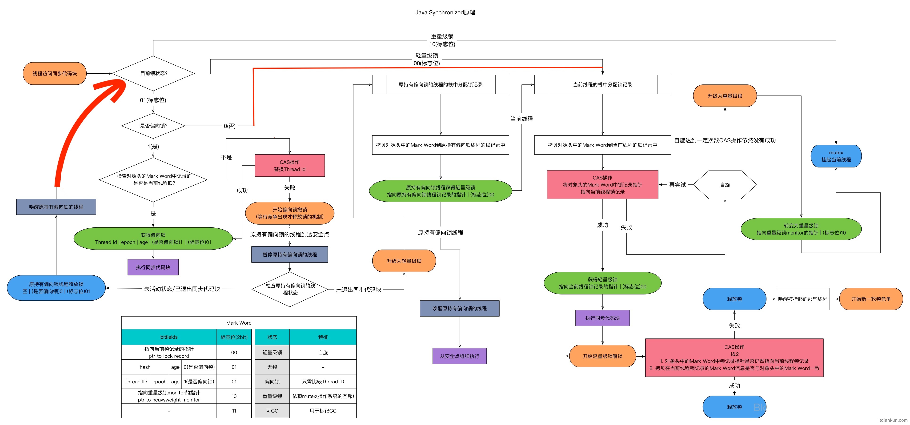
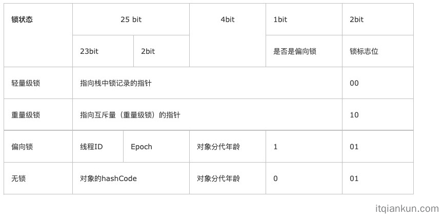
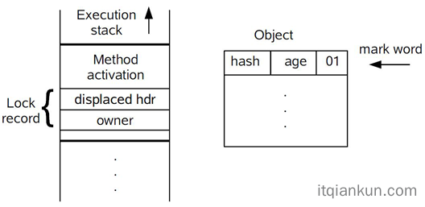
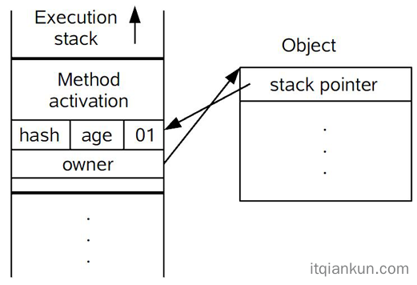
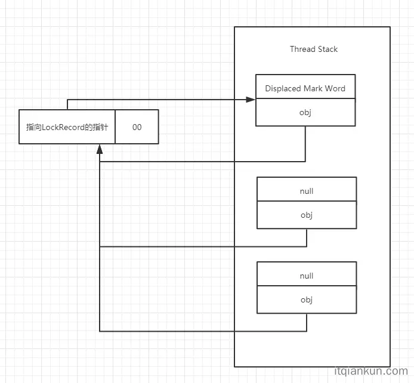
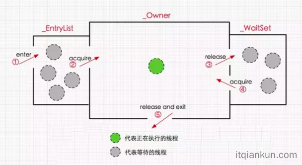

### 转载：彻底搞懂Java中的偏向锁,轻量级锁,重量级锁

> 转载自：https://www.itqiankun.com/article/bias-lightweight-synchronized-lock
>
> 转载自：https://www.itqiankun.com/article/bias-lock-epoch-effect

今天我们来聊聊 Synchronized 里面的各种锁：偏向锁、轻量级锁、重量级锁，以及三个锁之间是如何进行锁膨胀的。先来一张图来总结


#### 提前了解知识

##### 锁的升级过程

锁的状态总共有四种：无锁状态、偏向锁、轻量级锁和重量级锁。随着锁的竞争，锁可以从偏向锁升级到轻量级锁，再升级的重量级锁（但是锁的升级是单向的，也就是说只能从低到高升级，不会出现锁的降级）

##### Java 对象头

因为在Java中任意对象都可以用作锁，因此必定要有一个映射关系，存储该对象以及其对应的锁信息（比如当前哪个线程持有锁，哪些线程在等待）。一种很直观的方法是，用一个全局map，来存储这个映射关系，但这样会有一些问题：需要对map做线程安全保障，不同的synchronized之间会相互影响，性能差；另外当同步对象较多时，该map可能会占用比较多的内存。

所以最好的办法是将这个映射关系存储在对象头中，因为对象头本身也有一些hashcode、GC相关的数据，所以如果能将锁信息与这些信息共存在对象头中就好了。

在JVM中，对象在内存中除了本身的数据外还会有个对象头，对于普通对象而言，其对象头中有两类信息：mark word和类型指针。另外对于数组而言还会有一份记录数组长度的数据。

类型指针是指向该对象所属类对象的指针，mark word用于存储对象的HashCode、GC分代年龄、锁状态等信息。在32位系统上mark word长度为32bit，64位系统上长度为64bit。为了能在有限的空间里存储下更多的数据，其存储格式是不固定的，在32位系统上各状态的格式如下：



可以看到锁信息也是存在于对象的mark word中的。当对象状态为偏向锁（biasable）时，mark word存储的是偏向的线程ID；当状态为轻量级锁（lightweight locked）时，mark word存储的是指向线程栈中Lock Record的指针；当状态为重量级锁（inflated）时，为指向堆中的monitor对象的指针。

##### 全局安全点（safepoint）

safepoint这个词我们在GC中经常会提到，简单来说就是其代表了一个状态，在该状态下所有线程都是暂停的。

#### 偏向锁

一个线程反复的去获取/释放一个锁，如果这个锁是轻量级锁或者重量级锁，不断的加解锁显然是没有必要的，造成了资源的浪费。于是引入了偏向锁，偏向锁在获取资源的时候会在资源对象上记录该对象是偏向该线程的，偏向锁并不会主动释放，这样每次偏向锁进入的时候都会判断改资源是否是偏向自己的，如果是偏向自己的则不需要进行额外的操作，直接可以进入同步操作。

##### 偏向锁获取过程：

（1）访问Mark Word中偏向锁标志位是否设置成1，锁标志位是否为01——确认为可偏向状态。
（2）如果为可偏向状态，则测试线程ID是否指向当前线程，如果是，进入步骤（5），否则进入步骤（3）。
（3）如果线程ID并未指向当前线程，则通过CAS操作竞争锁。如果竞争成功，则将Mark Word中线程ID设置为当前线程ID，然后执行（5）；如果竞争失败，执行（4）。
（4）如果CAS获取偏向锁失败，则表示有竞争。当到达全局安全点（safepoint）时获得偏向锁的线程被挂起，偏向锁升级为轻量级锁，然后被阻塞在安全点的线程继续往下执行同步代码。
（5）执行同步代码。

##### 偏向锁的释放：

偏向锁的撤销在上述第四步骤中有提到。偏向锁只有遇到其他线程尝试竞争偏向锁时，持有偏向锁的线程才会释放锁，线程不会主动去释放偏向锁。
偏向锁的撤销，需要等待全局安全点safepoint，它会首先暂停拥有偏向锁的线程A，然后判断这个线程A，此时有两种情况：

```java
1:A 线程已经退出了同步代码块，或者是已经不在存活了，如果是上面两种情况之一的，此时就会直接撤销偏向锁，变成无锁状态。
2:A 线程还在同步代码块中，此时将 A 线程的偏向锁升级为轻量级锁。具体怎么升级的看下面的偏向锁升级轻量级锁的过程。
```

##### 批量重偏向

**为什么有批量重偏向**
当只有一个线程反复进入同步块时，偏向锁带来的性能开销基本可以忽略，但是当有其他线程尝试获得锁时，就需要等到safe point时将偏向锁撤销为无锁状态或升级为轻量级/重量级锁。这个过程是要消耗一定的成本的，所以如果说运行时的场景本身存在多线程竞争的，那偏向锁的存在不仅不能提高性能，而且会导致性能下降。因此，JVM中增加了一种批量重偏向/撤销的机制。

**批量重偏向的原理**

1.首先引入一个概念epoch，其本质是一个时间戳，代表了偏向锁的有效性，epoch存储在可偏向对象的MarkWord中。除了对象中的epoch,对象所属的类class信息中，也会保存一个epoch值。

2.每当遇到一个全局安全点时(这里的意思是说批量重偏向没有完全替代了全局安全点，全局安全点是一直存在的)，比如要对class C 进行批量再偏向，则首先对 class C中保存的epoch进行增加操作，得到一个新的epoch_new

3.然后扫描所有持有 class C 实例的线程栈，根据线程栈的信息判断出该线程是否锁定了该对象，仅将epoch_new的值赋给被锁定的对象中，也就是现在偏向锁还在被使用的对象才会被赋值epoch_new。

4.退出安全点后，当有线程需要尝试获取偏向锁时，直接检查 class C 中存储的 epoch 值是否与目标对象中存储的 epoch 值相等， 如果不相等，则说明该对象的偏向锁已经无效了（因为（3）步骤里面已经说了只有偏向锁还在被使用的对象才会有epoch_new，这里不相等的原因是class C里面的epoch值是epoch_new,而当前对象的epoch里面的值还是epoch），此时竞争线程可以尝试对此对象重新进行偏向操作。

#### 轻量级锁

##### 轻量级锁的获取过程

（1）在代码进入同步块的时候，如果同步对象锁状态为偏向状态（就是锁标志位为“01”状态，是否为偏向锁标志位为“1”），虚拟机首先将在当前线程的栈帧中建立一个名为锁记录（Lock Record）的空间，用于存储锁对象目前的Mark Word的拷贝。官方称之为 Displaced Mark Word（所以这里我们认为Lock Record和 Displaced Mark Word其实是同一个概念）。这时候线程堆栈与对象头的状态如图所示：


（2）拷贝对象头中的Mark Word复制到锁记录中。

（3）拷贝成功后，虚拟机将使用CAS操作尝试将对象头的Mark Word更新为指向Lock Record的指针，并将Lock record里的owner指针指向对象头的mark word。如果更新成功，则执行步骤（4），否则执行步骤（5）。

（4）如果这个更新动作成功了，那么这个线程就拥有了该对象的锁，并且对象Mark Word的锁标志位设置为“00”，即表示此对象处于轻量级锁定状态，这时候线程堆栈与对象头的状态如下所示：



（5）如果这个更新操作失败了，虚拟机首先会检查对象的Mark Word是否指向当前线程的栈帧，如果是就说明当前线程已经拥有了这个对象的锁，现在是重入状态，那么设置Lock Record第一部分（Displaced Mark Word）为null，起到了一个重入计数器的作用。下图为重入三次时的lock record示意图，左边为锁对象，右边为当前线程的栈帧，重入之后然后结束。接着就可以直接进入同步块继续执行。

如果不是说明这个锁对象已经被其他线程抢占了，说明此时有多个线程竞争锁，那么它就会自旋等待锁，一定次数后仍未获得锁对象，说明发生了竞争，需要膨胀为重量级锁。

##### 轻量级锁的解锁过程

（1）通过CAS操作尝试把线程中复制的Displaced Mark Word对象替换当前的Mark Word。

（2）如果替换成功，整个同步过程就完成了。

（3）如果替换失败，说明有其他线程尝试过获取该锁（此时锁已膨胀），那就要在释放锁的同时，唤醒被挂起的线程。

#### 重量级锁

##### 重量级锁加锁和释放锁机制

1.调用omAlloc分配一个ObjectMonitor对象，把锁对象头的mark word锁标志位变成 “10 ”，然后在mark word存储指向ObjectMonitor对象的指针
2.ObjectMonitor中有两个队列，_WaitSet和_EntryList，用来保存ObjectWaiter对象列表(每个等待锁的线程都会被封装成ObjectWaiter对象)，_owner指向持有ObjectMonitor对象的线程，当多个线程同时访问一段同步代码时，首先会进入 _EntryList 集合，当线程获取到对象的monitor 后进入 _Owner 区域并把monitor中的owner变量设置为当前线程同时monitor中的计数器count加1，若线程调用wait()方法，将释放当前持有的monitor，owner变量恢复为null，count自减1，同时该线程进入WaitSet集合中等待被唤醒。若当前线程执行完毕也将释放monitor(锁)并复位变量的值，以便其他线程进入获取monitor(锁)。如下图所示


##### Synchronized同步代码块的底层原理

同步代码块的加锁、解锁是通过 Javac 编译器实现的，底层是借助monitorenter和monitorerexit，为了能够保证无论代码块正常执行结束 or 抛出异常结束，都能正确释放锁，Javac 编译器在编译的时候，会对monitorerexit进行特殊处理，举例说明：

```java
public class Hello {   
  	public void test() {       
      	synchronized (this) {      
          	System.out.println("test");    
        }
    }
}
```

通过 javap -c 查看其编译后的字节码:

```java
public class Hello {  
  	public Hello();   
  		Code:      
  			0: aload_0
        1: invokespecial #1  // Method java/lang/Object."<init>":()V       
      	4: return 
    
    public void test();   
  		Code:    
  			0: aload_0  
        1: dup    
        2: astore_1   
        3: monitorenter     
        4: getstatic     #2   // Field java/lang/System.out:Ljava/io/PrintStream;  
        7: ldc           #3   // String test       
        9: invokevirtual #4   // Method java/io/PrintStream.println:(Ljava/lang/String;)V    
        12: aload_1     
        13: monitorexit 
        14: goto  22     
        17: astore_2     
        18: aload_1     
        19: monitorexit     
        20: aload_2      
        21: athrow    
        22: return   
      Exception table:    
  			from    to  target type          
           4    14    17   any          
          17    20    17   any
}
```

从字节码中可知同步语句块的实现使用的是monitorenter和monitorexit指令，其中monitorenter指令指向同步代码块的开始位置，monitorexit指令则指明同步代码块的结束位置，当执行monitorenter指令时，当前线程将试图获取mark word里面存储的monitor，当 monitor的进入计数器为 0，那线程可以成功取得monitor，并将计数器值设置为1，取锁成功。

如果当前线程已经拥有 monitor 的持有权，那它可以重入这个 monitor ，重入时计数器的值也会加 1。倘若其他线程已经拥有monitor的所有权，那当前线程将被阻塞，直到正在执行线程执行完毕，即monitorexit指令被执行，执行线程将释放 monitor并设置计数器值为0 ，其他线程将有机会持有 monitor 。

值得注意的是编译器将会确保无论方法通过何种方式完成，方法中调用过的每条 monitorenter 指令都有执行其对应 monitorexit 指令，而无论这个方法是正常结束还是异常结束。为了保证在方法异常完成时 monitorenter 和 monitorexit 指令依然可以正确配对执行，编译器会自动产生一个异常处理器，这个异常处理器声明可处理所有的异常，它的目的就是用来执行 monitorexit 指令。从上面的字节码中也可以看出有两个monitorexit指令，它就是异常结束时被执行的释放monitor 的指令。

##### 同步方法底层原理

同步方法的加锁、解锁是通过 Javac 编译器实现的，底层是借助ACC_SYNCHRONIZED访问标识符来实现的，代码如下所示：

```java
public class Hello {    
		public synchronized void test() {   
    		System.out.println("test");   
    }
}
```

方法级的同步是隐式，即无需通过字节码指令来控制的，它实现在方法调用和返回操作之中。JVM可以从方法常量池中的方法表结构(method_info Structure) 中的 ACC_SYNCHRONIZED 访问标志区分一个方法是否同步方法。当方法调用时，调用指令将会 检查方法的 ACC_SYNCHRONIZED访问标志是否被设置，如果设置了，执行线程将先持有monitor，然后再执行方法，最后在方法完成(无论是正常完成还是非正常完成)时释放monitor。在方法执行期间，执行线程持有了monitor，其他任何线程都无法再获得同一个monitor。如果一个同步方法执行期间抛出了异常，并且在方法内部无法处理此异常，那这个同步方法所持有的monitor将在异常抛到同步方法之外时自动释放。

下面我们看看字节码层面如何实现：

```java
public class Hello {  
  	public Hello(); 
  		Code:       
  			0: aload_0   
        1: invokespecial #1   // Method java/lang/Object."<init>":()V  
        4: return 
          
    public synchronized void test();  
  		Code:     
  			0: getstatic     #2   // Field java/lang/System.out:Ljava/io/PrintStream;      
        3: ldc           #3   // String test       
        5: invokevirtual #4   // Method java/io/PrintStream.println:(Ljava/lang/String;)V   
        8: return
}
```

#### 锁的其他优化

1、适应性自旋（Adaptive Spinning）：从轻量级锁获取的流程中我们知道，当线程在获取轻量级锁的过程中执行CAS操作失败时，是要通过自旋来获取重量级锁的。问题在于，自旋是需要消耗CPU的，如果一直获取不到锁的话，那该线程就一直处在自旋状态，白白浪费CPU资源。解决这个问题最简单的办法就是指定自旋的次数，例如让其循环10次，如果还没获取到锁就进入阻塞状态。但是JDK采用了更聪明的方式——适应性自旋，简单来说就是线程如果自旋成功了，则下次自旋的次数会更多，如果自旋失败了，则自旋的次数就会减少。
2、锁粗化（Lock Coarsening）：锁粗化的概念应该比较好理解，就是将多次连接在一起的加锁、解锁操作合并为一次，将多个连续的锁扩展成一个范围更大的锁。举个例子：

```java
public  void lockCoarsening() {     
	int i=0;    
  synchronized (this){       
    i=i+1;        
  } 
  synchronized (this){      
    i=i+2;
  } 
}
```

上面的两个同步代码块可以变成一个

```java
public  void lockCoarsening() {     
  int i=0;
  synchronized (this){        
    i=i+1;           
    i=i+2;
  }
}
```

3、锁消除（Lock Elimination）：锁消除即删除不必要的加锁操作的代码。比如下面的代码,下面的for循环完全可以移出来，这样可以减少加锁代码的执行过程

```java
public  void lockElimination() {       
  int i=0; 
  synchronized (this){           
    for(int c=0; c<1000; c++){        
      System.out.println(c);        
    } 
    i=i+1;
  }
}
```

#### 本文需要了解的

1.java对象头里面两个重要属性：标志位，java对象头怎么知道当前对象拥有的是哪一个锁
2.偏向锁获取和释放过程，偏向锁里面的epoch作用
3.轻量级锁的获取和释放过程
4.重量级锁的获取和释放过程
5.重量级锁里面_WaitSet和_EntryList和_Owner作用，还有为什么_WaitSet和_EntryList一个是set，一个是list