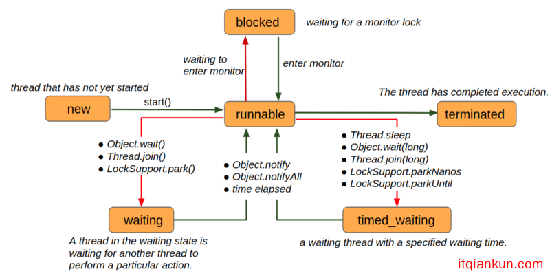

### 线程状态及常用方法

> 转载自：https://www.itqiankun.com/article/1190000016056471

## 线程状态

在Thread类中, 线程状态是通过`threadStatus`属性以及`State`枚举类实现的:

```java
    /* Java thread status for tools,
     * initialized to indicate thread 'not yet started'
     */
    private volatile int threadStatus = 0;
    public enum State {
        /**
         * Thread state for a thread which has not yet started.
         */
        NEW,
        /**
         * Thread state for a runnable thread.  A thread in the runnable
         * state is executing in the Java virtual machine but it may
         * be waiting for other resources from the operating system
         * such as processor.
         */
        RUNNABLE,
        /**
         * Thread state for a thread blocked waiting for a monitor lock.
         * A thread in the blocked state is waiting for a monitor lock
         * to enter a synchronized block/method or
         * reenter a synchronized block/method after calling
         * {@link Object#wait() Object.wait}.
         */
        BLOCKED,
        /**
         * Thread state for a waiting thread.
         * A thread is in the waiting state due to calling one of the
         * following methods:
         * <ul>
         *   <li>{@link Object#wait() Object.wait} with no timeout</li>
         *   <li>{@link #join() Thread.join} with no timeout</li>
         *   <li>{@link LockSupport#park() LockSupport.park}</li>
         * </ul>
         *
         * <p>A thread in the waiting state is waiting for another thread to
         * perform a particular action.
         *
         * For example, a thread that has called <tt>Object.wait()</tt>
         * on an object is waiting for another thread to call
         * <tt>Object.notify()</tt> or <tt>Object.notifyAll()</tt> on
         * that object. A thread that has called <tt>Thread.join()</tt>
         * is waiting for a specified thread to terminate.
         */
        WAITING,
        /**
         * Thread state for a waiting thread with a specified waiting time.
         * A thread is in the timed waiting state due to calling one of
         * the following methods with a specified positive waiting time:
         * <ul>
         *   <li>{@link #sleep Thread.sleep}</li>
         *   <li>{@link Object#wait(long) Object.wait} with timeout</li>
         *   <li>{@link #join(long) Thread.join} with timeout</li>
         *   <li>{@link LockSupport#parkNanos LockSupport.parkNanos}</li>
         *   <li>{@link LockSupport#parkUntil LockSupport.parkUntil}</li>
         * </ul>
         */
        TIMED_WAITING,
        /**
         * Thread state for a terminated thread.
         * The thread has completed execution.
         */
        TERMINATED;
    }
    /**
     * Returns the state of this thread.
     * This method is designed for use in monitoring of the system state,
     * not for synchronization control.
     *
     * @return this thread's state.
     * @since 1.5
     */
    public State getState() {
        // get current thread state
        return sun.misc.VM.toThreadState(threadStatus);
    }
```

从源码中可以看出, 线程一共有6种状态, 其状态转换关系如下图所示:



值得一提的是，从状态的定义中可以看出，RUNNABLE状态包含了我们通常所说的`running`和`ready`两种状态。


## 常用方法

### currentThread

源码中currentThread定义如下：

```java
    /**
     * Returns a reference to the currently executing thread object.
     *
     * @return  the currently executing thread.
     */
    public static native Thread currentThread();
```

可见，它是一个静态方法，并且是一个native方法，返回的是**当前正在执行的线程**。

爱思考的同学可能就要问了，现在咱都多核CPU了，同一时刻可以有多个线程跑在不同的CPU核心上，那当前正在执行的线程有多个，到底返回的是哪一个呢？

其实，这里”当前正在执行的线程”指的是**当前正在执行这段代码的线程**。

我们知道，线程是CPU调度的最小单位，任意一段代码总得由一个线程执行，所以该方法返回的是正在执行`Thread.currentThread`这行代码的线程，例如:

```java
    public class ThreadTest {
        public static void main(String[] args) {
            System.out.println(Thread.currentThread().getName());
        }
    }
```

输出:

```java
main
```

我们知道当一个Java程序启动以后，有一个线程就会立马跑起来，这就是通常所说的Main线程，main线程将会执行java的入口方法main方法，所以当前正在执行Thread.currentThread()方法的线程就是main线程。


### sleep

谈起sleep方法, 被问的最多的两个问题就是:

1. Thread.sleep() 与 Thread.currentThread().sleep() 有什么区别？
2. Thread.sleep() 和 Object.wait()有什么区别?

这些问题的答案, 你在源码里都能找得到。我们直接来看源码:

```java
    /**
     * Causes the currently executing thread to sleep (temporarily cease
     * execution) for the specified number of milliseconds, subject to
     * the precision and accuracy of system timers and schedulers. The thread
     * does not lose ownership of any monitors.
     *
     * @param  millis
     *         the length of time to sleep in milliseconds
     *
     * @throws  IllegalArgumentException
     *          if the value of {@code millis} is negative
     *
     * @throws  InterruptedException
     *          if any thread has interrupted the current thread. The
     *          <i>interrupted status</i> of the current thread is
     *          cleared when this exception is thrown.
     */
    public static native void sleep(long millis) throws InterruptedException;
```

可见, sleep方法也是一个静态方法, 并且是native方法, 从注释`Causes the currently executing thread to sleep`中可以看出, 它作用于`当前正在执行的线程`, 所以上面那个问题我们就能回答了:

> Thread.sleep() 与 Thread.currentThread().sleep() 没有区别

如果硬要说他们有什么区别的话, 那就是一个是用类直接调用静态方法, 一个是用类的实例调用静态方法.

另外, 上面的注释中还有一句非常重要的话:

> The thread does not lose ownership of any monitors.

也就是说, **虽然sleep函数使当前线程让出了CPU, 但是, 当前线程仍然持有它所获得的监视器锁, 这与同时让出CPU资源和监视器锁资源的wait方法是不一样的。**

sleep方法还有另外一个版本:

```java
    /**
     * Causes the currently executing thread to sleep (temporarily cease
     * execution) for the specified number of milliseconds plus the specified
     * number of nanoseconds, subject to the precision and accuracy of system
     * timers and schedulers. The thread does not lose ownership of any
     * monitors.
     *
     * @param  millis
     *         the length of time to sleep in milliseconds
     *
     * @param  nanos
     *         {@code 0-999999} additional nanoseconds to sleep
     *
     * @throws  IllegalArgumentException
     *          if the value of {@code millis} is negative, or the value of
     *          {@code nanos} is not in the range {@code 0-999999}
     *
     * @throws  InterruptedException
     *          if any thread has interrupted the current thread. The
     *          <i>interrupted status</i> of the current thread is
     *          cleared when this exception is thrown.
     */
    public static void sleep(long millis, int nanos) throws InterruptedException {
        if (millis < 0) {
            throw new IllegalArgumentException("timeout value is negative");
        }
        if (nanos < 0 || nanos > 999999) {
            throw new IllegalArgumentException("nanosecond timeout value out of range");
        }
        if (nanos >= 500000 || (nanos != 0 && millis == 0)) {
            millis++;
        }
        sleep(millis);
    }
```

这个方法多加了纳秒级别的延时参数, 但是我们看源码就知道, 这个多加的纳秒级别的延时并没有什么用, 最终该函数还是调用了上面的单参数native sleep方法, 延时还是毫秒级别的, 多出来的参数最多是让当前毫秒级别的延时增加1毫秒.
还记得我们上次讲的wait方法吗？我们来对比下:

```java
    public final void wait(long timeout, int nanos) throws InterruptedException {
        if (timeout < 0) {
            throw new IllegalArgumentException("timeout value is negative");
        }
        if (nanos < 0 || nanos > 999999) {
            throw new IllegalArgumentException("nanosecond timeout value out of range");
        }
        if (nanos > 0) {
            timeout++;
        }
        wait(timeout);
    }
```

怎么样？是不是很像？两者只不过在从纳秒向毫秒的进位处有细微的差别，我猜这个不统一是历史原因导致的。

另外，值得一提的是，wait有无参的`wait()`方法，它调用的是`wait(0)`,表示无限期等待，而sleep并没有无参数的版本，那么`sleep(0)`代表什么呢？

这一点在源码里面并没有提及，但是通过猜测sleep方法的定义我们知道，它是让出CPU 0毫秒，这听上去好像没有什么意义，但其实调用Thread.sleep(0)的当前线程确实被“冻结”了一下，让其他线程有机会优先执行。也就是说当前线程会释放一些未用完的时间片给其他线程或进程使用，就相当于一个让位动作，这看上去就和下面要说的yield方法很像了。


### yield

既然上面谈到了sleep(0)方法, 就不得不提yield方法了:

```java
    /**
     * A hint to the scheduler that the current thread is willing to yield
     * its current use of a processor. The scheduler is free to ignore this
     * hint.
     *
     * <p> Yield is a heuristic attempt to improve relative progression
     * between threads that would otherwise over-utilise a CPU. Its use
     * should be combined with detailed profiling and benchmarking to
     * ensure that it actually has the desired effect.
     *
     * <p> It is rarely appropriate to use this method. It may be useful
     * for debugging or testing purposes, where it may help to reproduce
     * bugs due to race conditions. It may also be useful when designing
     * concurrency control constructs such as the ones in the
     * {@link java.util.concurrent.locks} package.
     */
    public static native void yield();
```

yield方法也是一个native方法, 从它的注释可以看出`A hint to the scheduler that the current thread is willing to yield its current use of a processor. The scheduler is free to ignore this hint.` 它对于CPU只是一个建议, 告诉CPU, 当前线程愿意让出CPU给其他线程使用, 至于CPU采不采纳, 取决于不同厂商的行为, 有可能一个线程刚yield出CPU, 然后又立马获得了CPU。与之相对, sleep方法一定会让出CPU资源, 并且休眠指定的时间, 不参与CPU的竞争.

所以调用yield方法不会使线程退出`RUNNANLE`状态，顶多会使线程从running 变成 ready，
但是sleep方法是有可能将线程状态转换成`TIMED_WAITING`的。


### isAlive

`isAlive`方法用于检查线程是否还活着，它是一个native方法，但不是静态方法，也就是说它必须被线程的实例所调用。

其实大家可以思考一下它为什么不是静态方法，因为静态方法一般都是作用于`当前正在执行的线程`，既然是“当前正在执行”，那必然是`Alive`的，所以作为静态方法调用并没有意义。

```java
    /**
     * Tests if this thread is alive. A thread is alive if it has
     * been started and has not yet died.
     *
     * @return  <code>true</code> if this thread is alive;
     *          <code>false</code> otherwise.
     */
    public final native boolean isAlive();
```


### join

join方法是另一个能将线程状态转换成`WAITING`或者`TIMED_WAITING`的，它和wait方法一样，有三个版本，我们一个个来看:

```java
    /**
     * Waits at most {@code millis} milliseconds for this thread to
     * die. A timeout of {@code 0} means to wait forever.
     *
     * <p> This implementation uses a loop of {@code this.wait} calls
     * conditioned on {@code this.isAlive}. As a thread terminates the
     * {@code this.notifyAll} method is invoked. It is recommended that
     * applications not use {@code wait}, {@code notify}, or
     * {@code notifyAll} on {@code Thread} instances.
     *
     * @param  millis
     *         the time to wait in milliseconds
     *
     * @throws  IllegalArgumentException
     *          if the value of {@code millis} is negative
     *
     * @throws  InterruptedException
     *          if any thread has interrupted the current thread. The
     *          <i>interrupted status</i> of the current thread is
     *          cleared when this exception is thrown.
     */
    public final synchronized void join(long millis) throws InterruptedException {
        long base = System.currentTimeMillis();
        long now = 0;
        if (millis < 0) {
            throw new IllegalArgumentException("timeout value is negative");
        }
        if (millis == 0) {
            while (isAlive()) {
                wait(0);
            }
        } else {
            while (isAlive()) {
                long delay = millis - now;
                if (delay <= 0) {
                    break;
                }
                wait(delay);
                now = System.currentTimeMillis() - base;
            }
        }
    }
```

这段源码注释的开头部分就告诉了我们join方法的作用:

> Waits at most {[@code](https://github.com/code) millis} milliseconds for this thread to die. A timeout of {[@code](https://github.com/code) 0} means to wait forever.

也就是说，该方法等待`this thread`终止，最多等指定的时间，如果指定时间为0，则一直等。

这里有两个问题需要弄清楚:

1. 谁在等`this thread`终止？
2. `this thread`指的是哪个线程？

为了便于说明，我们直接来看一个例子：

```java
    public class JoinMethodTest {
        private static void printWithThread(String content) {
            System.out.println("[" + Thread.currentThread().getName() + "线程]: " + content);
        }
        public static void main(String[] args) {
            printWithThread("开始执行main方法");
            Thread myThread = new Thread(() -> {
                printWithThread("我在自定义的线程的run方法里");
                printWithThread("我马上要休息1秒钟, 并让出CPU给别的线程使用.");
                try {
                    Thread.sleep(1000);
                    printWithThread("已经休息了1秒, 又重新获得了CPU");
                    printWithThread("我休息好了, 马上就退出了");
                } catch (InterruptedException e) {
                    e.printStackTrace();
                }
            });
            try {
                myThread.start();
                printWithThread("我在main方法里面, 我要等下面这个线程执行完了才能继续往下执行.");
                myThread.join();
                printWithThread("我在main方法里面, 马上就要退出了.");
            } catch (InterruptedException e) {
                e.printStackTrace();
            }
        }
    }
```

在上面的例子中，我们在main方法中调用了`myThread.join()`，注意上面这段代码有两个线程，一个是执行main方法的线程，一个是我们自定义的`myThread`线程，所以上面的两个问题的答案是:

1. main线程在等`this thread`的终止，因为我们在main方法中调用了`myThread.join()`
2. `this thread`线程指的是`myThread`线程，因为我们在myThread对象上调用了join方法。

上面这段代码的执行结果为:

```java
    [main线程]: 开始执行main方法
    [main线程]: 我在main方法里面, 我要等下面这个线程执行完了才能继续往下执行.
    [Thread-0线程]: 我在自定义的线程的run方法里
    [Thread-0线程]: 我马上要休息1秒钟, 并让出CPU给别的线程使用.
    [Thread-0线程]: 已经休息了1秒, 又重新获得了CPU
    [Thread-0线程]: 我休息好了, 马上就退出了
    [main线程]: 我在main方法里面, 马上就要退出了.
```


从运行结果可以看出，虽然myThread线程(即Thread-0线程)中途让出了CPU, main线程还是必须等到其执行完毕了才能继续往下执行，我们现在修改一下代码，让main线程最多等0.5秒,即将`myThread.join()`改为`myThread.join(500);`，则结果如下:

```java
    [main线程]: 开始执行main方法
    [main线程]: 我在main方法里面, 我要等下面这个线程执行完了才能继续往下执行.
    [Thread-0线程]: 我在自定义的线程的run方法里
    [Thread-0线程]: 我马上要休息1秒钟, 并让出CPU给别的线程使用.
    [main线程]: 我在main方法里面, 马上就要退出了.
    [Thread-0线程]: 已经休息了1秒, 又重新获得了CPU
    [Thread-0线程]: 我休息好了, 马上就退出了
```

我们看到，由于main线程最多等待myThread 0.5秒，在myThread休眠的一秒内，它就不等了，继续往下执行，而随后myThread抢占到CPU资源继续运行。

通过列子有了感性的认识后，我们再来看源码，首先看join(0)部分:

```java
    public final synchronized void join(long millis) throws InterruptedException {
        ...
        if (millis == 0) {
            while (isAlive()) {
                wait(0);
            }
        } else {
            ...
        }
        ...
    }
```

这是一个自旋操作，注意，这里的`isAlive`和`wait(0)`方法都是线程实例的方法，在上面的例子中就是`myThread`的方法，Thread虽然是一个线程类，但只是特殊在它的native方法上，除此之外，它就是个普通的java类，而java中所有的类都继承自`Object`类，所以Thread类继承了Object的wait方法，`myThread`作为线程类的实例，自然也有wait方法。

我们之前说wait方法的时候提到过，执行wait方法必须拿到监视器锁，并且必须在同步代码块中调用，这里我们检查join方法发现，它确实被`synchronized`关键字修饰，并且是一个非静态方法，所以它使用的是当前对象实例的监视器锁(this)。

好像开始复杂了，我们从头到尾捋一捋(**注意了！敲黑板了！这段比较绕!** ):

1. 首先我们要明确，这里牵涉到两个线程，一个是main线程，一个是我们自定义的myThread线程(即例子里的Thread-0)。
2. 我们在main方法中调用了`myThread.join()`，main方法由main线程执行，所以执行`myThread.join()`这行代码的“当前线程”是main线程。
3. join方法是一个同步方法，使用的是对象锁(this 锁)，即myThread对象所关联的监视器对象。
4. main线程必须首先拿到join方法的监视器锁才能进入同步代码块。
5. main线程进入同步代码块后会首先检查`myThread`线程是否还存活，注意，这里的isAlive是myThread线程的方法，它是检查myThread线程是否还活着，而不是当前线程（当前线程是执行isAlive方法的线程，即main线程）。
6. 如果myThread线程还存活，(main线程)就无限期等待，并让出监视器锁，进入`WAITING`状态。
7. 当main线程从`WAITING`状态被唤醒后（通过notify，notifyAll或者是假唤醒), 将继续竞争监视器锁，当成功获得监视器锁后，他将从调用wait的地方恢复，继续运行。由于wait方法在while循环中，则它将继续检查`myThread`线程是否存活，如果还是没有终止，则继续挂起等待。
8. 可以看出，退出这个“自旋”状态的唯一途径就是`myThread`线程终止运行（或者有中断异常抛出）。

有的细心的同学可能就要问了: 要是没有人调用`notify`或者`notifyAll`,也没有假唤醒状态的发生，那main线程不就一直被`wait(0)`方法挂起了吗？这样以来不就连检测`myThread`线程是否存活的机会都没有吗？这样即使`myThread`终止了，也无法退出啊。

关于这一点，注释中其实是做了解释的:

> As a thread terminates the {[@code](https://github.com/code) this.notifyAll} method is invoked.

我们知道，wait(0)方法的监视器锁就是myThread对象(this), 而**当myThread终止执行时，this.notifyAll会被调用**，所以所有等待this锁的线程都会被唤醒，而main线程就是等待在这个监视器锁上的线程，因此myThread运行结束时，main线程会从wait方法处被唤醒。

另外，注释中还多加了一句:

> It is recommended that applications not use {[@code](https://github.com/code) wait}, {[@code](https://github.com/code) notify}, or {[@code](https://github.com/code) notifyAll} on {[@code](https://github.com/code) Thread} instances.

这个推荐还是很有必要的，至于为什么，就给大家留作思考题吧<(￣︶￣)>

不过我这里再啰嗦一句，**一定要分清执行代码的线程和方法所属的线程类所代表的线程！**

例如，在上面的例子中：

- `myThread.join()` 是myThread对象的方法，但是执行这个方法的是main线程；
- `isAlive()` 是myThread对象的方法，但是执行这个方法的是main线程，而这个方法检测是myThread线程是否活着
- `wait(0)` 是myThread对象的方法，但是执行这个方法的是main线程，它使得main线程挂起，但是main线程是在myThread对象代表的monitor上挂起。

这里**最重要的是区分“myThread对象”和“myThread线程”**，myThread对象有时候代表了myThread线程，例如myThread对象的`isAlive`方法，检测的就是它代表的myThread线程是否活着，但是其实大多数时候，myThread对象就是普通的java对象，这个对象的方法通常也都是由其他线程(例如上面例子中的main线程)来执行的，对于我们自定义的线程来说(例如上面的myThread线程)，通常由它自己执行的方法就只有传进入的`run`方法了。

再回到上面的例子，从上面的分析中可以看出，join(0)方法实现了一定程度上的线程同步，即**当前线程只有等join方法所属的线程对象所代表的线程终止执行了才能继续往下执行，否则将一直挂起等待。**

这一点也说明使用join(0)是很危险的，因为如果`myThread`线程因为得不到资源一直被挂起，而main线程又在等待`myThread`线程终止，则程序永远会停在那里，无法终止，所以源码中提供了限时等待的版本:

```java
    public final synchronized void join(long millis) throws InterruptedException {
            long base = System.currentTimeMillis();
            long now = 0;
            ...
            if (millis == 0) {
                ...
            } else {
                while (isAlive()) {
                    long delay = millis - now;
                    if (delay <= 0) {
                        break;
                    }
                    wait(delay);
                    now = System.currentTimeMillis() - base;
                }
            }
        }
```

与无限期等待不同的是，限时等待只等待指定时间，如果指定的时间到了就直接从循环中跳出来，使用的wai方法也是限时wait的版本，定时时间到了之后，main线程会被自动唤醒。上面的代码是自解释的，我就不再赘述了。

接下来我们再来看看其他两个版本的join方法:

```java
    public final void join() throws InterruptedException {
        join(0);
    }
    public final synchronized void join(long millis, int nanos) throws InterruptedException {
        if (millis < 0) {
            throw new IllegalArgumentException("timeout value is negative");
        }
        if (nanos < 0 || nanos > 999999) {
            throw new IllegalArgumentException("nanosecond timeout value out of range");
        }
        if (nanos >= 500000 || (nanos != 0 && millis == 0)) {
            millis++;
        }
        join(millis);
    }
```

可见，其他两个版本最终调用的都是我们分析的第一版本，这和wait方法，sleep方法很像，至于为什么wait方法和join方法都提供了无参方法而sleep方法没有，我个人认为是为了保持语义的一致性:

`wait()`和`join()`分别和`wait(0)`和`join(0)`等价，他们都代表了无限期等待，而sleep(0)并不代表无限期等待，所以sleep方法没有无参的形式，以防止语义上的混乱。除这点之外，这三个方法在两个参数的版本XXX(long millis, int nanos)中的实现，都大同小异。

另外最后一点值得注意的是，我们在`join`方法中只调用了`isAlive`方法检测线程是否存活，并没有启动这个线程，也就是说，如果我们想要实现当前线程等待`myThread`线程执行完成之后再执行的效果，就必须在调用`myThread.join()`之前调用`myThread.start()`让线程先跑起来，否则`join`方法发现`isAlive`为false会立即退出，`myThread`线程就不会被执行，大家可以将`myThread.start()`注释掉自己跑一跑试试看。