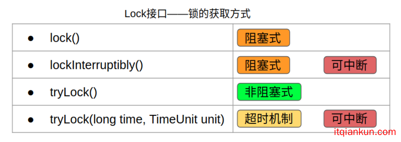

### 线程间的同步与通信——Lock和Condtion

> 转自：[线程间的同步与通信(4)——Lock和Condtion](https://www.itqiankun.com/article/1190000016449988)

## 前言

[系列文章目录](https://itqiankun.com/article/1190000016058789)

前面几篇我们学习了synchronized同步代码块，了解了java的内置锁，并学习了监视器锁的wait/notify机制。在大多数情况下，内置锁都能很好的工作，但它在功能上存在一些局限性，例如无法实现非阻塞结构的加锁规则等。为了拓展同步代码块中的监视器锁，java 1.5 开始，出现了lock接口，它实现了可定时、可轮询与可中断的锁获取操作，公平队列，以及非块结构的锁。

与内置锁不同，Lock是一种显式锁，它更加“危险”，因为在程序离开被锁保护的代码块时，不会像监视器锁那样自动释放，需要我们手动释放锁。所以，在我们使用lock锁时，一定要记得：
***在finally块中调用lock.unlock()手动释放锁！！！\***
***在finally块中调用lock.unlock()手动释放锁！！！\***
***在finally块中调用lock.unlock()手动释放锁！！！\***

## Lock接口

```java
    public interface Lock {
        void lock();
        void lockInterruptibly() throws InterruptedException;
        boolean tryLock();
        boolean tryLock(long time, TimeUnit unit) throws InterruptedException;
        void unlock();
        Condition newCondition();
    }
```

典型的使用方式：

```java
    Lock l = ...;
    l.lock();
    try {
        // access the resource protected by this lock
    } finally {
        l.unlock();
    }
```


### 锁的获取

Lock接口定义了四种获取锁的方式，下面我们一个个来看

- lock()
  - **阻塞式获取**，在没有获取到锁时，当前线程将会休眠，不会参与线程调度，直到获取到锁为止，**获取锁的过程中不响应中断**。
- lockInterruptibly()
  - **阻塞式获取**，并且**可中断**，该方法将在以下两种情况之一发生的情况下抛出InterruptedException
    - 在调用该方法时，线程的中断标志位已经被设为true了
    - 在获取锁的过程中，线程被中断了，并且锁的获取实现会响应这个中断
  - 在InterruptedException抛出后，当前线程的中断标志位将会被清除
- tryLock()
  - **非阻塞式获取**，从名字中也可以看出，try就是试一试的意思，无论成功与否，该方法都是立即返回的
  - 相比前面两种阻塞式获取的方式，该方法是有返回值的，获取锁成功了则返回true,获取锁失败了则返回false
- tryLock(long time, TimeUnit unit)
  - **带超时机制，并且可中断**
  - 如果可以获取带锁，则立即返回true
  - 如果获取不到锁，则当前线程将会休眠，不会参与线程调度，直到以下三个条件之一被满足：
    - 当前线程获取到了锁
    - 其它线程中断了当前线程
    - 设定的超时时间到了
  - 该方法将在以下两种情况之一发生的情况下抛出InterruptedException
    - 在调用该方法时，线程的中断标志位已经被设为true了
    - 在获取锁的过程中，线程被中断了，并且锁的获取实现会响应这个中断
  - 在InterruptedException抛出后，当前线程的中断标志位将会被清除
  - 如果超时时间到了，当前线程还没有获得锁，则会直接返回false(注意，这里并没有抛出超时异常)

其实，`tryLock(long time, TimeUnit unit)`更像是阻塞式与非阻塞式的结合体，即在一定条件下(超时时间内，没有中断发生)阻塞，不满足这个条件则立即返回（非阻塞）。

这里把四种锁的获取方式总结如下：


### 锁的释放

相对于锁的获取，锁的释放的方法就简单的多，只有一个

```java
void unlock();
```

值得注意的是，只有拥有的锁的线程才能释放锁，并且，必须显式地释放锁，这一点和离开同步代码块就自动被释放的监视器锁是不同的。

### newCondition

Lock接口还定义了一个newCondition方法：

```java
Condition newCondition();
```

该方法将创建一个绑定在当前Lock对象上的Condition对象，这说明Condition对象和Lock对象是对应的，一个Lock对象可以创建多个Condition对象，它们是一个对多的关系。

## Condition 接口

上面我们说道，Lock接口中定义了`newCondition`方法，它返回一个关联在当前Lock对象上的Condition对象，下面我们来看看这个Condition对象是个啥。

每一个新工具的出现总是为了解决一定的问题，Condition接口的出现也不例外。
如果说Lock接口的出现是为了拓展现有的监视器锁，那么Condition接口的出现就是为了拓展同步代码块中的wait, notify机制。

### 监视器锁的 wait/notify 机制的弊端

通常情况下，我们调用wait方法，主要是因为一定的条件没有满足，我们把需要满足的事件或条件称作条件谓词。

而另一方面，由前面几篇介绍synchronized原理的文章我们知道，所有调用了wait方法的线程，都会在同一个监视器锁的`wait set`中等待，这看上去很合理，但是却是该机制的短板所在——所有的线程都等待在同一个notify方法上(notify方法指`notify()`和`notifyAll()`两个方法，下同)。每一个调用wait方法的线程可能等待在不同的条件谓词上，但是有时候即使自己等待的条件并没有满足，线程也有可能被“别的线程的”notify方法唤醒，因为大家用的是同一个监视器锁。这就好比一个班上有几个重名的同学(使用相同的监视器锁)，老师喊了这个名字（notify方法），结果这几个同学全都站起来了（等待在监视器锁上的线程都被唤醒了）。

这样以来，即使自己被唤醒后，抢到了监视器锁，发现其实条件还是不满足，还是得调用wait方法挂起，就导致了很多无意义的时间和CPU资源的浪费。

这一切的根源就在于我们在调用wait方法时没有办法来指明究竟是在等待什么样的条件谓词上，因此唤醒时，也不知道该唤醒谁，只能把所有的线程都唤醒了。

因此，最好的方式是，我们在挂起时就指明了在什么样的条件谓词上挂起，同时，在等待的事件发生后，只唤醒等待在这个事件上的线程，而实现了这个思路的就是Condition接口。

有了Condition接口，我们就可以在同一个锁上创建不同的唤醒条件，从而在一定条件谓词满足后，有针对性的唤醒特定的线程，而不是一股脑的将所有等待的线程都唤醒。

### Condition的 await/signal 机制

既然前面说了Condition接口的出现是为了拓展现有的wait/notify机制，那我们就先来看看现有的wait/notify机制有哪些方法：

```java
    public class Object {
        public final void wait() throws InterruptedException {
            wait(0);
        }
        public final native void wait(long timeout) throws InterruptedException;
        public final void wait(long timeout, int nanos) throws InterruptedException {
            // 这里省略方法的实现
        }
        public final native void notify();
        public final native void notifyAll();
    }
```

接下来我们再看看Condition接口有哪些方法：

```java
    public interface Condition {
        void await() throws InterruptedException;
        long awaitNanos(long nanosTimeout) throws InterruptedException;
        boolean await(long time, TimeUnit unit) throws InterruptedException;
        void awaitUninterruptibly();
        boolean awaitUntil(Date deadline) throws InterruptedException;
        void signal();
        void signalAll();
    }
```

对比发现，这里存在明显的对应关系：

| Object 方法                        | Condition 方法                          | 区别                       |
| ---------------------------------- | --------------------------------------- | -------------------------- |
| void wait()                        | void await()                            |                            |
| void wait(long timeout)            | long awaitNanos(long nanosTimeout)      | 时间单位，返回值           |
| void wait(long timeout, int nanos) | boolean await(long time, TimeUnit unit) | 时间单位，参数类型，返回值 |
| void notify()                      | void signal()                           |                            |
| void notifyAll()                   | void signalAll()                        |                            |
| -                                  | void awaitUninterruptibly()             | Condition独有              |
| -                                  | boolean awaitUntil(Date deadline)       | Condition独有              |

它们在接口的规范上都是差不多的，只不过wait/notify机制针对的是所有在监视器锁的`wait set`中的线程，而await/signal机制针对的是所有等待在该Condition上的线程。

这里多说一句，在接口的规范中，`wait(long timeout)`的时间单位是毫秒(milliseconds), 而`awaitNanos(long nanosTimeout)`的时间单位是纳秒(nanoseconds), 就这一点而言，awaitNanos这个方法名其实语义上更清晰，并且相对于`wait(long timeout, int nanos)`这个略显鸡肋的方法（[之前的分析](https://itqiankun.com/article/1190000016002355)中我们已经吐槽过这个方法的实现了），`await(long time, TimeUnit unit)`这个方法就显得更加直观和有效。

另外一点值得注意的是，`awaitNanos(long nanosTimeout)`是**有返回值的**，它返回了剩余等待的时间；`await(long time, TimeUnit unit)`也是有返回值的，如果该方法是因为超时时间到了而返回的，则该方法返回false, 否则返回true。

我们知道，当一个线程从带有超时时间的wait/await方法返回时，必然是发生了以下4种情况之一：

1. 其他线程调用了notify/signal方法，并且当前线程恰好是被选中来唤醒的那一个
2. 其他线程调用了notifyAll/signalAll方法
3. 其他线程中断了当前线程
4. 超时时间到了

其中，第三条会抛出InterruptedException，是比较容易分辨的；除去这个，**当wait方法返回后，我们其实无法区分它是因为超时时间到了返回了，还是被notify返回的**。但是对于await方法，因为它是有返回值的，我们就能够通过返回值来区分：

- 如果`awaitNanos(long nanosTimeout)`的返回值大于0，说明超时时间还没到，则该返回是由signal行为导致的
- 如果`await(long time, TimeUnit unit)`返回true, 说明超时时间还没到，则该返回是由signal行为导致的

源码的注释也说了，`await(long time, TimeUnit unit)`相当于调用`awaitNanos(unit.toNanos(time)) > 0`

所以，**它们的返回值能够帮助我们弄清楚方法返回的原因**。

Condition接口中还有两个在Object中找不到对应的方法：

```java
    void awaitUninterruptibly();
    boolean awaitUntil(Date deadline) throws InterruptedException;
```

前面说的所有的wait/await方法，它们方法的签名中都抛出了InterruptedException，说明他们在等待的过程中都是响应中断的，awaitUninterruptibly方法从名字中就可以看出，**它在等待锁的过程中是不响应中断的**，所以没有InterruptedException抛出。也就是说，它会一直阻塞，直到signal/signalAll被调用。如果在这过程中线程被中断了，它并不响应这个中断，只是在该方法返回的时候，该线程的中断标志位将是true, 调用者可以检测这个中断标志位以辅助判断在等待过程中是否发生了中断，以此决定要不要做额外的处理。

`boolean awaitUntil(Date deadline)`和`boolean await(long time, TimeUnit unit)` 其实作用是差不多的，返回值代表的含义也一样，只不过一个是相对时间，一个是绝对时间，awaitUntil方法的参数是Date，表示了一个绝对的时间，即截止日期，在这个日期之前，该方法会一直等待，除非被signal或者被中断。

至此，Lock接口和Condition接口我们就分析完了。

我们将在下一篇中给出Lock接口的具体实现的例子，在逐行分析AQS源码(4)——Condition接口实现中给出Condition接口具体实现的例子。

（完）