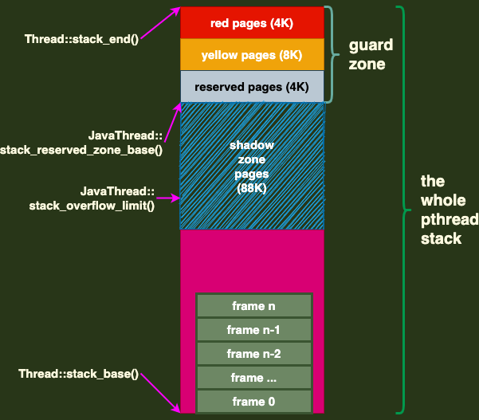

# JavaThread::create_stack_guard_pages()

> **thread.cpp**
>
> **`这个note要结合《5. os::init_before_ergo().md》、《10. Thread:: record_stack_base_and_size().md》一起理解。`**

```c++
void JavaThread::create_stack_guard_pages() {
  	address low_addr = stack_end();
  	size_t len = stack_guard_zone_size(); //16K

    /*
    由于需要在栈顶往高地址方向保留red/yellow/reserved pages, 共16KB的空间;
    os::guard_memory(low_addr, len); 的实际逻辑是通过操作系统调用API 直接将
    从low_addr开始至len字节长度的内存的权限设置为不可访问、不可读、不可写
    */
		os::guard_memory((char *) low_addr, len); //
    _stack_guard_state = stack_guard_enabled; //更新stack_guard_state
}
```


## 1. Stack(栈)结构总结

> **在`《10. Thread:: record_stack_base_and_size().md》第1.1节`中描述了Hotspot 对 JavaThread stack结构的安排。而在`《5. os::init_before_ergo().md》第1节`中具体描述了Hotspot对JavaThread stack中的预留部分的结构。**
>
> **进而JavaThread Stack结构大致如下: **
>
>  

> **说明: **
>
> + **1): 在《1. 命令行参数处理.md》中新建了一个pthread线程来执行JavaMain()函数。在启动pthread前有一个stack size的设置步骤，那里传入的size参数是 1MB，但是`需要注意那个1MB参数并不是指限定栈大小为1MB，而是限定栈大小不小于1MB，至于具体的栈大小，并不确定，需要通过系统调用来获取。`**
> + **2): 在《10. Thread::record_stack_base_and_size().md》中`就是在获取栈大小，并且不只是栈大小，栈顶和栈底的地址同样可以获取到，不过Thread中并没有成员变量来直接存储栈顶地址，只用成员变量存储了栈底地址和栈大小，所以栈顶 stack_end() 直接相减一下即可。`**
> + **3): 图中 stack_end()、stack_reserved_zone_base()、stack_end() 三个值的指示位置比较明显，直接就是开头、guard_zone结尾、栈底。`但是 stack_overflow_limit() 的指向比较奇怪，结合《10. Thread::record_stack_base_and_size().md》》第2节，它的值是(stack_end() + 88K)，所以它指向的是shadow zone pages部分中间的位置。`**
> + **4): 具体 red/yellow...等等区域的作用是什么待补. //TODO**

