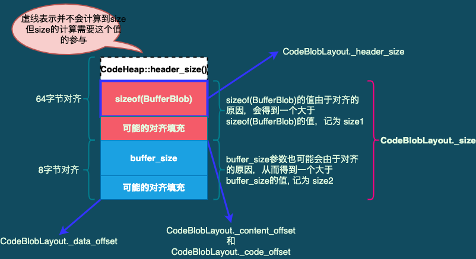

# VM_Version_init() 函数

> **源码: vm_version.cpp**

```c++
void VM_Version_init() {
  	VM_Version::initialize(); //实际就是调用的这个方法
}
```


## VM_Version::initialize()

```c++
void VM_Version::initialize() {
  
    //第1, 2节: 创建BufferBlob实例
  	stub_blob = BufferBlob::create("get_cpu_info_stub", stub_size); //stub_size=1100

  	CodeBuffer c(stub_blob); //第3节
  	VM_Version_StubGenerator g(&c); //第4节
  
    // 调用 VM_Version_StubGenerator::generate_get_cpu_info() 函数, 
    // 函数返回的是一段使用汇编写入CodeBuffer中的BufferBlob code segment的用于获取CPU信息的代码
  	get_cpu_info_stub = CAST_TO_FN_PTR(get_cpu_info_stub_t, g.generate_get_cpu_info());

    // 函数逻辑核心就是调用 get_cpu_info_stub 函数指针来获取CPU信息, 见第5节
  	get_processor_features();
}
```


### 1 BufferBlob类说明

#### 1.1 CodeBlob类

> **CodeBlob类： 表示CodeCache中的所有Entry的父类。即CodeCache中存储的都是CodeBlob类型实例。**
>
> > **CodeBlob的各个子类: **
> >
> > ```c++
> > // Subtypes are:
> > //  CompiledMethod       : Compiled Java methods (include method that calls to native code)
> > //   nmethod             : JIT Compiled Java methods
> > //   AOTCompiledMethod   : AOT Compiled Java methods - Not in the CodeCache!
> > //                         AOTCompiledMethod objects are allocated in the C-Heap, the code they
> > //                         point to is allocated in the AOTCodeHeap which is in the C-Heap as
> > //                         well (i.e. it's the memory where the shared library was loaded to)
> > //  RuntimeBlob          : Non-compiled method code; generated glue code
> > //   BufferBlob          : Used for non-relocatable code such as interpreter, stubroutines, etc.
> > //    AdapterBlob        : Used to hold C2I/I2C adapters
> > //    VtableBlob         : Used for holding vtable chunks
> > //    MethodHandlesAdapterBlob : Used to hold MethodHandles adapters
> > //   RuntimeStub         : Call to VM runtime methods
> > //   SingletonBlob       : Super-class for all blobs that exist in only one instance
> > //    DeoptimizationBlob : Used for deoptimization
> > //    ExceptionBlob      : Used for stack unrolling
> > //    SafepointBlob      : Used to handle illegal instruction exceptions
> > //    UncommonTrapBlob   : Used to handle uncommon traps
> > ```
>

```c++
// --- codeBlob.hpp
class CodeBlob {
	protected:
  	const CompilerType _type;                      // CompilerType
  	int        _size;                              // total size of CodeBlob in bytes
  	int        _header_size;                       // size of header (depends on subclass)
  
    // instruction offsets in [0.._frame_complete_offset) have not finished setting up their frame. Beware of 
  	// pc's in that range. There is a similar range(s) on returns which we don't detect.
  	int        _frame_complete_offset;             
                                                 
  	int        _data_offset;                       // offset to where data region begins
  	int        _frame_size;                        // size of stack frame

  	address    _code_begin;
  	address    _code_end;
  
    // address to where content region begins (this includes consts, insts, stubs)
    // address    _content_end - not required, for all CodeBlobs _code_end == _content_end for now
  	address    _content_begin;                     
                                                 
  	address    _data_end;
  	address    _relocation_begin;
  	address    _relocation_end;

  	ImmutableOopMapSet* _oop_maps;                 // OopMap for this CodeBlob
  	bool                _caller_must_gc_arguments;
  	CodeStrings         _strings;
  	const char*         _name;
};
```


#### 1.2 RuntimeBlob类

> **RuntimeBlob类继承了CodeBlob类，但其中并没有定义扩展的字段。所以`RuntimeBlob只起到一个标记类型的作用`**


#### 1.3 BufferBlob类

> **`BufferBlob: used to hold non-relocatable machine code such as the interpreter, stubroutines, etc.`**

```c++
class BufferBlob: public RuntimeBlob {
		// BufferBlob 继承自 RuntimeBlob, 但也没有定义额外的字段. 所以后面可能会注意相关方法的实现
};

// ------ VM_Version::initialize() 方法中调用的BufferBlob::create方法
// ---- 其实就是创建了一个BufferBlob实例, 但中间涉及到一些大小对齐的处理;
BufferBlob* BufferBlob::create(const char* name, int buffer_size) {
  
  	BufferBlob* blob = NULL;
  	unsigned int size = sizeof(BufferBlob);
  	size = CodeBlob::align_code_offset(size); // <2.3节> 
  	size += align_up(buffer_size, oopSize); // <2.3节> 
  	{
    		MutexLockerEx mu(CodeCache_lock, Mutex::_no_safepoint_check_flag);
    		blob = new (size) BufferBlob(name, size);
  	}

 	 	return blob;
}

//========================
// ---- 调用的BufferBlob构造函数
BufferBlob::BufferBlob(const char* name, int size)
: RuntimeBlob(name, sizeof(BufferBlob), size, CodeOffsets::frame_never_safe, /*locs_size:*/ 0)
{}

// --- 进而调用的RuntimeBlob构造函数
// --- 注意: 这里构造的 CodeBlobLayout对象, 关于CodeBlobLayout构造函数, 参考2.2节
RuntimeBlob::RuntimeBlob(const char* name, int header_size, int size, int frame_complete, int locs_size)
  : CodeBlob(name, compiler_none, 
      CodeBlobLayout((address) this, size, header_size, locs_size, size), 
      frame_complete, 0, NULL, false /* caller_must_gc_arguments */)
{}

// --- 进而调用的CodeBlob构造函数
CodeBlob::CodeBlob(const char* name, CompilerType type, const CodeBlobLayout& layout, int frame_complete_offset, int frame_size, ImmutableOopMapSet* oop_maps, bool caller_must_gc_arguments) :
  _type(type),
  _size(layout.size()),
  _header_size(layout.header_size()),
  _frame_complete_offset(frame_complete_offset),
  _data_offset(layout.data_offset()),
  _frame_size(frame_size),
  _code_begin(layout.code_begin()),
  _code_end(layout.code_end()),
  _content_begin(layout.content_begin()),
  _data_end(layout.data_end()),
  _relocation_begin(layout.relocation_begin()),
  _relocation_end(layout.relocation_end()),
  _oop_maps(oop_maps),
  _caller_must_gc_arguments(caller_must_gc_arguments),
  _strings(CodeStrings()),
  _name(name)
{}
```


### 2. CodeBlobLayout

> **所谓的CodeBlob类布局的意思是，CodeBlob表示JVM会在对象实例空间后面直接附加生成的代码，如stub入口代码或其它代码等。这些代码会在CodeBlob对象后面，但也并非只有代码，还包括重定位信息，data信息等，而这些信息在对象实例空间后面的空间大小不固定，但是相对顺序是固定的，所以`每个不同对象后面的空间大小都需要先进行计算，再使用CodeBlobLayout来按顺序确定每个区间的大小位置等。`**
>
> **`关于它的位置确定，参考2.2节中的CodeBlobLayout构造函数中的逻辑。`**


> **上面说到了，CodeBlob类/子类的布局由`CodeBlobLayout类`表示。再结合上面 1.3节关于 BufferBlob::create() 方法， 在 BufferBlob::create() 方法中计算了两个大小，并将这两个大小都附加到了size局部变量中，且最终使用这个size值传入了BufferBlob 构造方法。**


#### 2.1 CodeBlobLayout类作用

> **CodeBlob类的原注释---:**
>
> > **CodeBlob子类有两种布局：**
> >
> > + **1. 非AOTCompiledMethod类型:**
> >
> >   ```c++
> >   // Layout (all except AOTCompiledMethod) : continuous in the CodeCache
> >   //   - header
> >   //   - relocation
> >   //   - content space
> >   //     - instruction space
> >   //   - data space
> >   ```
> >
> > + **2. AOTCompiledMethod类型: **
> >
> >   ```c++
> >   // Layout (AOTCompiledMethod) : in the C-Heap
> >   //   - header -\
> >   //     ...     |
> >   //   - code  <-/
> >   ```


> **CodeBlob表示的空间布局用一个类来表示: `CodeBlobLayout`**
>
> > **正常情况下，CodeBlob中的成员变量会使用CodeBlobLayout对象的相关成员变量来初始化**


#### 2.2 CodeBlobLayout类

```c++
class CodeBlobLayout : public StackObj {
private:
  	int _size;
  	int _header_size;
  	int _relocation_size;
  	int _content_offset;
  	int _code_offset;
  	int _data_offset;
  	address _code_begin;
  	address _code_end;
  	address _content_begin;
  	address _content_end;
  	address _data_end;
  	address _relocation_begin;
  	address _relocation_end;
};

// ---- BufferBlob中调用的CodeBlobLayout构造函数
CodeBlobLayout(const address start, int size, int header_size, int relocation_size, int data_offset) :
    _size(size),
    _header_size(header_size),
    _relocation_size(relocation_size),
    _content_offset(CodeBlob::align_code_offset(_header_size + _relocation_size)),
    _code_offset(_content_offset),
    _data_offset(data_offset)
{
    //CodeBlobLayout中指向对应的BufferBlob的位置指针;  
    //根据1.3节的BufferBlob的构造函数以及2.4节, 其中relocation_size 值为0; data_offset值为size; 
    //且 start为BufferBlob对象指针
    _code_begin = (address) start + _code_offset;
    _code_end = (address) start + _data_offset;

    _content_begin = (address) start + _content_offset;
    _content_end = (address) start + _data_offset;

    _data_end = (address) start + _size;
    _relocation_begin = (address) start + _header_size;
    _relocation_end = _relocation_begin + _relocation_size;
}
```


#### 2.3 BufferBlob::create()中涉及的空间大小

**BufferBlob::create() 方法中计算了两个空间大小: **

+ **CodeBlob::align_code_offset(size); 用size1表示**

  > **源码: **
  >
  > > **局部变量 size初始值为 sizeof(BufferBlob)，而 `size = CodeBlob::align_code_offset(size)` 这一行调用，可能会增加 size值大小，使其满足 (size + CodeHeap::header_size()) 的结果是 64字节对齐的。**
  >
  > ```c++
  > // 注意: 这里是将空间以 CodeEntryAlignment (64) 为单位对齐; 
  > // 但是这个空间并非offset参数值, 而是 "offset + CodeHeap::header_size()", 由于header size固定, 
  > // 所以为了满足对齐要求, 则可能需要返回一个大于offset的值; 
  > 
  > // 算法逻辑是, (offset + CodeHeap::header_size()) , 注: 使用size表示; 而为了处理size的值小于64情况
  > //(即此时size将低6位置0后, 结果为0), 将size增加(CodeEntryAlignment-1)后将低6位置0后的size结果, 
  > // 就是满足要求的最小size值. 这样再用size-header 后, 即是满足要求的结果
  > unsigned int CodeBlob::align_code_offset(int offset) {
  >   return
  >     ((offset + (int)CodeHeap::header_size() + (CodeEntryAlignment-1)) & ~(CodeEntryAlignment-1))
  >     - (int)CodeHeap::header_size();
  > }
  > ```

+ **align_up(buffer_size, oopSize); 用size2表示**

  > **逻辑类似上面的align_code_offset，返回的是 >= buffer_size 的满足oopSize对齐要求的最小值**


#### 2.4 CodeBlobLayout 图示




### 3. CodeBuffer

> **参考上面的第1节、第2节，创建了一个BufferBlob实例，而在BufferBlob构造函数中，又使用CodeBlobLayout来计算了相关的空间大小以及位置信息。`但是此时并没有为BufferBlob对象后分配空间以及写入信息，而只是确定了各个size大小。具体的分配空间以及代码写入等操作则是VM_Version_StubGenerator中完成的。`**

> **CodeBuffer类的作用是根据BufferBlob中的各个信息size大小的成员变量值，将各个 CodeSection类型的成员变量指向对应的内存区域。相关调用为`CodeBuffer c(stub_blob);` 这一行**

```c++
// codeBuffer.cpp
CodeBuffer::CodeBuffer(CodeBlob* blob) {
  	initialize_misc("static buffer"); //初始化 _name 成员变量, 其余成员变量清空或置NULL
  	initialize(blob->content_begin(), blob->content_size());
  	verify_section_allocation(); //验证, 略
}

// ---- 核心调用是 initialize(blob->content_begin(), blob->content_size()); 这一行
// --- 根据 2.4节图示, BufferBlob的content区域就是蓝色块区域
// --- 注: 根据下面的逻辑, 主要关注一下 _insts 成员变量
void initialize(address code_start, csize_t code_size) {
      // _consts/_insts/_stubs 都是 CodeSection类型, 分别初始化它们持有的CodeBuffer对象以及类型(用 SET_CONSTS等枚举表示)
    	_consts.initialize_outer(this,  SECT_CONSTS);
    	_insts.initialize_outer(this,   SECT_INSTS);
    	_stubs.initialize_outer(this,   SECT_STUBS);
    
      // --- 初始化 _total_start 和 _total_size, 使它们指向整个content内存空间
    	_total_start = code_start;
    	_total_size  = code_size;
    	
      // --- 初始化 _insts的 _start 和 _limit字段; 注: 只初始化了 _insts, 没有初始化_consts/_stubs这两个
    	_insts.initialize(code_start, code_size);

    	_oop_recorder = &_default_oop_recorder; //看名字是记录oop操作数量的类, 略过了
  }
```


### 4. VM_Version_StubGenerator 构造函数

> **VM_Version_StubGenerator类作用: `VM Version相关的Stub代码生成器。`**
>
> > **`构造函数的核心就是初始化父类StubCodeGenerator::_masm成员变量`**
>
> **VM_Version_StubGenerator的父类是StubCodeGenerator，`StubCodeGenerator是所有stub代码生成器的基类。`**
>
> > ```c++
> > // --- stubCodeGenerator.hpp
> > class StubCodeGenerator: public StackObj {
> >  protected:
> >   MacroAssembler*  _masm; //生成代码的核心类, 根据不同的硬件平台有不同的实现, 这里只关注 x86平台的实现
> > 
> >  public:
> >   StubCodeGenerator(CodeBuffer* code, bool print_code = false);
> >   ~StubCodeGenerator();
> > };
> > ```


```c++
// --- stubCodeGenerator.cpp

// -- VM_Version_StubGenerator构造函数
VM_Version_StubGenerator(CodeBuffer *c) : StubCodeGenerator(c) {}

// -- 调用父类的构造函数
StubCodeGenerator::StubCodeGenerator(CodeBuffer* code, bool print_code) {
  	_masm = new MacroAssembler(code); //重要: 初始化_masm为 MacroAssembler对象
}
```


#### 4.1 MacroAssembler

> **关于 MacroAssembler 的说明，以后找时间再整理**


### 5. VM_Version_StubGenerator::generate_get_cpu_info() 函数

> **源码:  vm_version_x86.cpp**

```c++
// 生成汇编代码, 这些汇编代码的意义是获取cpu信息; 
// 返回的也是这些汇编代码的起始地址;
// 简要概括一下就是: generate_get_cpu_info() 函数在代码运行过程中用汇编的方式生成了一个新的函数;
// 为什么没有直接在源代码中写这个函数: 因为这个函数是需要写到BufferBlob实例后的空间(即CodeBuffer中指示的特定位置)处, 
// 因为BufferBlob的实例地址是不固定的, 所以每次运行VM时的对应函数也是不固定的; 
address generate_get_cpu_info() {
    // Flags to test CPU type.
    const uint32_t HS_EFL_AC = 0x40000;
    const uint32_t HS_EFL_ID = 0x200000;
    // Values for when we don't have a CPUID instruction.
    const int      CPU_FAMILY_SHIFT = 8;
    const uint32_t CPU_FAMILY_386 = (3 << CPU_FAMILY_SHIFT);
    const uint32_t CPU_FAMILY_486 = (4 << CPU_FAMILY_SHIFT);
    bool use_evex = FLAG_IS_DEFAULT(UseAVX) || (UseAVX > 2);

    Label detect_486, cpu486, detect_586, std_cpuid1, std_cpuid4;
    Label sef_cpuid, ext_cpuid, ext_cpuid1, ext_cpuid5, ext_cpuid7, ext_cpuid8, done, wrapup;
    Label legacy_setup, save_restore_except, legacy_save_restore, start_simd_check;

    StubCodeMark mark(this, "VM_Version", "get_cpu_info_stub");
#   define __ _masm->

    address start = __ pc();

    //
    // void get_cpu_info(VM_Version::CpuidInfo* cpuid_info);
    //
    // LP64: rcx and rdx are first and second argument registers on windows

    __ push(rbp);

    __ movptr(rbp, Address(rsp, 8)); // cpuid_info address

    __ push(rbx);
    __ push(rsi);
    __ pushf();          // preserve rbx, and flags
    __ pop(rax);
    __ push(rax);
    __ mov(rcx, rax);
    //
    // if we are unable to change the AC flag, we have a 386
    //
    __ xorl(rax, HS_EFL_AC);
    __ push(rax);
    __ popf();
    __ pushf();
    __ pop(rax);
    __ cmpptr(rax, rcx);
    __ jccb(Assembler::notEqual, detect_486);

    __ movl(rax, CPU_FAMILY_386);
    __ movl(Address(rbp, in_bytes(VM_Version::std_cpuid1_offset())), rax);
    __ jmp(done);

    //
    // If we are unable to change the ID flag, we have a 486 which does
    // not support the "cpuid" instruction.
    //
    __ bind(detect_486);
    __ mov(rax, rcx);
    __ xorl(rax, HS_EFL_ID);
    __ push(rax);
    __ popf();
    __ pushf();
    __ pop(rax);
    __ cmpptr(rcx, rax);
    __ jccb(Assembler::notEqual, detect_586);

    __ bind(cpu486);
    __ movl(rax, CPU_FAMILY_486);
    __ movl(Address(rbp, in_bytes(VM_Version::std_cpuid1_offset())), rax);
    __ jmp(done);

    //
    // At this point, we have a chip which supports the "cpuid" instruction
    //
    __ bind(detect_586);
    __ xorl(rax, rax);
    __ cpuid();
    __ orl(rax, rax);
    __ jcc(Assembler::equal, cpu486);   // if cpuid doesn't support an input
                                        // value of at least 1, we give up and
                                        // assume a 486
    __ lea(rsi, Address(rbp, in_bytes(VM_Version::std_cpuid0_offset())));
    __ movl(Address(rsi, 0), rax);
    __ movl(Address(rsi, 4), rbx);
    __ movl(Address(rsi, 8), rcx);
    __ movl(Address(rsi,12), rdx);

    __ cmpl(rax, 0xa);                  // Is cpuid(0xB) supported?
    __ jccb(Assembler::belowEqual, std_cpuid4);

    //
    // cpuid(0xB) Processor Topology
    //
    __ movl(rax, 0xb);
    __ xorl(rcx, rcx);   // Threads level
    __ cpuid();

    __ lea(rsi, Address(rbp, in_bytes(VM_Version::tpl_cpuidB0_offset())));
    __ movl(Address(rsi, 0), rax);
    __ movl(Address(rsi, 4), rbx);
    __ movl(Address(rsi, 8), rcx);
    __ movl(Address(rsi,12), rdx);

    __ movl(rax, 0xb);
    __ movl(rcx, 1);     // Cores level
    __ cpuid();
    __ push(rax);
    __ andl(rax, 0x1f);  // Determine if valid topology level
    __ orl(rax, rbx);    // eax[4:0] | ebx[0:15] == 0 indicates invalid level
    __ andl(rax, 0xffff);
    __ pop(rax);
    __ jccb(Assembler::equal, std_cpuid4);

    __ lea(rsi, Address(rbp, in_bytes(VM_Version::tpl_cpuidB1_offset())));
    __ movl(Address(rsi, 0), rax);
    __ movl(Address(rsi, 4), rbx);
    __ movl(Address(rsi, 8), rcx);
    __ movl(Address(rsi,12), rdx);

    __ movl(rax, 0xb);
    __ movl(rcx, 2);     // Packages level
    __ cpuid();
    __ push(rax);
    __ andl(rax, 0x1f);  // Determine if valid topology level
    __ orl(rax, rbx);    // eax[4:0] | ebx[0:15] == 0 indicates invalid level
    __ andl(rax, 0xffff);
    __ pop(rax);
    __ jccb(Assembler::equal, std_cpuid4);

    __ lea(rsi, Address(rbp, in_bytes(VM_Version::tpl_cpuidB2_offset())));
    __ movl(Address(rsi, 0), rax);
    __ movl(Address(rsi, 4), rbx);
    __ movl(Address(rsi, 8), rcx);
    __ movl(Address(rsi,12), rdx);

    //
    // cpuid(0x4) Deterministic cache params
    //
    __ bind(std_cpuid4);
    __ movl(rax, 4);
    __ cmpl(rax, Address(rbp, in_bytes(VM_Version::std_cpuid0_offset()))); // Is cpuid(0x4) supported?
    __ jccb(Assembler::greater, std_cpuid1);

    __ xorl(rcx, rcx);   // L1 cache
    __ cpuid();
    __ push(rax);
    __ andl(rax, 0x1f);  // Determine if valid cache parameters used
    __ orl(rax, rax);    // eax[4:0] == 0 indicates invalid cache
    __ pop(rax);
    __ jccb(Assembler::equal, std_cpuid1);

    __ lea(rsi, Address(rbp, in_bytes(VM_Version::dcp_cpuid4_offset())));
    __ movl(Address(rsi, 0), rax);
    __ movl(Address(rsi, 4), rbx);
    __ movl(Address(rsi, 8), rcx);
    __ movl(Address(rsi,12), rdx);

    //
    // Standard cpuid(0x1)
    //
    __ bind(std_cpuid1);
    __ movl(rax, 1);
    __ cpuid();
    __ lea(rsi, Address(rbp, in_bytes(VM_Version::std_cpuid1_offset())));
    __ movl(Address(rsi, 0), rax);
    __ movl(Address(rsi, 4), rbx);
    __ movl(Address(rsi, 8), rcx);
    __ movl(Address(rsi,12), rdx);

    //
    // Check if OS has enabled XGETBV instruction to access XCR0
    // (OSXSAVE feature flag) and CPU supports AVX
    //
    __ andl(rcx, 0x18000000); // cpuid1 bits osxsave | avx
    __ cmpl(rcx, 0x18000000);
    __ jccb(Assembler::notEqual, sef_cpuid); // jump if AVX is not supported

    //
    // XCR0, XFEATURE_ENABLED_MASK register
    //
    __ xorl(rcx, rcx);   // zero for XCR0 register
    __ xgetbv();
    __ lea(rsi, Address(rbp, in_bytes(VM_Version::xem_xcr0_offset())));
    __ movl(Address(rsi, 0), rax);
    __ movl(Address(rsi, 4), rdx);

    //
    // cpuid(0x7) Structured Extended Features
    //
    __ bind(sef_cpuid);
    __ movl(rax, 7);
    __ cmpl(rax, Address(rbp, in_bytes(VM_Version::std_cpuid0_offset()))); // Is cpuid(0x7) supported?
    __ jccb(Assembler::greater, ext_cpuid);

    __ xorl(rcx, rcx);
    __ cpuid();
    __ lea(rsi, Address(rbp, in_bytes(VM_Version::sef_cpuid7_offset())));
    __ movl(Address(rsi, 0), rax);
    __ movl(Address(rsi, 4), rbx);
    __ movl(Address(rsi, 8), rcx);
    __ movl(Address(rsi, 12), rdx);

    //
    // Extended cpuid(0x80000000)
    //
    __ bind(ext_cpuid);
    __ movl(rax, 0x80000000);
    __ cpuid();
    __ cmpl(rax, 0x80000000);     // Is cpuid(0x80000001) supported?
    __ jcc(Assembler::belowEqual, done);
    __ cmpl(rax, 0x80000004);     // Is cpuid(0x80000005) supported?
    __ jcc(Assembler::belowEqual, ext_cpuid1);
    __ cmpl(rax, 0x80000006);     // Is cpuid(0x80000007) supported?
    __ jccb(Assembler::belowEqual, ext_cpuid5);
    __ cmpl(rax, 0x80000007);     // Is cpuid(0x80000008) supported?
    __ jccb(Assembler::belowEqual, ext_cpuid7);
    __ cmpl(rax, 0x80000008);     // Is cpuid(0x80000009 and above) supported?
    __ jccb(Assembler::belowEqual, ext_cpuid8);
    __ cmpl(rax, 0x8000001E);     // Is cpuid(0x8000001E) supported?
    __ jccb(Assembler::below, ext_cpuid8);
    //
    // Extended cpuid(0x8000001E)
    //
    __ movl(rax, 0x8000001E);
    __ cpuid();
    __ lea(rsi, Address(rbp, in_bytes(VM_Version::ext_cpuid1E_offset())));
    __ movl(Address(rsi, 0), rax);
    __ movl(Address(rsi, 4), rbx);
    __ movl(Address(rsi, 8), rcx);
    __ movl(Address(rsi,12), rdx);

    //
    // Extended cpuid(0x80000008)
    //
    __ bind(ext_cpuid8);
    __ movl(rax, 0x80000008);
    __ cpuid();
    __ lea(rsi, Address(rbp, in_bytes(VM_Version::ext_cpuid8_offset())));
    __ movl(Address(rsi, 0), rax);
    __ movl(Address(rsi, 4), rbx);
    __ movl(Address(rsi, 8), rcx);
    __ movl(Address(rsi,12), rdx);

    //
    // Extended cpuid(0x80000007)
    //
    __ bind(ext_cpuid7);
    __ movl(rax, 0x80000007);
    __ cpuid();
    __ lea(rsi, Address(rbp, in_bytes(VM_Version::ext_cpuid7_offset())));
    __ movl(Address(rsi, 0), rax);
    __ movl(Address(rsi, 4), rbx);
    __ movl(Address(rsi, 8), rcx);
    __ movl(Address(rsi,12), rdx);

    //
    // Extended cpuid(0x80000005)
    //
    __ bind(ext_cpuid5);
    __ movl(rax, 0x80000005);
    __ cpuid();
    __ lea(rsi, Address(rbp, in_bytes(VM_Version::ext_cpuid5_offset())));
    __ movl(Address(rsi, 0), rax);
    __ movl(Address(rsi, 4), rbx);
    __ movl(Address(rsi, 8), rcx);
    __ movl(Address(rsi,12), rdx);

    //
    // Extended cpuid(0x80000001)
    //
    __ bind(ext_cpuid1);
    __ movl(rax, 0x80000001);
    __ cpuid();
    __ lea(rsi, Address(rbp, in_bytes(VM_Version::ext_cpuid1_offset())));
    __ movl(Address(rsi, 0), rax);
    __ movl(Address(rsi, 4), rbx);
    __ movl(Address(rsi, 8), rcx);
    __ movl(Address(rsi,12), rdx);

    //
    // Check if OS has enabled XGETBV instruction to access XCR0
    // (OSXSAVE feature flag) and CPU supports AVX
    //
    __ lea(rsi, Address(rbp, in_bytes(VM_Version::std_cpuid1_offset())));
    __ movl(rcx, 0x18000000); // cpuid1 bits osxsave | avx
    __ andl(rcx, Address(rsi, 8)); // cpuid1 bits osxsave | avx
    __ cmpl(rcx, 0x18000000);
    __ jccb(Assembler::notEqual, done); // jump if AVX is not supported

    __ movl(rax, 0x6);
    __ andl(rax, Address(rbp, in_bytes(VM_Version::xem_xcr0_offset()))); // xcr0 bits sse | ymm
    __ cmpl(rax, 0x6);
    __ jccb(Assembler::equal, start_simd_check); // return if AVX is not supported

    // we need to bridge farther than imm8, so we use this island as a thunk
    __ bind(done);
    __ jmp(wrapup);

    __ bind(start_simd_check);
    //
    // Some OSs have a bug when upper 128/256bits of YMM/ZMM
    // registers are not restored after a signal processing.
    // Generate SEGV here (reference through NULL)
    // and check upper YMM/ZMM bits after it.
    //
    intx saved_useavx = UseAVX;
    intx saved_usesse = UseSSE;
    // check _cpuid_info.sef_cpuid7_ebx.bits.avx512f
    __ lea(rsi, Address(rbp, in_bytes(VM_Version::sef_cpuid7_offset())));
    __ movl(rax, 0x10000);
    __ andl(rax, Address(rsi, 4)); // xcr0 bits sse | ymm
    __ cmpl(rax, 0x10000);
    __ jccb(Assembler::notEqual, legacy_setup); // jump if EVEX is not supported
    // check _cpuid_info.xem_xcr0_eax.bits.opmask
    // check _cpuid_info.xem_xcr0_eax.bits.zmm512
    // check _cpuid_info.xem_xcr0_eax.bits.zmm32
    __ movl(rax, 0xE0);
    __ andl(rax, Address(rbp, in_bytes(VM_Version::xem_xcr0_offset()))); // xcr0 bits sse | ymm
    __ cmpl(rax, 0xE0);
    __ jccb(Assembler::notEqual, legacy_setup); // jump if EVEX is not supported

    // If UseAVX is unitialized or is set by the user to include EVEX
    if (use_evex) {
      // EVEX setup: run in lowest evex mode
      VM_Version::set_evex_cpuFeatures(); // Enable temporary to pass asserts
      UseAVX = 3;
      UseSSE = 2;
#ifdef _WINDOWS
      // xmm5-xmm15 are not preserved by caller on windows
      // https://msdn.microsoft.com/en-us/library/9z1stfyw.aspx
      __ subptr(rsp, 64);
      __ evmovdqul(Address(rsp, 0), xmm7, Assembler::AVX_512bit);
#ifdef _LP64
      __ subptr(rsp, 64);
      __ evmovdqul(Address(rsp, 0), xmm8, Assembler::AVX_512bit);
      __ subptr(rsp, 64);
      __ evmovdqul(Address(rsp, 0), xmm31, Assembler::AVX_512bit);
#endif // _LP64
#endif // _WINDOWS

      // load value into all 64 bytes of zmm7 register
      __ movl(rcx, VM_Version::ymm_test_value());
      __ movdl(xmm0, rcx);
      __ vpbroadcastd(xmm0, xmm0, Assembler::AVX_512bit);
      __ evmovdqul(xmm7, xmm0, Assembler::AVX_512bit);
#ifdef _LP64
      __ evmovdqul(xmm8, xmm0, Assembler::AVX_512bit);
      __ evmovdqul(xmm31, xmm0, Assembler::AVX_512bit);
#endif
      VM_Version::clean_cpuFeatures();
      __ jmp(save_restore_except);
    }

    __ bind(legacy_setup);
    // AVX setup
    VM_Version::set_avx_cpuFeatures(); // Enable temporary to pass asserts
    UseAVX = 1;
    UseSSE = 2;
#ifdef _WINDOWS
    __ subptr(rsp, 32);
    __ vmovdqu(Address(rsp, 0), xmm7);
#ifdef _LP64
    __ subptr(rsp, 32);
    __ vmovdqu(Address(rsp, 0), xmm8);
    __ subptr(rsp, 32);
    __ vmovdqu(Address(rsp, 0), xmm15);
#endif // _LP64
#endif // _WINDOWS

    // load value into all 32 bytes of ymm7 register
    __ movl(rcx, VM_Version::ymm_test_value());

    __ movdl(xmm0, rcx);
    __ pshufd(xmm0, xmm0, 0x00);
    __ vinsertf128_high(xmm0, xmm0);
    __ vmovdqu(xmm7, xmm0);
#ifdef _LP64
    __ vmovdqu(xmm8, xmm0);
    __ vmovdqu(xmm15, xmm0);
#endif
    VM_Version::clean_cpuFeatures();

    __ bind(save_restore_except);
    __ xorl(rsi, rsi);
    VM_Version::set_cpuinfo_segv_addr(__ pc());
    // Generate SEGV
    __ movl(rax, Address(rsi, 0));

    VM_Version::set_cpuinfo_cont_addr(__ pc());
    // Returns here after signal. Save xmm0 to check it later.

    // check _cpuid_info.sef_cpuid7_ebx.bits.avx512f
    __ lea(rsi, Address(rbp, in_bytes(VM_Version::sef_cpuid7_offset())));
    __ movl(rax, 0x10000);
    __ andl(rax, Address(rsi, 4));
    __ cmpl(rax, 0x10000);
    __ jcc(Assembler::notEqual, legacy_save_restore);
    // check _cpuid_info.xem_xcr0_eax.bits.opmask
    // check _cpuid_info.xem_xcr0_eax.bits.zmm512
    // check _cpuid_info.xem_xcr0_eax.bits.zmm32
    __ movl(rax, 0xE0);
    __ andl(rax, Address(rbp, in_bytes(VM_Version::xem_xcr0_offset()))); // xcr0 bits sse | ymm
    __ cmpl(rax, 0xE0);
    __ jcc(Assembler::notEqual, legacy_save_restore);

    // If UseAVX is unitialized or is set by the user to include EVEX
    if (use_evex) {
      // EVEX check: run in lowest evex mode
      VM_Version::set_evex_cpuFeatures(); // Enable temporary to pass asserts
      UseAVX = 3;
      UseSSE = 2;
      __ lea(rsi, Address(rbp, in_bytes(VM_Version::zmm_save_offset())));
      __ evmovdqul(Address(rsi, 0), xmm0, Assembler::AVX_512bit);
      __ evmovdqul(Address(rsi, 64), xmm7, Assembler::AVX_512bit);
#ifdef _LP64
      __ evmovdqul(Address(rsi, 128), xmm8, Assembler::AVX_512bit);
      __ evmovdqul(Address(rsi, 192), xmm31, Assembler::AVX_512bit);
#endif

#ifdef _WINDOWS
#ifdef _LP64
      __ evmovdqul(xmm31, Address(rsp, 0), Assembler::AVX_512bit);
      __ addptr(rsp, 64);
      __ evmovdqul(xmm8, Address(rsp, 0), Assembler::AVX_512bit);
      __ addptr(rsp, 64);
#endif // _LP64
      __ evmovdqul(xmm7, Address(rsp, 0), Assembler::AVX_512bit);
      __ addptr(rsp, 64);
#endif // _WINDOWS
      generate_vzeroupper(wrapup);
      VM_Version::clean_cpuFeatures();
      UseAVX = saved_useavx;
      UseSSE = saved_usesse;
      __ jmp(wrapup);
   }

    __ bind(legacy_save_restore);
    // AVX check
    VM_Version::set_avx_cpuFeatures(); // Enable temporary to pass asserts
    UseAVX = 1;
    UseSSE = 2;
    __ lea(rsi, Address(rbp, in_bytes(VM_Version::ymm_save_offset())));
    __ vmovdqu(Address(rsi, 0), xmm0);
    __ vmovdqu(Address(rsi, 32), xmm7);
#ifdef _LP64
    __ vmovdqu(Address(rsi, 64), xmm8);
    __ vmovdqu(Address(rsi, 96), xmm15);
#endif

#ifdef _WINDOWS
#ifdef _LP64
    __ vmovdqu(xmm15, Address(rsp, 0));
    __ addptr(rsp, 32);
    __ vmovdqu(xmm8, Address(rsp, 0));
    __ addptr(rsp, 32);
#endif // _LP64
    __ vmovdqu(xmm7, Address(rsp, 0));
    __ addptr(rsp, 32);
#endif // _WINDOWS
    generate_vzeroupper(wrapup);
    VM_Version::clean_cpuFeatures();
    UseAVX = saved_useavx;
    UseSSE = saved_usesse;

    __ bind(wrapup);
    __ popf();
    __ pop(rsi);
    __ pop(rbx);
    __ pop(rbp);
    __ ret(0);

#   undef __

    return start;
  };
```

