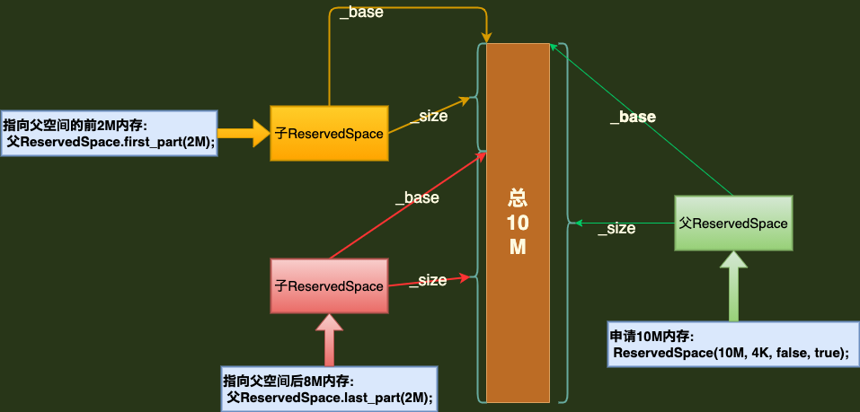

# ReservedSpace

> **virtualspace.hpp**
>
> **`表示在堆中分配的连续内存空间的数据结构`**

```c++
class ReservedSpace {
 protected:
  char*  _base;  //空间的地址
  size_t _size;  //空间大小
  size_t _noaccess_prefix; 
  size_t _alignment;  // _base值(即地址值)需要按 _alignment对齐
  bool   _special;    // ...
  int    _fd_for_heap; //如果是文件映射内存的话, 这里是文件fd; 如果是申请内存的话,这里值是 -1
 private:
  bool   _executable; //是否可执行
}
```


## 1. 申请内存构造函数

> **ReservedSpace 定义了多个重载的构造函数，先说明用到的一个。**
>
> **下面的构造函数会申请size大小的内存，再将申请内存地址、内存大小等信息存储进成员变量中**

```c++
// 非内存映射文件, 所以将 _fd_for_heap 设置为 -1; 其它调用 initialize() 函数进行初始化
// 此外, large参数指操作系统中是否使用大于 4K 的页, 一般为false
// size: 要申请的内存大小
// alignment: 按下面的逻辑申请到的内存地址应该是alignment对齐的; 正常情况下alignment为4K
// executable: 构造子类ReservedCodeSpace对象时, 此参数通常为true
ReservedSpace::ReservedSpace(size_t size, size_t alignment,
                             bool large, bool executable) : _fd_for_heap(-1) {
  	initialize(size, alignment, large, NULL, executable);
}

//在申请内存时, rqeusted_address一般为NULL; executable 一般为true
void ReservedSpace::initialize(size_t size, size_t alignment, bool large,
                               char* requested_address,
                               bool executable) {
  if (size == 0) return;
  
  // vm内存分布粒度, 正常情况下为页大小, 即4K 
  const size_t granularity = os::vm_allocation_granularity();

  alignment = MAX2(alignment, (size_t)os::vm_page_size()); //4k

  // --- 先用默认值初始化成员变量
  _base = NULL;
  _size = 0;
  _special = false;
  _executable = executable; 
  _alignment = 0;
  _noaccess_prefix = 0;

  // ---- 申请内存
  char* base = NULL;
  if (base == NULL) {
      // 实际的申请内存操作
      base = os::reserve_memory(size, NULL, alignment, _fd_for_heap);
    	if (base == NULL) return;
  }
  // ---- 申请成功后更新相应的成员变量值
  _base = base;
  _size = size;
  _alignment = alignment;

  if (_fd_for_heap != -1) {
    	_special = true;
  }
}
```


## 2. ReservedSpace::first_part() 函数 以及 另一个构造函数

> **first_part() 函数，通过函数名大概可以了解到它的作用是从某个内存空间的开头处取一部分。通过下面的函数实现可以了解到，它指向了`父对象的 开头至partition_size字节 的空间`**

```c++
// 集中研究下 split 为false时, 因为对于Bsd系统中, 一般没有split为true的情况
ReservedSpace ReservedSpace::first_part(size_t partition_size, 
                                        bool split = false, 
                                        bool realloc = true) {
  return first_part(partition_size, alignment(), split, realloc);
}

// 实际调用函数; 
ReservedSpace ReservedSpace::first_part(size_t partition_size, size_t alignment,
                                        bool split, bool realloc) {
  if (split) {
    	os::split_reserved_memory(base(), size(), partition_size, realloc);
  }
  
  //调用了另一个构选函数构建了一个新的ReservdSpace对象
  ReservedSpace result(base(), partition_size, alignment, special(), executable());
  return result;
}

// 可以看到这个构造函数并没有进行内存申请操作;
// 通过这个构造函数创建的ReservedSpace 可以看作一个子对象, 它的父对象就是
// 实际申请到base地址所指向的内存空间的那个对象,即某个通过第1节的构造函数创建的对象. 
// 而这个子对象继承父对象的special, executalbe, alignment属性值.
ReservedSpace::ReservedSpace(char* base, size_t size, size_t alignment,
                             bool special, bool executable) : _fd_for_heap(-1) {
  _base = base;
  _size = size;
  _alignment = alignment;
  _noaccess_prefix = 0;
  _special = special;
  _executable = executable;
}
```


## 3. ReservedSpace::last_part() 函数

> **与 first_part() 函数相反， `last_part() 函数取父对象的 (开头+partition_size字节) 至 最后 的空间。`**

```c++
ReservedSpace ReservedSpace::last_part(size_t partition_size, size_t alignment) {
	ReservedSpace result(base() + partition_size, size() - partition_size,
                       alignment, special(), executable());
  return result;
}
```


## 4. ReservedSpace总结

> **基本上就是通过调用第1节的构造函数申请一个固定大小的空间后，再通过调用 first_part、last_part等函数去这这个内存空间中取某一部分。当然无论是整个空间还是某一部分的空间，都用ReservedSpace对象来表示。**
>
> **如下图: **
>
> 


## 5. 子类系列

> **其实ReservedSpace类已经是完整的功能实现了。VM定义了多个ReservedSpace的子类，主要是对各种空间中存储的内容进行区分。 **

### 5.1 ReservedCodeSpace: 代码空间

> **比较简单点，没有定义其它的成员变量和函数，只有一个构造函数。当前遇到的代码也只是涉及到ReservedCodeSpace。**

```c++
class ReservedCodeSpace : public ReservedSpace {
 	public:
    //构造函数也没有啥特殊操作, 直接就是调用了父类的构造函数. 只是多了使用MemTracker的记录步骤
  	ReservedCodeSpace(size_t r_size, size_t rs_align, bool large) :
  								ReservedSpace(r_size, rs_align, large, /*executable*/ true) {
  			MemTracker::record_virtual_memory_type((address)base(), mtCode);
		}
};
```


### 5.2 ReservedHeapSpace: 堆空间

> **`或者可以说是: Java堆.................`**
>
> **待补，//TODO**

```c++
class ReservedHeapSpace : public ReservedSpace {
 private:
  void try_reserve_heap(size_t size, size_t alignment, bool large, char *requested_address);
  
  void try_reserve_range(char *highest_start, char *lowest_start,
                         size_t attach_point_alignment, char *aligned_HBMA,
                         char *upper_bound, size_t size, size_t alignment, bool large);
  
  void initialize_compressed_heap(const size_t size, size_t alignment, bool large);

  void establish_noaccess_prefix();
 public:
  
  ReservedHeapSpace(size_t size, size_t forced_base_alignment, bool large,
                    const char* heap_allocation_directory = NULL);

  char *compressed_oop_base() { return _base - _noaccess_prefix; }
};
```

