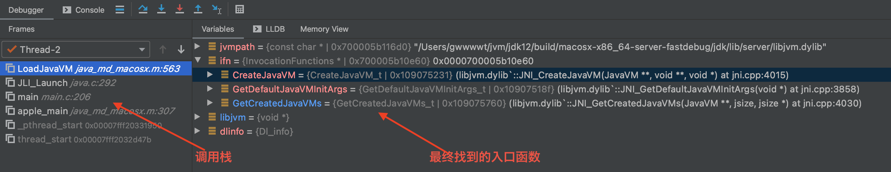

# 相关数据结构


### JLI_List应用：复制命令行参数

```c
//src/java.base/share/native/launcher/main.c

//argc为main()的参数, 表示执行java命令时的参数个数, args->capacity初始值为 argc + 1
JLI_List args = JLI_List_new(argc + 1);
int i = 0;

// Add first arg, which is the app name
JLI_List_add(args, JLI_StringDup(argv[0])); //复制argv[0], 并存储到args->elements[0]
       
// Append JDK_JAVA_OPTIONS; 暂时没有, 跳过
if (JLI_AddArgsFromEnvVar(args, JDK_JAVA_OPTIONS)) { //getenv()查询是否有"JDK_JAVA_OPTIONS"变量,如果有,
           
  	// JLI_SetTraceLauncher is not called yet
 	 	// Show _JAVA_OPTIONS content along with JDK_JAVA_OPTIONS to aid diagnosis
  	if (getenv(JLDEBUG_ENV_ENTRY)) {
      	char *tmp = getenv("_JAVA_OPTIONS");
      	if (NULL != tmp) {
          	JLI_ReportMessage(ARG_INFO_ENVVAR, "_JAVA_OPTIONS", tmp);
        }
    }
}
        
// Iterate the rest of command line       
for (i = 1; i < argc; i++) {
  	JLI_List argsInFile = JLI_PreprocessArg(argv[i], JNI_TRUE);
  	if (NULL == argsInFile) {
      	JLI_List_add(args, JLI_StringDup(argv[i])); //将argv[1-(argc-1)]的参数依次复制到args中;
    } else {
               
      	int cnt, idx;
      	cnt = argsInFile->size;   
      
      	for (idx = 0; idx < cnt; idx++) {
          	JLI_List_add(args, argsInFile->elements[idx]);
        }
        
      	// Shallow free, we reuse the string to avoid copy
      	JLI_MemFree(argsInFile->elements);        
      	JLI_MemFree(argsInFile);
    }
}
      
margc = args->size; //参数个数, 此时参数个数不仅包含命令行参数个数, 还可能包含JDK_JAVA_OPTIONS环境变量参数个数
        
// add the NULL pointer at argv[argc]
JLI_List_add(args, NULL); //最后附加NULL到args
      
margv = args->elements; //margv指向所有参数字符串
}

//main函数最终调用 JLI_Launch
return JLI_Launch(margc, margv, 
                   jargc, (const char**) jargv,
                   0, NULL,
                   VERSION_STRING,
                   DOT_VERSION,
                   (const_progname != NULL) ? const_progname : *margv,
                   (const_launcher != NULL) ? const_launcher : *margv,
                   jargc > 0,
                   const_cpwildcard, const_javaw, 0);
```


## 实际入口函数

> 上面的函数经过一番分析调用后，最终找到的入口函数如下：



