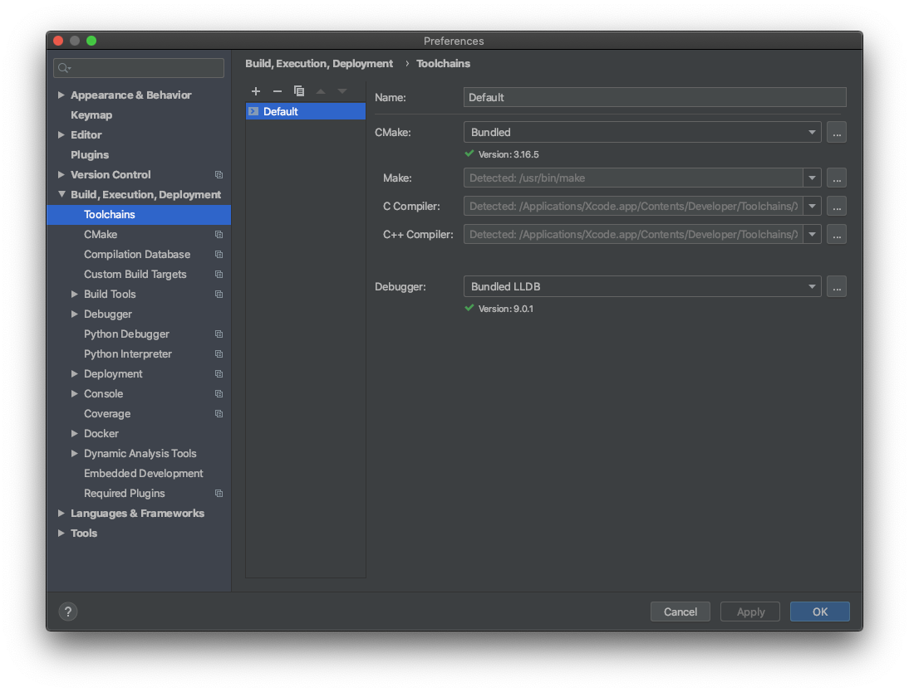
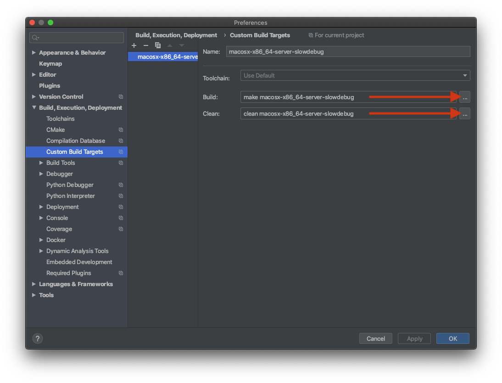
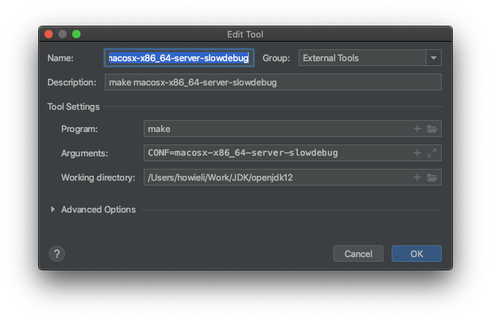
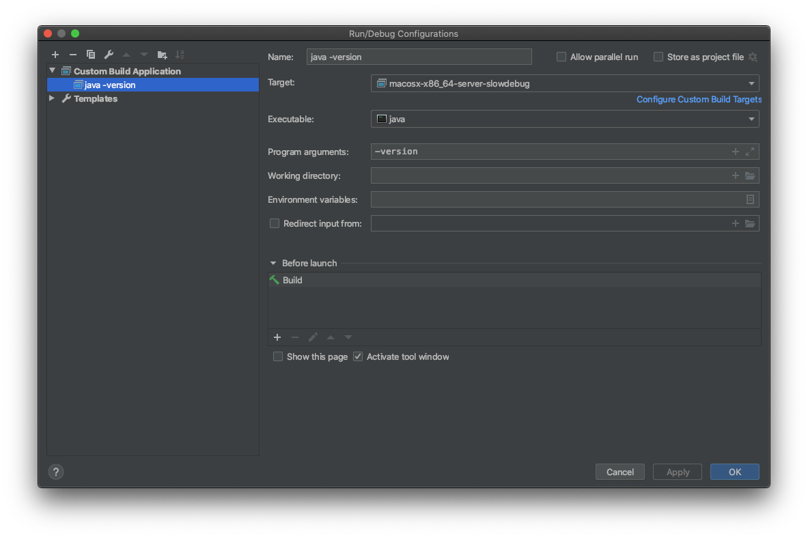
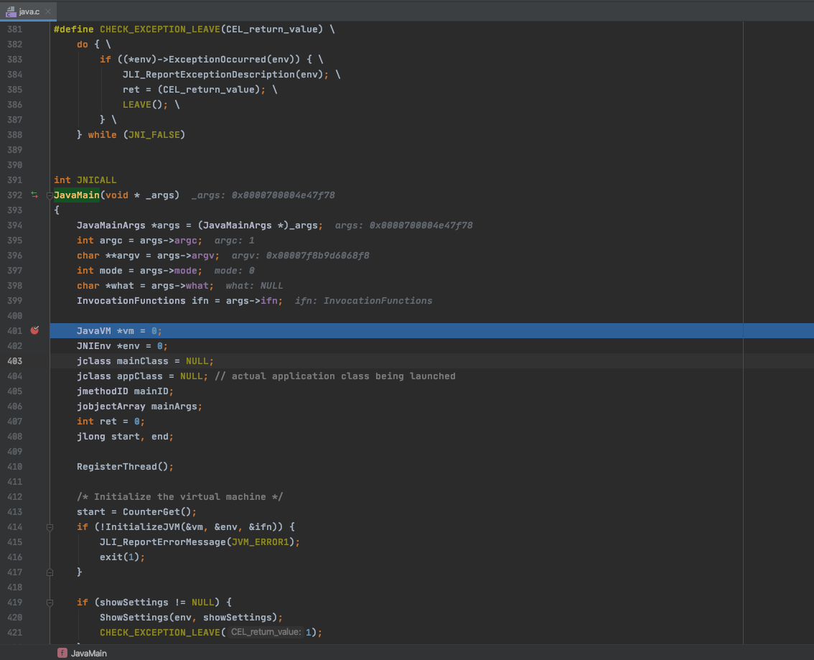
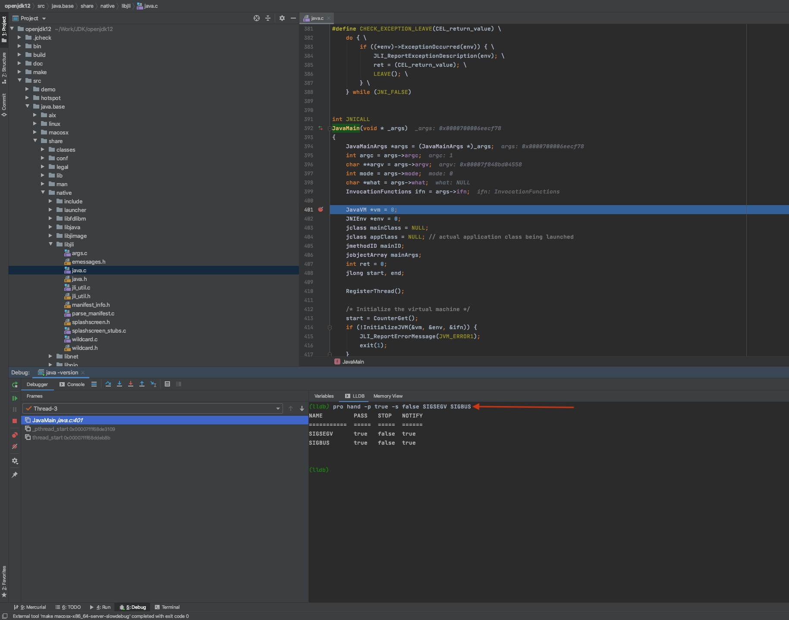
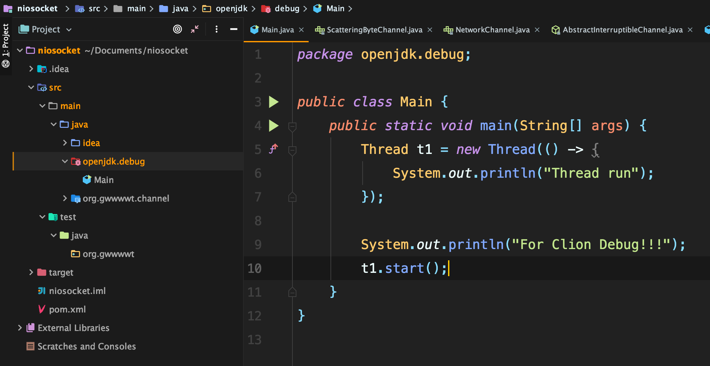
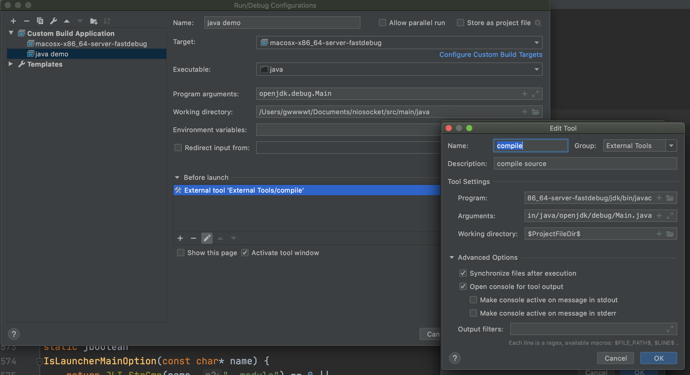
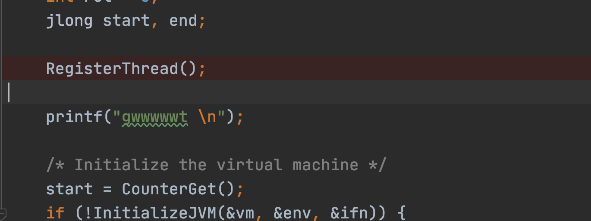
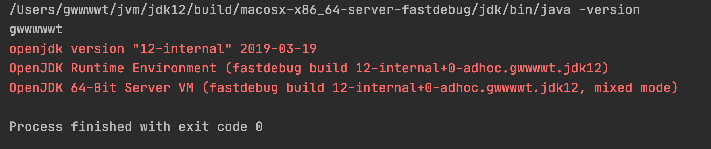

## openjdk12 源码编译和Debug环境搭建


> 参考资料:
>
> >  "https://www.howieli.cn/posts/macos-clion-build-debug-openjdk12.html"
> >
> > "https://juejin.im/post/6854573216665436173"
>
> 环境: 
>
> > Mac Catalina 10.15.7
> >
> > Xcode 11.7
> >
> > Clion 2020.1

#### 1. 源码下载

> 在《深入理解Java虚拟机》以及其它网络Blog上一般都说要采用 "Mercurial" 或直接到 "http://hg.openjdk.java.net/jdk/jdk12" 上下载源码;
>
> 但是网络实在太慢了, 后来发现以前下载过源码包并放到了百度云盘上备份; ***:=( 很无语😓***
>
> 直接下载并解压到事先创建的 "~/jvm/" 目录中, 并且将源码解压后的目录重命名为'jdk12';
>
> 所以在本机上, 执行编译命令的目录为***"~/jvm/jdk12"***

#### 2. 编译

> 编译openjdk12 需要提前安装过 10 或 11 版本的java以作为 Bootstrap JDK;
>
> 这里使用本机安装的 jdk11;

##### 2.1 安装依赖

```shell
# 用于生成shell脚本的工具，可以使软件包在不同的系统下都可以编译
brew install autoconf
# 字体引擎
brew install freetype
```

##### 2.2 Xcode

```shell
# 安装Xcode

# 再安装Command Line Tools for XCode
xcode-select --install
```

##### 2.3 生成编译参数

切换到"~/jvm/jdk12"目录，执行`configure`命令，可以生成编译参数，详细参数可以通过执行`bash configure --help`获取帮助。本次编译使用以下参数进行编译：

```shell
# 注: 下面的命令为摘抄的博客使用的命令
bash configure  --with-boot-jdk='~/Work/JDK/jdk-11/Contents/Home' --with-debug-level=slowdebug --with-target-bits=64 --disable-warnings-as-errors --enable-dtrace --with-jvm-variants=serverCopy

# 注: 下面的命令为本机使用的编译命令
# --enable-debug表示 debug-level为fastdebug; --with-jvm-variants=server表示仅含server模式
# 其它参数默认, 脚本会自动查询系统信息并进行配置; 注意: 执行命令时需要切换到java11版本即可
bash configure --enable-debug --with-jvm-variants=server

```

- `--with-boot-jdk`：指定`Bootstrap JDK`路径，如果在终端直接执行`java -version`所输出的版本是`11`的话，那么这个参数可省略；
- `--with-debug-level`：编译级别，可选值为`release`、`fastdebug`、`slowdebug`和`optimized`，默认值为`release`，如果我们要调试的话，需要设定为`fastdebug`或者`slowdebug`。建议设置为`slowdebug`；
- `--with-target-bits`：指定编译`32`位还是`64`位的虚拟机；
- `--disable-warnings-as-errors`：避免因为警告而导致编译过程中断；
- `--enable-dtrace`：开启一个性能工具，暂时还不知道怎么使用；
- `--with-jvm-variants`：编译特定模式下的虚拟机，一般这里编译`server`模式；
- `--with-conf-name`：指定编译配置的名称，如果没有指定，则会生成默认的配置名称，比如`macosx-x86_64-server-slowdebug`，我这里没有使用这个参数，采用默认生成配置。

另外，在很多场景下编译`OpenJDK`都会使用`--enable-ccache`参数，来通过`ccache`加快编译速度，但我没有采用，因为目前编译速度其实不慢，再有就是如果增加了这个参数，后续导入`CLion`的时候，会出现很多红字提示，看着好像不影响使用，但总归看着不太舒服。


##### 2.4 执行编译

> ```shell
> make images
> ```
>
> >  在编译过程中, 遇到的一个报错如下: 
>>
> > ```shell
> > /Users/gwwwwt/jvm/jdk12/test/hotspot/gtest/classfile/test_symbolTable.cpp:62:6: error: explicitly assigning value of variable of type 'TempNewSymbol' to itself [-Werror,-Wself-assign-overloaded]
> >   s1 = s1; // self assignment
> > ```
> >
> > 需要编辑 test_symbolTable.cpp 文件, 并将出错的第 62 行 "s1 = s1" 注释掉即可;
> 
> ***之后执行成功，会在build目录下生成 macosx-x86_64-server-fastdebug***


#### 3. 导入Clion

> 按《深入理解Java虚拟机》或其它Blog中的直接将jdk12目录导入Clion后，会出现很多找不到头文件的错误，需要修改CmakeLists.txt才行，但不知道怎么改；
>
> 这里参考的资料采用了另外一种方式，经过测试发现可以，这也是整理本Note的一个原因；

##### 3.1 生成Compilation Database

```shell
# 在/Users/gwwwwt/jvm/jdk12 目录下执行
# 如果在编译参数中指定的debug-level为slowdebug, 则下面的命令需要将fastdebug改成slowdebug
make CONF=macosx-x86_64-server-fastdebug compile-commands
```

##### 3.2 编译生成的目录代码

> 在导入Clion之前，要编译一下， 因为某些模块使用了预编译头， 如果不编译，Clion 会在索引过程中提示找不到各种各样的文件；

```shell
# 执行如下命令
make CONF=macosx-x86_64-server-fastdebug
```


##### 3.3 导入Clion

在`CLion`中，首先确保配置好了 `Toolchains`，可通过如下界面进行配置：



配置好`Toolchains`后，通过`File -> Open...`功能，选中`${source_root}/build/macosx-x86_64-server-fastdebug/compile_commands.json`，`As a project`打开，这样就导入了`Compilation Database`文件，接下来`CLion`开始进行索引。

> ***这里需要注意打开compile_commands.json时， 一定要选择 'As a project'打开；***

这时候，你会发现你是看不到源码的，所以下面需要修改项目的根目录，通过`Tools -> Compilation Database -> Change Project Root`功能，选中你的源码目录，也就是`${source_root}`，这样设置就可以在`CLion`中看到源代码啦。如果不出意外，这个时候，`CLion`又开始进行索引，为了避免不必要的麻烦，后续的操作，建议等待索引完成后进行。


#### 4. 调试

##### 4.1 添加构建目标

> 需要在`Preferences --> Build, Exceution, Deployment --> Custom Build Targets`配置构建目标;
>
> > ***需要注意的是，下面的截图是直接使用参考Blog的截图，所以它使用的是slowdebug***





##### 4.2 Run/Debug configurations

> ***新建 "Custom Build Application" 配置***


- `Target`：选择上一步配置的`Build Target`；
- `Executable`：选择`${source_root}/build/macosx-x86_64-server-slowdebug/jdk/bin/java`，或者其它你想调试的文件，比如`javac`；
- `Before launch`：这个下面的`Build`可去可不去，去掉就不会每次执行都去`Build`，节省时间，但其实`OpenJDK`增量编译的方式，每次`Build`都很快，所以就看个人选择了。


#### 5. 调试 Debug

在`${source_root}/src/java.base/share/native/libjli/java.c`的`401`行打断点，点击`Debug`，效果如下：




##### 5.1 Debug问题

> 在通常情况下，按上面的方式进行Debug时， 总会有一步出下如下问题:
>
> 
>
> 
>
> > 查了下，几乎所有说调试`OpenJDK`的文章都有涉及到这个问题，`SIGSEGV`代表指针所对应的地址是无效地址，没有物理内存对应该地址。其实还有一个，是`SIGBUS`，代表指针所对应的地址是有效地址，但总线不能正常使用该指针，通常是未对齐的数据访问所致。
> >
> > `MacOS`的`CLion`默认使用`LLDB`进行`Debug`，所以要避免这种情况，可以通过在进入第一个断点时，执行以下命令避免后面出现此类问题：
> >
> > > ```shell
> > > # LLDB使用如下命令，GDB暂不讨论，原理基本一致，可以自行搜索
> > > pro hand -p true -s false SIGSEGV SIGBUS
> > > ```
> >
> > 之后：
> >
> > 


> 这样虽然可以解决问题，但如果每次`Debug`都手动修改，会很繁琐。在`JetBrains`的文章[Develop OpenJDK in CLion with Pleasure](https://blog.jetbrains.com/clion/2020/03/openjdk-with-clion/)中，文末也提到了解决这种问题，但我试了一下，却总是不生效，也没找到是什么原因。
>
> 不过最后在这个[博客](https://yemablog.com/posts/debug-openjdk-in-clion)中找到了一个解决方案，博主提到，`LLDB`只支持`Session`级别的忽略设置（`GDB`貌似支持全局，感兴趣的同学可以尝试），就是需要先启动`Debug`，打断点，然后执行忽略命令，才可以生效。然后博主提出了一种解决方案，在`~/.lldbinit`文件中，使用如下命令，实现每次`Debug`时自动打个断点，然后输入`pro hand -p true -s false SIGSEGV SIGBUS`，最后继续执行后续流程，文件内容如下（其中`main.c`文件的路径自行替换）：
>
> ```shell
> # 下面是一条完整的配置命令, 只是命令太长导致换行;
> breakpoint set --file  \ /Users/xxxx/Work/JDK/openjdk12/src/java.base/share/native/launcher/main.c \
> --line 98 -C "pro hand -p true -s false SIGSEGV SIGBUS" --auto-continue true
> 
> ```
>
> 这样即可解决`Debug`时的小问题，但依然觉得`JetBrains`说的那种方案是比较优雅的，后面再研究下～


#### 6. 与Java程序联合Debug

> 上面演示的实际是java -version如何debug,那么如何做到通过自己编写的java代码作为程序入口来调试呢？

首先java代码如下：




CLion中配置如下：

> **注: 在本机上设置了Before launc时执行compile任务，但在执行java时却只完成了compile任务， 而没有继续执行java任务，所以本问题暂留；**


之后Debug即可


##### 6.1 调试时的问题

> **使用Clion调试在Idea中创建Java源码时，第一次就调试了一个多线程验证 wait/notify 的问题，有点无语；**

--------------------------------------------------------------------

#### 7.  修改源码并应用Change

> **步骤： **
>
> > 1. **修改源码**
> >
> >    
> >
> > 2. **执行make**
> >
> >    ```shell
> >    # 需要在jdk根目录下执行
> >    # 如果修改文件比较少, make使用增量编译, 所以很快就会完成
> >    make
> >    ```
> >
> > 3. **验证**
> >
> >    > **之后再次执行 "java -version"**
> >    >
> >    > 


#### 8. 后续

> **后来有一天把Xcode从11.7升级到12.3了, 然后再编译源码时报错了, 下面会整理这些报错以及解决方式: **
>
> > **报错: /Users/gwwwwt/jvm/jdk12/src/hotspot/share/runtime/sharedRuntime.cpp:2873:85: error: expression does not compute the number of elements in this array; element type is 'double', not 'relocInfo' [-Werror,-Wsizeof-array-div]
> >       buffer.insts()->initialize_shared_locs((relocInfo*)locs_buf, sizeof(locs_buf) / sizeof(relocInfo));**
> >
> > ****
> >
> > **解决: 修改shareRuntime.cpp中的代码, 在 `sizeof(locs_buf)/sizeof(relocInfo)` 添加括号: `(sizeof(locs_buf))/(sizeof(relocInfo))` ;**
>
> > **报错: /Users/gwwwwt/jvm/jdk12/src/hotspot/share/runtime/arguments.cpp:1452:35: error: result of comparison against a string literal is unspecified (use an explicit string comparison function instead) [-Werror,-Wstring-compare]
> >       if (old_java_vendor_url_bug != DEFAULT_VENDOR_URL_BUG) {**
> >
> > ****
> >
> > **解决: 将判断改为 `if (strcmp(old_java_vendor_url_bug,DEFAULT_VENDOR_URL_BUG) != 0){`**
>
> > **报错： /Users/gwwwwt/jvm/jdk12/src/java.desktop/macosx/native/libawt_lwawt/awt/CSystemColors.m:134:9: error: converting the result of '?:' with integer constants to a boolean always evaluates to 'true' [-Werror,-Wtautological-constant-compare]
> >     if (colorIndex < (useAppleColor) ? sun_lwawt_macosx_LWCToolkit_NUM_APPLE_COLORS : java_awt_SystemColor_NUM_COLORS) {**
> >
> > ****
> >
> > **解决: 改为 `if (colorIndex < (useAppleColor ? sun_lwawt_macosx_LWCToolkit_NUM_APPLE_COLORS : java_awt_SystemColor_NUM_COLORS)) {`**

